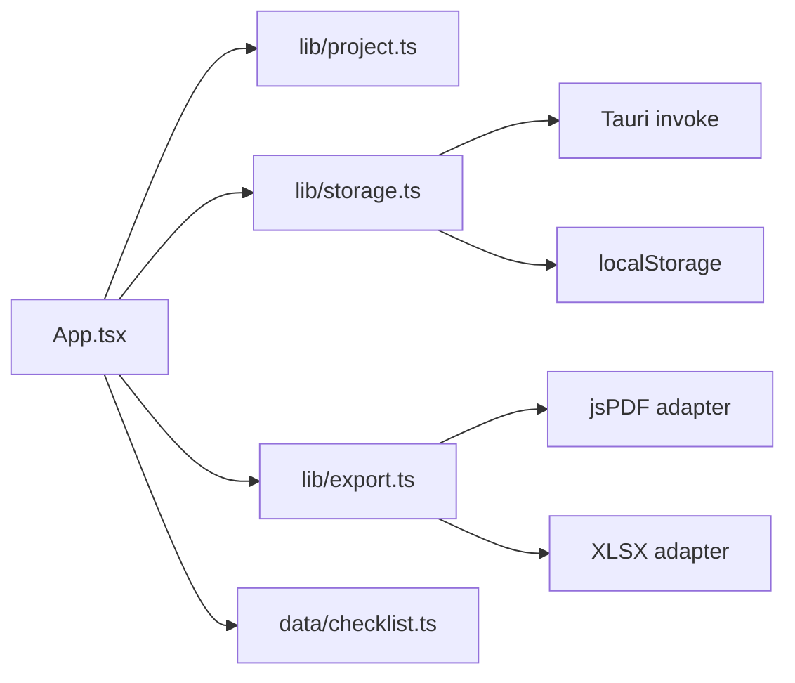
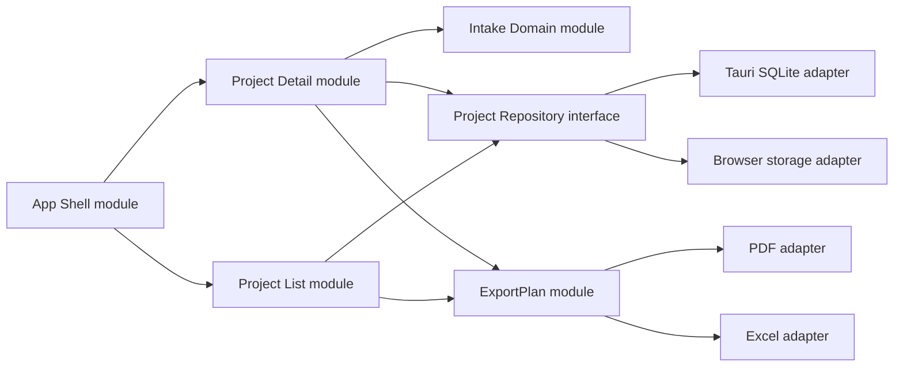

# Codebase Architecture Refactor Design

## Status

Implemented baseline.

## Summary

Project Maker mukodik, de az MVP gyors fejlesztese utan nehany module tul shallow lett. A baseline refactor az alkalmazas shell, a projekt reszletes workflow es az export pipeline szetvalasztasat valositotta meg ugy, hogy a jelenlegi viselkedes nem valtozott. A cel nem uj funkcio, hanem jobb locality, kisebb interface-ek es olyan module-alak, amelyre kesobb teszt, GitHub workflow es uj PM/PO funkcio is kevesebb kockazattal epulhet.

## Context and Scope

A jelenlegi rendszer Tauri + React + SQLite/localStorage offline-first desktop app. A domain a projektinditasi intake, readiness review, checklist, follow-up, decision score es PDF/Excel export.

Fontos jelenlegi jelek:

- `src/App.tsx` app shell szerepben marad: globalis view, repository init, kijeloles, export commandok es high-level navigacio.
- `src/features/projects/ProjectTable.tsx` tartalmazza az aktiv/archiv lista, kijeloles, szures es lista export feluletet.
- `src/features/project-detail/ProjectDetailView.tsx` detail koordinatorkent mukodik; a Cockpit, Interju, Alapadatok, Checklist, Follow-up es Dontes tabok kulon `src/features/project-detail/tabs/*` modulokban vannak.
- `src/features/project-detail/detailTypes.ts` es `src/features/project-detail/detailUi.tsx` tartalmazza a detail kozos tipusait es kis UI elemeit.
- `src/lib/exportPlan.ts` egyszer definialja az export tartalmat, `src/lib/export.ts` pedig PDF/Excel render adapterkent mukodik.
- `src/lib/storage.ts` repository orchestration reteg; a Tauri SQLite es localStorage implementacio a `src/lib/storageAdapters.ts` adapterekben, az interface pedig `src/lib/storageTypes.ts` alatt van.
- Van `README.md`, `CONTEXT.md`, ADR mappa es minimalis verification script baseline.
- A `release/`, `dist/`, `src-tauri/target/` es lokalis adatbazis artifactok `.gitignore` alatt vannak.

Ez a design a kodbazis strukturajat es refactor sorrendjet fedi le. Nem celja a UI ujratervezese vagy uj termekfunkcio bevezetese.

## Goals

- Az `App.tsx` interface-et szukiteni: route/allapot shell maradjon fent, feature module-ok vigyek a listat, detailt es workflow-t.
- A projekt intake domain logika legyen tesztelheto a sajat interface-en keresztul.
- Az export tartalom egyszer legyen definialva, es tobb adapter renderelje PDF-be vagy Excelbe.
- A storage seam legyen vilagos: repository interface, Tauri SQLite adapter, browser/localStorage adapter.
- Repo legyen GitHub-ready: README, ellenorzesi parancsok, test/lint alap, artifact hygiene.

## Non-Goals

- Nem vezetunk be tobbfelhasznalos backend-et.
- Nem migraltatjuk az adatbazis formatumat, hacsak a storage module refactor nem igenyli minimalisan.
- Nem cserelunk UI frameworkot.
- Nem eroltetunk tul sok absztrakciot olyan helyekre, ahol egy adapter van es nincs valodi seam.
- Nem bontjuk fel a CSS-t elso korben, mert jelenleg nem ez adja a legnagyobb karbantartasi kockazatot.

## Constraints

- A jelenlegi felhasznaloi workflow es export viselkedes nem torhet.
- A lokalis/offline-first mukodes marad.
- A telepito es release folyamat Windows/NSIS alapu.
- Az SQLite adat a telepitett app mappaja melletti `data/project-maker.db` fajlban van.
- A refactor lepesenkent legyen buildelheto, hogy barmelyik lepes utan vissza lehessen allni stabil allapotra.

## Proposed Design

### 1. App Shell module melyitese

Az `App.tsx` helyett legyen egy kicsi app shell module, amely csak a globalis view-t, selected project id-t, repository initet, notice/error allapotot es high-level commandokat tartja.

Javasolt modulok:

- `src/app/App.tsx`: app shell, view valtas, repository init.
- `src/features/projects/ProjectListView.tsx`: aktiv/archiv lista, szures, kijeloles, lista export inditas.
- `src/features/project-detail/ProjectDetailView.tsx`: detail header, tab valtas, project szerkesztesi commandok.
- `src/features/project-detail/tabs/*`: overview, checklist, follow-ups, decision, cockpit, interview.
- `src/ui/*`: TextField, SelectField, TooltipIconButton, badges, buttons.

Ez a module melyites az interface-et csokkenti: az app shell nem tudja, hogyan nez ki a checklist vagy az interview; csak commandokat ad tovabb.

### 2. Intake domain module stabil interface-szel

`src/lib/project.ts` mar hasznos domain module, de tovabb erositheto egy tisztabb interface-szel:

- `createDraftProject()`
- `applyProjectPatch(project, patch)`
- `applyChecklistAnswer(project, itemId, patch)`
- `applyFollowUpPatch(project, followUpId, patch)`
- `recalculateProject(project)`
- `createDecisionSummary(project)`

A UI ekkor nem kezzel masolgat nested objektumokat. A locality jobb: checklist/follow-up update hibak egy module-ban javithatok.

### 3. ExportPlan module es renderer adapterek

Az export tartalmi dontesei keruljenek egy kozos module-ba:

- `buildExportPlan(projects, preset)` visszaad semleges szekciokat: key-value, table, title, summary.
- `renderPdfExport(plan)` csak PDF adapter.
- `renderExcelExport(plan)` csak Excel adapter.
- `makeExportFileName(...)` maradhat kozos helperkent.

Igy a "Vezetoi osszefoglalo / Teljes felmeres / Hianylista" logika egyszer el, nem ket rendererben.

### 4. Storage seam tisztazasa

Legyen explicit repository interface:

```ts
interface ProjectRepository {
  init(): Promise<StorageStatus>;
  listProjects(scope: "active" | "archived"): Promise<ProjectListItem[]>;
  getProject(id: string): Promise<Project | null>;
  saveProject(project: Project): Promise<void>;
  archiveProject(id: string): Promise<void>;
  reopenProject(id: string): Promise<void>;
  deleteProject(id: string): Promise<void>;
}
```

Adapterek:

- `TauriProjectRepository`
- `BrowserProjectRepository`
- `createProjectRepository()`

Ket adapter valoban indokolja a seam-et. A caller interface kicsi marad, az invoke/localStorage reszletek elrejtve.

### 5. GitHub-ready hardening

Minimalis repo hygiene:

- `README.md`: cel, stack, dev setup, build, release, adatfajlok helye.
- `CONTEXT.md`: domain glossary: Project, Intake, Readiness, Decision Score, Follow-up, Export Preset.
- `docs/adr/0001-offline-first-tauri-sqlite.md`.
- scripts: `typecheck`, `build`, `tauri:build`.
- teszt alap: domain es export-plan module tesztek, UI smoke kesobb.
- `.gitignore`: release artifact, desktop.ini, lokalis logok es adatbazisok tisztazasa.

## Architecture Views

### Current high-level shape



### Proposed high-level shape



## Interfaces and Data

Nincs kotelezo adatbazis-migracio az elso refactorhoz, mert a `Project` JSON tovabbra is azonos alakban mentheto.

Erdemes viszont bevezetni:

- `ProjectCommand` vagy celzott domain fuggvenyek a nested project update-ekhez.
- `ExportPlan` semleges adatstrukturat, amely nem importal PDF vagy XLSX csomagot.
- `StorageStatus`, amely nem csak string, hanem explicit `{ mode, databasePath? }`.

## Alternatives Considered

### A. Csak fajlokra bontani az App.tsx-et

Gyors, de shallow maradna: a nested update logika es workflow dontesek tovabb szivarognanak a UI-ba. Kevesebb locality, kisebb hosszutavu leverage.

### B. Teljes feature rewrite

Tisztanak tunik, de tul nagy blast radius. Az app mar mukodik es van release; a refactor fokozatosan legyen buildelheto.

### C. Allapotkezelo library bevezetese

Lehet kesobb, de most nem ez a legkisebb interface. Eloszor domain commandokkal es module melyitessel csokkentjuk a feluletet; utana latszik, kell-e kulon state library.

## Tradeoffs

- Tobb fajl lesz, de kevesebb ok lesz egy fajlt megnyitni egy adott valtoztatashoz.
- Az elso refactor nem ad lathato uj funkciot, viszont csokkenti a kovetkezo feature-ek kockazatat.
- Az export-plan bevezetese egyszeri atalakitas, de utana az uj export presetek olcsobbak.
- A repository interface formalizalasa kis boilerplate, de ket adapter miatt ez valodi seam.

## Cross-Cutting Concerns

- **Reliability**: domain commandok es export-plan module tesztek fogjak a regressziokat.
- **Performance**: export csomagok tovabbra is dynamic importtal tolthetok, hogy az alap app bundle ne nojon indokolatlanul.
- **Security/privacy**: lokalis adat tarolasa marad; README-ben dokumentalni kell az adatbazis es export helyet.
- **Operations**: release artifact ne legyen veletlen commit targya; build folyamat dokumentalt legyen.
- **AI-navigability**: feature folder es domain glossary csokkenti, hogy egy jovobeli modositas teljes repo-keresest igenyeljen.

## Rollout and Migration

1. Repo hygiene: README, CONTEXT, ADR, scripts, `.gitignore`.
2. UI atomok kiemelese `src/ui`.
3. Project list module kiemelese.
4. Project detail tabok kiemelese viselkedesvaltozas nelkul.
5. Intake domain commandok bevezetese, App/Detail nested update-ek csereje.
6. ExportPlan bevezetese, PDF/Excel adapterek atkotese.
7. Repository adapterek formalizalasa.
8. Unit tesztek es CI.

Minden lepes utan minimum `pnpm build`; Tauri-erinto lepesek utan `pnpm tauri build`.

## Open Questions

- A release artifactokat teljesen `.gitignore`-oljuk, vagy GitHub Releases-be keruljenek?
- A teszt stack Vitest legyen, vagy maradjon csak TypeScript build + kesobbi Playwright?
- A domain commandok mennyire legyenek granularisak: celzott `updateChecklistAnswer`, vagy altalanos `applyProjectCommand`?

## Decision

Javasolt dontes: eloszor az App Shell es Project Detail module melyites induljon, mert ez adja a legnagyobb locality javulast es csokkenti a legtobb jovobeli feature koltseget. Masodik lepes az ExportPlan, harmadik a repository seam formalizalasa. A design akkor lephet implementation fazisba, ha elfogadjuk ezt a sorrendet vagy valasztunk masik top jeloltet.
