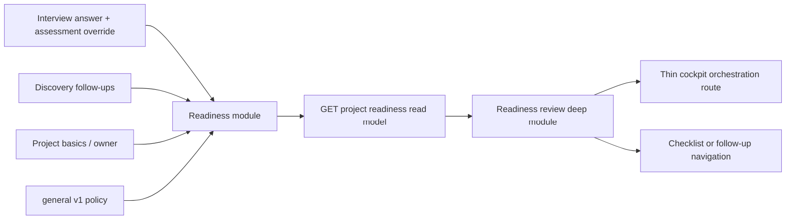

# SCORE-01.1 Readiness Assessment and Review Design

**Status:** Approved for implementation planning on 2026-08-10; implementation delivered on `main` in `b922258`. Current delivery status is maintained in [`docs/roadmap.md`](../../roadmap.md).

## Purpose

Deliver the first trustworthy readiness vertical slice. A PM, PO, or BA can
assess the completeness of each `INITIAL_INTAKE` question, see an explainable
completion and readiness result in the project cockpit, and navigate directly
to the unresolved work that prevents estimation or development.

The slice deliberately establishes explicit checklist assessment state before
calculating readiness. A saved answer alone is not enough evidence that a
question is complete: it can be partial, irrelevant to the project, or need
further clarification.

## Scope

### Included

- Per-question effective checklist statuses for an `INITIAL_INTAKE` round:
  `Nincs meg`, `Részben megvan`, `Kész`, and `Nem releváns`.
- Persisted, auditable overrides for the two states that cannot safely be
  inferred from answer presence: `Részben megvan` and `Nem releváns`.
- A required rationale for a `Nem releváns` override.
- Completion validation that treats a justified `Nem releváns` assessment as
  excluded, while a partial assessment remains incomplete for a required
  question.
- A read-only readiness result for a complete canonical `general` v1
  30-question schema, including completion, readiness factors, and ordered
  remediation gaps.
- A separate cockpit readiness-review deep module with its own state, markup,
  styles, API adapter, loading/error/retry states, and navigation actions.
- API, PostgreSQL integrity, browser-workflow, documentation, and full-gate
  verification evidence.

### Explicitly excluded

- Decision Score, Go / Conditional Go / No-Go recommendation, or decision
  recording (`SCORE-01.2`).
- Canonical Markdown generation and all PDF, spreadsheet, acceptance-criteria,
  and user-story outputs (`OUTPUT-01` through `OUTPUT-03`).
- Source checklist-item linkage for discovery follow-ups (`INTAKE-04.3b`).
- New playbooks, custom-playbook scoring, additional round types, generic
  multi-user collaboration, authentication, authorization, notifications, or
  background recalculation.
- Persisting derived completion, readiness, factor, or gap snapshots. This
  slice derives them from durable source data on each read.

## Context and decision

The current product contract already defines the four checklist statuses, the
readiness weights, the resolved follow-up statuses, and readiness thresholds in
`packages/contracts/playbooks/general.v1.json`. The delivered interview flow,
however, persists only an answer value or no answer. Treating every non-empty
answer as `Kész` would make a partial answer look fully ready and would make
the `Nem releváns` exclusion rule impossible to apply honestly.

Three approaches were considered:

| Approach | Result | Decision |
| --- | --- | --- |
| Derive `Kész` from every answer and `Nincs meg` from every absence | Smallest code change, but falsely gives full credit to partial answers and cannot exclude irrelevant items | Rejected |
| Add assessment state first, then calculate from it | Preserves the playbook semantics, supports partial and irrelevant work, and creates a stable input seam for later scoring | Chosen |
| Show only completion and gaps until checklist state exists | Avoids a misleading score, but delays the main business outcome | Rejected |

The chosen approach remains one bounded `SCORE-01.1` vertical slice: assessment
state is the input foundation of the same user-visible readiness review, not an
unrelated roadmap detour.

## Domain semantics

### Effective checklist status

Each `RoundQuestionSnapshot` returned to a client exposes:

```ts
readonly checklistStatus: string;
readonly assessmentRationale: string | null;
```

`checklistStatus` always comes from the canonical playbook vocabulary. It is
calculated as follows:

| Stored source state | Effective status | Rationale |
| --- | --- | --- |
| No persisted answer and no override | `Nincs meg` | There is no validated evidence for the question. |
| Valid persisted answer and no override | `Kész` | Existing delivered answer behavior remains useful without a migration backfill. |
| Persisted partial override | `Részben megvan` | A user has judged a valid answer incomplete. |
| Persisted irrelevant override | `Nem releváns` | The question does not apply to this project and its rationale is retained. |

The two inferred states are not stored merely to repeat information already
held in `round_answers`. The override states are stored in a separate relation
because `Nem releváns` may exist without an answer and because no answer row
exists for a missing answer.

### Override rules

1. `Részben megvan` requires a valid persisted answer for the same snapshot.
   It does not satisfy a required question for round completion and contributes
   `0.5` where the canonical policy assigns that value.
2. `Nem releváns` requires a trimmed, nonblank rationale of at most 10,000
   characters. It may coexist with a retained answer, does not delete prior
   evidence, is excluded from completion and readiness denominators, and
   satisfies the required-question completion gate for that snapshot.
3. Resetting an override deletes only the override. The effective status then
   returns to the deterministic answer-presence result above.
4. Clearing an answer resets a `Részben megvan` override in the same
   transaction, because that override cannot remain valid without evidence.
   Clearing an answer does not reset `Nem releváns`; its independent rationale
   continues to explain why the item is excluded.
5. Completed rounds are immutable. An assessment override cannot be created,
   changed, or reset after completion.
6. Repeating the same override request is a safe no-op: it does not change a
   timestamp and does not create a duplicate audit event. Resetting a
   nonexistent override is also a safe no-op.

The partial-answer precondition is a persistence invariant as well as an API
rule. The override trigger verifies that a valid answer exists before it
accepts `Részben megvan`, and the answer-delete trigger rejects removal of the
last answer while that override exists. The API clears the partial override
first, then clears the answer, in one transaction.

### Completion

For a source round, completion is the arithmetic mean of the canonical
checklist values for all relevant snapshots:

- `Kész` = `1`;
- `Részben megvan` = `0.5`;
- `Nincs meg` = `0`;
- `Nem releváns` = excluded from the denominator.

An empty relevant denominator yields `0`, never `100`. Completion is rounded
to the nearest whole percentage. The canonical completion labels apply as:

| Result | Label |
| --- | --- |
| `0` | `Pontosítás szükséges` |
| `1` to `99` | `Folyamatban` |
| `100` | `Kész` |

The existing server completion gate changes only where necessary: a required
snapshot passes when it has a valid persisted answer or a persisted,
justified `Nem releváns` override. A `Részben megvan` override remains
insufficient for completion.

### Readiness source and availability

The calculator selects the source round deterministically:

1. the most recently created open `INITIAL_INTAKE` round for the project;
2. otherwise, the most recently completed `INITIAL_INTAKE` round;
3. otherwise, no source round exists.

The first delivery supports only a source round whose snapshot stable keys are
the exact canonical `general-001` through `general-030` set. A source round
with a subset, custom key, or altered set is not assigned a fabricated score.
It returns an explicit unavailable result so the user can understand that this
playbook has no score policy in this release.

No source round and an unsupported schema are availability states, not zero
scores. They have explicit Hungarian guidance in the cockpit and do not imply
that a project is ready or unready.

## Policy binding and calculation

The scoring weights and status values remain in the immutable general v1
playbook. The contract gains a typed `readiness.inputBindings` field so the
mapping below also lives in the versioned policy rather than becoming hidden
framework-specific logic.

```json
{
  "baseInfoProjectFields": [
    "name",
    "customerContactName",
    "customerContactEmail"
  ],
  "businessChecklistItemIds": [1, 2],
  "ownershipProjectFields": ["ballOwner"],
  "ownershipChecklistItemIds": [3]
}
```

The field completes the binding of weights already present in `general` v1; it
does not alter a status vocabulary, threshold, or weight. Contracts validation
must require the exact canonical binding just as it already requires the exact
canonical scoring policy.

For an available source round, the pure calculator produces these factor
fractions before applying the policy weights:

| Factor | Source | Fraction |
| --- | --- | --- |
| `baseInfo` | project name, customer contact name, customer contact email | present fields / 3 |
| `business` | canonical checklist items 1 and 2 | mean effective checklist value; no relevant evidence = 0 |
| `ownership` | `ballOwner` and canonical checklist item 3 | mean of owner-presence (`0` or `1`) and checklist value; no relevant evidence = 0 |
| `checklist` | all relevant canonical snapshots | mean effective checklist value; empty denominator = 0 |
| `followUpResolution` | project-owned discovery follow-ups | resolved / total; no follow-ups = 1 |

The readiness percentage is:

```text
round((
  baseInfo × 0.20 +
  business × 0.20 +
  ownership × 0.15 +
  checklist × 0.30 +
  followUpResolution × 0.15
) × 100)
```

The implementation reads the exact weights, checklist values, excluded status,
and resolved follow-up statuses from the typed playbook export. It must not
duplicate them in the API, browser application, database migration, or tests.

The readiness band is derived from existing thresholds:

| Percentage | User-facing band |
| --- | --- |
| below 55 | `Pontosítás szükséges` |
| 55 to 74 | `Becslés előkészíthető` |
| 75 to 89 | `Becslésre kész` |
| 90 to 100 | `Fejlesztésre kész` |

## Readiness gaps

Each returned gap has a stable implementation identifier, a canonical
severity, a Hungarian explanation, a Hungarian next step, and a navigation
target. It never returns an answer value, an assessment rationale, a follow-up
question, a follow-up answer, or another user-entered free-text value.

```ts
type ReadinessGapTarget = 'overview' | 'checklist' | 'follow-ups';

interface ReadinessGap {
  readonly id: string;
  readonly severity: string;
  readonly category: string;
  readonly message: string;
  readonly nextStep: string;
  readonly target: ReadinessGapTarget;
  readonly snapshotId: string | null;
  readonly followUpId: string | null;
}
```

Gap rules are deterministic:

| Condition | Severity | Target |
| --- | --- | --- |
| Missing `ballOwner` | `Fontos` | `overview` |
| A blocking snapshot is `Nincs meg` | `Kritikus` | `checklist` |
| A nonblocking required snapshot is `Nincs meg` | `Fontos` | `checklist` |
| An optional snapshot is `Nincs meg` | `Pontosítás` | `checklist` |
| A required or blocking snapshot is `Részben megvan` | `Fontos` | `checklist` |
| An optional snapshot is `Részben megvan` | `Pontosítás` | `checklist` |
| A discovery follow-up has canonical status `Blokkolt` | `Kritikus` | `follow-ups` |
| A discovery follow-up has any other non-resolved canonical status | `Fontos` | `follow-ups` |

`Nem releváns` snapshots do not create a checklist gap because their mandatory
rationale is retained as the explicit exclusion decision. Resolved follow-ups
are read from `generalPlaybookV1.scoring.readiness.resolvedFollowUpStatuses`.

Gaps sort by severity (`Kritikus`, `Fontos`, `Pontosítás`), then source order:
checklist display order for checklist gaps; due date then creation order for
follow-up gaps; and stable identifier as the final tie-breaker. This produces
a deterministic list for users and tests.

## Architecture



### Persistence seam

Create a `round_question_assessment_overrides` table rather than altering the
answer payload or snapshot rows.

| Column | Constraint and meaning |
| --- | --- |
| `id` | UUID primary key |
| `round_id` | Required; part of the composite foreign key to the snapshot |
| `snapshot_id` | Required; paired with `round_id` so another round's question cannot be referenced |
| `status` | Required; database check permits only `Részben megvan` or `Nem releváns` |
| `rationale` | Required, trimmed nonblank text only for `Nem releváns`; null only for `Részben megvan` |
| `created_at`, `updated_at` | Required timestamps |

The table has a unique `(round_id, snapshot_id)` pair and a composite foreign
key to `round_question_snapshots(round_id, id)`. A database trigger prevents
any insert, update, or delete when the parent round is completed, preserves
row identity, validates the partial-answer precondition, and keeps the API
rule from being bypassed by direct SQL. The existing answer-protection trigger
is extended so a direct answer delete cannot leave a `Részben megvan` override
without a valid answer.

Migration `down` must fail with an actionable error when override rows exist;
it must not erase assessment decisions merely to make a rollback succeed.

### Interview assessment interface

The existing interview route retains answer autosave ownership. It adds an
assessment control adjacent to each answer state:

- show the effective canonical status as a tag;
- offer `Automatikus állapot`, `Részben megvan`, and `Nem releváns`;
- reveal an accessible rationale field only for `Nem releváns`;
- disable controls for a completed round;
- preserve input and show a Hungarian retryable failure state on an API error;
- use stable `data-testid` attributes rather than translated visible copy for
  browser automation.

`Automatikus állapot` sends the reset command. It is not a fifth persisted
checklist state. The parent interview route owns completion blocking while a
status request is in flight, so a user cannot close a round against stale
assessment data.

The two commands are intentionally narrow:

```text
PUT    /projects/:projectId/rounds/:roundId/answers/:snapshotId/assessment
DELETE /projects/:projectId/rounds/:roundId/answers/:snapshotId/assessment
```

The PUT DTO accepts exactly `status` and `rationale`. The server validates the
allowed override state and its preconditions in a transaction, returns the
updated `RoundQuestionSnapshot`, and writes a redacted audit event. The DELETE
route returns the reset snapshot and records an audit event only when an
override actually existed.

### Readiness module seam

Create an API `ReadinessModule` that owns one small external interface:

```text
GET /projects/:projectId/readiness -> ProjectReadiness
```

Internally, `ReadinessService` loads the project, selected source round,
snapshots, answers, assessment overrides, and discovery follow-ups. A pure
calculator receives that normalized input and produces either an available
readiness result or an explicit availability result. The controller, TypeORM
queries, policy loading, factor calculation, and gap ordering remain inside
this module; callers do not coordinate those concerns.

The shared contract is a discriminated union:

```ts
interface AvailableProjectReadiness {
  readonly available: true;
  readonly projectId: string;
  readonly sourceRoundId: string;
  readonly sourceRoundStatus: string;
  readonly completionPercentage: number;
  readonly completionLabel: string;
  readonly readinessPercentage: number;
  readonly readinessBand: string;
  readonly factors: readonly ReadinessFactor[];
  readonly gaps: readonly ReadinessGap[];
}

interface UnavailableProjectReadiness {
  readonly available: false;
  readonly projectId: string;
  readonly reason: 'NO_INITIAL_INTAKE' | 'UNSUPPORTED_SCHEMA';
}
```

`ReadinessFactor` carries a stable factor ID, the policy weight, the rounded
factor percentage, and Hungarian label/help text. The data is transparent
enough for a user to understand the result but contains no answer content.

### Cockpit deep module

Create `apps/web/src/app/projects/readiness-review/` with a standalone
`ReadinessReviewComponent`, its own API service, HTML, and SCSS. It receives a
small interface:

```ts
readonly projectId = input.required<string>();
readonly refreshKey = input.required<number>();
```

It reloads when either input changes. The component owns its own loading,
error, retry, available, and unavailable states. A gap action navigates to the
interview route with a snapshot fragment for checklist work, or to the
cockpit's discovery follow-up anchor for follow-up work.

`ProjectCockpitPage` remains an orchestration route. It imports and renders
the deep module, keeps a numeric readiness refresh key, increments it after a
workspace save and after the existing discovery follow-up committed-change
event, and does not absorb readiness calculation, API handling, markup, or
styles. The new module uses the existing Angular signal `input()` and
`output()` component pattern already used by the discovery-follow-up module.

## Error handling and security

- Unknown DTO fields are rejected by the existing global whitelist pipe.
- Invalid override transitions return a specific 400 or 409 response without
  echoing rationale text.
- Missing project, round, or snapshot returns the existing clear 404 behavior.
- A completed-round mutation returns 409 and leaves both assessment and audit
  state untouched.
- Audit payloads include only identifiers and canonical status names. They
  never include answer values, rationale, owner, question, due date, or next
  step.
- The read model returns only status, percentages, fixed policy-derived labels,
  and redacted gap metadata. It does not broaden access to persisted discovery
  content.
- The module does not introduce an external service, token, credential,
  notification, or authorization path.

## Acceptance criteria

1. An open initial-intake question with no answer returns and renders `Nincs
   meg`; a valid saved answer returns and renders `Kész` without a data
   backfill.
2. A user can persist, reload, edit, and reset `Részben megvan`; the state
   requires an answer and a required partial item prevents round completion.
3. A user can persist, reload, edit, and reset `Nem releváns` only with a
   rationale. It is excluded from completion/readiness denominators and allows
   a required item to pass the completion gate.
4. Completed rounds reject assessment mutations at both the API and database
   integrity layers.
5. Assessment audit events contain identifiers and status names only; they
   never expose answer or rationale content.
6. The readiness route returns an explicit unavailable result for no initial
   intake or a noncanonical schema, rather than a fabricated score.
7. For a canonical source round, the route returns the exact policy-weighted
   completion/readiness percentages, factor breakdown, threshold band, and
   deterministically ordered gaps.
8. No follow-up gives full `followUpResolution`; each unresolved follow-up
   lowers that factor; canonical resolved statuses restore it; a `Blokkolt`
   follow-up is a critical gap.
9. A workspace owner change and discovery follow-up create/edit/resolve action
   refresh the cockpit readiness review without reloading the whole page.
10. Gap actions take the user to the applicable interview question or
    discovery-follow-up section using stable navigation targets.
11. New user-facing copy and accessible names are Hungarian; engineering
    documentation remains English.
12. Contracts, API integration, database integrity, web unit, browser E2E,
    production build, and the repository verification gates pass.

## Verification strategy

| Concern | Evidence |
| --- | --- |
| Contract policy binding | Contracts test validates the exact `readiness.inputBindings` values and public read-model types typecheck in both applications. |
| Migration safety | Real PostgreSQL migration test proves composite integrity, status/rationale checks, completed-round immutability, no destructive down migration, and migration registration. |
| Assessment workflow | API integration verifies allowed and rejected overrides, reset/no-op behavior, answer-clearing interaction, audit redaction, completion semantics, and reload recovery. |
| Calculator correctness | Real-resource API tests exercise no intake, unsupported schema, all status values, each factor, threshold boundaries, gap severity, ordering, and follow-up resolution. |
| Cockpit behavior | Web tests cover independent loading/retry and refresh-key reloading; Playwright covers assessment persistence, cockpit refresh, gap navigation, and disabled completed-round controls through stable IDs. |
| Regression protection | Run the narrow tests first, then `pnpm verify`, `pnpm test:e2e`, isolated migration verification, and the relevant Compose health/readback path. |

## Risks and controls

| Risk | Control |
| --- | --- |
| A status change races with round completion | The interview route blocks completion while assessment saves are pending; server transactions and database triggers remain authoritative. |
| Existing answers receive a misleading status after release | Effective `Kész` is derived only from already validated persisted answers; no historical row is guessed or overwritten. |
| A custom schema receives a plausible but invalid score | Return `UNSUPPORTED_SCHEMA` with guidance; do not perform partial policy inference. |
| Audit history leaks business content | Define and test field-name/identifier-only payloads before implementation. |
| Cockpit route grows again | Keep calculator, API adapter, view state, markup, and SCSS inside the readiness-review deep module; the route only supplies its two inputs. |
| A schema rollback loses assessment decisions | Refuse the migration down path while overrides exist rather than deleting rows. |

## Consequences for the roadmap

After verified delivery, `SCORE-01` will show `SCORE-01.1` as delivered only
for checklist assessment state, completion, readiness, gap review, and
navigation on canonical general v1 intake. `SCORE-01.2` remains the separately
planned Decision Score and recommended-action slice. `INTAKE-04.3b` source
linkage remains optional: readiness uses follow-up resolution state and does
not require an origin link to calculate this slice.
