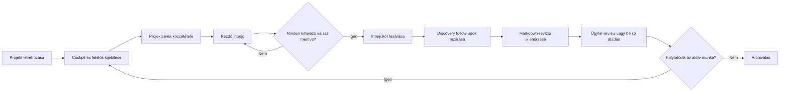
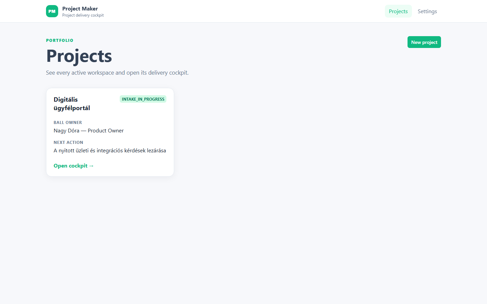
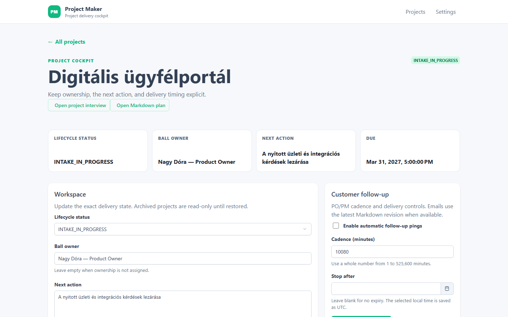
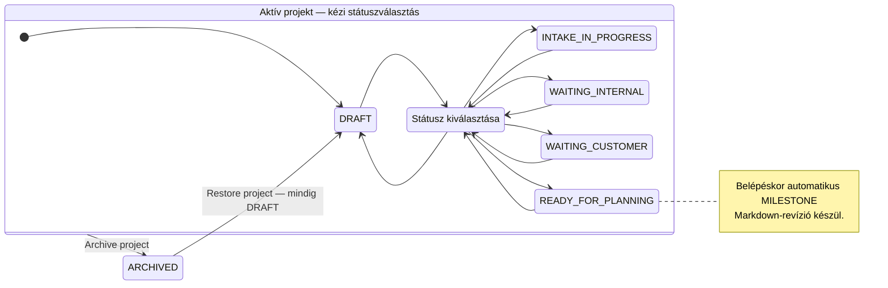
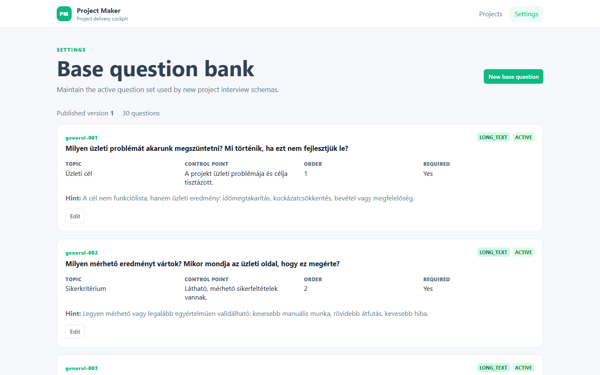
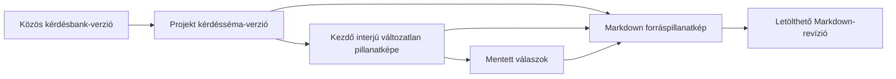
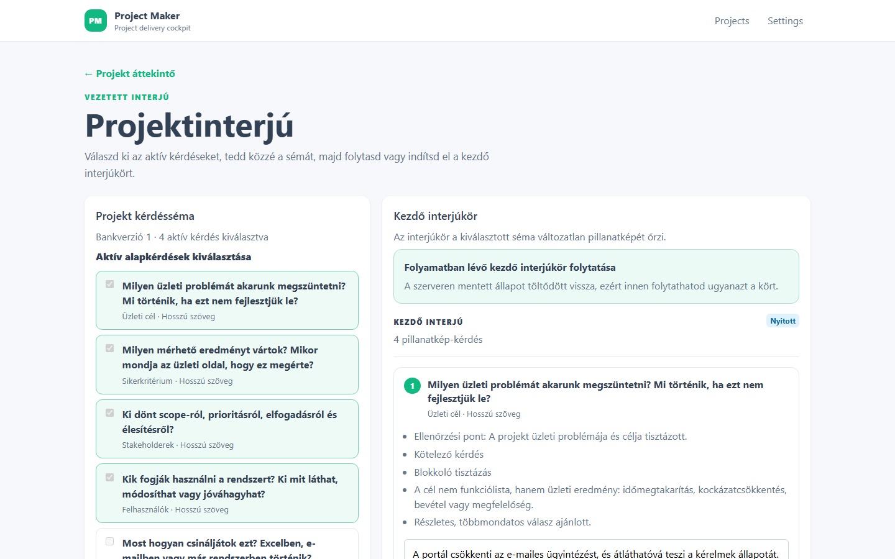
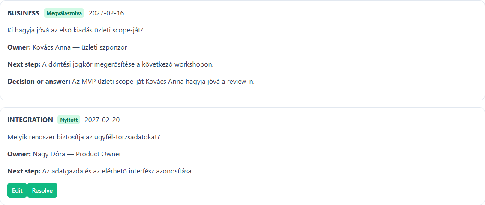
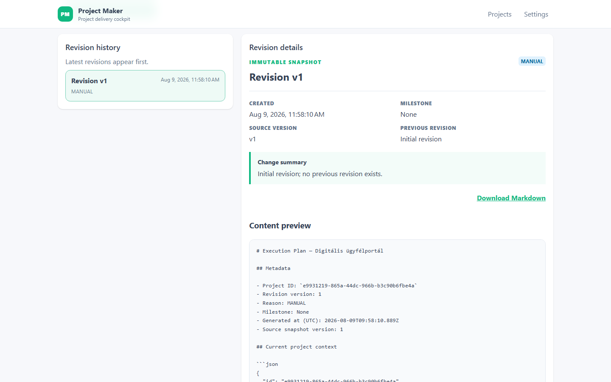

# Project Maker felhasználói kézikönyv

A Project Maker a discovery és az igények tisztázásának közös munkafelülete. Ez a kézikönyv úgy vezeti végig a napi használaton, mintha most kapnád meg először az alkalmazást.

Megmutatja, mit érdemes rögzíteni, mit jelent az eredmény, mikor történik külső hatás, és hogyan folytathatod biztonságosan, ha valami megszakad.

**Tartalom**

- [Hogyan használd ezt az útmutatót?](#hogyan-használd-ezt-az-útmutatót)
- [Project Maker öt percben](#project-maker-öt-percben)
- [Mielőtt dolgozni kezdesz](#mielőtt-dolgozni-kezdesz)
- [A felület térképe](#a-felület-térképe)
- [A teljes napi workflow](#a-teljes-napi-workflow)
- [Első projekted: vezetett gyorsindítás](#első-projekted-vezetett-gyorsindítás)
- [Projektek és a portfolio](#projektek-és-a-portfolio)
- [A projekt cockpit használata](#a-projekt-cockpit-használata)
- [A közös kérdésbank kezelése](#a-közös-kérdésbank-kezelése)
- [Projektséma és kezdő interjú](#projektséma-és-kezdő-interjú)
- [Discovery follow-upok kezelése](#discovery-follow-upok-kezelése)
- [Ügyfél-emlékeztetők és review email](#ügyfél-emlékeztetők-és-review-email)
- [Markdown-revíziók és átadási pillanatképek](#markdown-revíziók-és-átadási-pillanatképek)
- [Audit history: mi történt a projekttel?](#audit-history-mi-történt-a-projekttel)
- [Archiválás, visszaállítás és végleges törlés](#archiválás-visszaállítás-és-végleges-törlés)
- [Hibahelyzetek és biztonságos folytatás](#hibahelyzetek-és-biztonságos-folytatás)
- [Fogalomtár és állapotreferencia](#fogalomtár-és-állapotreferencia)
- [Mit nem tud még a jelenlegi verzió?](#mit-nem-tud-még-a-jelenlegi-verzió)
- [Napi és átadási ellenőrzőlisták](#napi-és-átadási-ellenőrzőlisták)

## Hogyan használd ezt az útmutatót?

Ha még nem dolgoztál a Project Makerrel, olvasd végig a [vezetett gyorsindítást](#első-projekted-vezetett-gyorsindítás), majd haladj a részletes fejezetekkel a napi workflow sorrendjében. Ha már ismered az alapokat, a tartalomjegyzékből közvetlenül megnyithatod az adott műveletet vagy hibahelyzetet.

A leírás elsődleges olvasója PM, PO, BA vagy más discovery-munkatárs. A [közös kérdésbank](#a-közös-kérdésbank-kezelése) fejezete annak a kijelölt szervezeti gazdának is szól, aki a minden projektre ható kérdéskészletet gondozza.

Az alkalmazás felülete jelenleg részben angol, részben magyar. A kézikönyv az angol gomb- és mezőfeliratokat változtatás nélkül, `ilyen formában` idézi, majd magyarul elmagyarázza a jelentésüket. A képernyőn megjelenő felirat kismértékben változhat, de mindig a művelet üzleti hatását ellenőrizd.

Minden részletes workflow ugyanarra a hét kérdésre válaszol:

1. Mi a művelet üzleti célja?
2. Milyen állapotból szabad elkezdeni?
3. Pontosan mit kell megtenni?
4. Mi marad meg a rendszerben, vagy mi jut el külső címzetthez?
5. Miből látszik, hogy sikerült?
6. Mi akadályozhatja meg?
7. Mi a biztonságos következő lépés?

> **Fontos különbség:** a Project Maker discovery- és igénytisztázó eszköz. Nem általános projektmenedzsment-rendszer, nem feladatkezelő, nem erőforrás-tervező, és a jelenlegi verzió nem számít automatikus készültségi vagy döntési pontszámot.

## Project Maker öt percben

A Project Makerben egy projekt nem egyszerűen egy név. Egy közös munkatér, amely összeköti:

- az ügyfél kapcsolattartóját;
- az aktuális felelőst, következő lépést és határidőt;
- a projektre kiválasztott kérdéssémát;
- a vezetett kezdő interjú mentett válaszait;
- a nyitott és lezárt discovery-kérdéseket;
- az ügyfél-emlékeztetők állapotát;
- a változatlan Markdown-pillanatképeket;
- a fontosabb események auditnyomát.

Az alkalmazás napi használatának lényege röviden:

| Helyzet | Mit tegyél? | Mi lesz az eredmény? |
| --- | --- | --- |
| Új igény érkezett | Hozz létre projektet a kapcsolattartóval | Létrejön egy `DRAFT` cockpit |
| Elindul az igényfelmérés | Adj felelőst, következő lépést, határidőt, és válassz státuszt | A portfólióban mindenki ugyanazt az operatív állapotot látja |
| Megvan a workshop kérdésköre | Tedd közzé a projektsémát | Rögzül, mely kérdések tartoznak ehhez a projekthez |
| Elindul az interjú | Indíts kezdő interjúkört és rögzítsd a válaszokat | A kör saját, változatlan kérdéspillanatképet kap |
| Új bizonytalanság merült fel | Hozz létre discovery follow-upot felelőssel és dátummal | A tisztázandó pont számonkérhetően megmarad |
| Átadási pont vagy review következik | Generálj és ellenőrizz Markdown-revíziót | Letölthető, változatlan projektpillanatkép készül |
| Lezárult az aktív munka | Archiváld a projektet | A történet megmarad, az aktív cockpit-módosítások leállnak |

Az alkalmazás nem kényszerít végig egy varázslón. A jó minőségű adat és a helyes sorrend a munkát végző csapat felelőssége.

## Mielőtt dolgozni kezdesz

### Működési és hozzáférési határ

> **Biztonsági határ:** a jelenlegi alkalmazásban nincs bejelentkezés, felhasználói azonosítás vagy jogosultság-ellenőrzés. Csak a szervezet által kontrollált belső hálózaton vagy VPN-határon belül használd. Aki eléri a webappot, az projektadatot és a közös kérdésbankot is módosíthatja.

A `Settings` menüpont technikailag nincs adminszerephez kötve. Szervezetileg mégis csak a kijelölt kérdésbank-gazda használja, mert egyetlen mentés minden későbbi projektsémára ható új bankverziót hoz létre.

Az alkalmazás nem mutatja meg, ki végzett egy műveletet. Egyezzetek meg a csapatban arról, ki a projekt operatív gazdája, és változtatás előtt ellenőrizzétek, hogy nem dolgozik-e valaki ugyanazon az adaton.

### Adatbiztonsági alapszabályok

- Csak a discoveryhez szükséges üzleti adatot rögzítsd.
- Ne írj jelszót, hozzáférési tokent, privát kulcsot vagy más titkot válaszba, follow-upba, Markdownba vagy mezőbe.
- Ügyfélnek küldés előtt ellenőrizd a projekt létrehozásakor megadott kapcsolattartó e-mail-címét.
- Ügyfél-review előtt olvasd át a legfrissebb Markdown-előnézetet; a kiküldés annak tartalmát használja.
- Hasznos történettel rendelkező projektet archiválj. A törlés csak üres, korai piszkozat eltávolítására való.
- Archivált projektet előbb állíts vissza, és csak utána hozz létre új tartalmat, még akkor is, ha egy közvetlen oldal technikailag megnyitható.

### Mit jelent a képernyő állapota?

| Jelenség | Jelentés | Teendő |
| --- | --- | --- |
| Forgó betöltésjelző | A webapp még adatot kér | Várj; ne indíts párhuzamos műveletet |
| Zöld sikerüzenet | A művelet választ kapott és sikerült | Ellenőrizd a megváltozott állapotot is |
| Piros hibaüzenet | A kérés nem fejeződött be | Olvasd el, mi maradt meg, majd a hiba szerinti helyreállítást kövesd |
| Letiltott gomb | Előfeltétel hiányzik, mentés folyik, vagy az állapot nem engedi a műveletet | Fejezd be a folyamatban lévő műveletet, mentsd a módosított beállítást, vagy állítsd vissza a projektet |
| `Try again`, `Retry` vagy `Újrapróbálás` | A betöltés vagy mentés megismételhető | Stabil kapcsolat mellett indítsd újra ugyanazt a kérést |

## A felület térképe

A felső navigáció két állandó kiindulópontot ad:

- `Projects`: a projektportfólió és minden projekt cockpitjének bejárata;
- `Settings`: a szervezeti szintű közös kérdésbank.

Egy projekten belül az oldalak közötti visszalépő linkek őrzik a munkafolyamatot: `All projects` visszavisz a portfólióba, `Projekt áttekintő` vagy `Project cockpit` pedig az adott projekthez.

| Felület | Mire való? | Legfontosabb műveletek |
| --- | --- | --- |
| `Projects` | Aktív és archivált projektek áttekintése | Új projekt, cockpit megnyitása |
| `Project cockpit` | Operatív állapot és projektközpont | Workspace mentése, follow-upok, e-mail, audit, lifecycle |
| `Projektinterjú` | Projektséma és kezdő interjú | Séma közzététele, kör indítása, válaszadás, lezárás |
| `Markdown execution plan` | Változatlan átadási pillanatképek | Revízió generálása, összehasonlítás, előnézet, letöltés |
| `Base question bank` | Minden projekt közös kérdéskészlete | Kérdés létrehozása, új verziót létrehozó szerkesztés |

Ha egy projekt vagy revízió közvetlen linkje már nem létező elemre mutat, térj vissza a projektlistára, és nyisd meg újra a kívánt elemet a felületről. Ne próbáld kézzel javítani az oldal címét.

## A teljes napi workflow

Az alábbi ábra a javasolt üzleti sorrendet mutatja. Nem rendszer által kikényszerített varázsló: a projekt státuszát és a lépések időzítését a csapat kézzel kezeli.

### 1. Indítás és közös kontextus

Hozd létre a projektet, majd a cockpitben tedd egyértelművé, ki viszi a következő labdát, mi az egyetlen konkrét következő lépés, és mikorra esedékes. A státusz azt fejezze ki, mi akadályozza vagy mi viszi előre az igényfelmérést.

### 2. Kérdéskör rögzítése

Válaszd ki az aktív alapkérdések közül az adott projekthez szükségeseket, és tedd közzé a projektsémát. Ettől kezdve a csapat vissza tudja vezetni, melyik bankverzióból és mely kérdésekből indult az interjú.

### 3. Interjú és megszakításbiztos mentés

Indíts kezdő interjúkört. Szöveges válasz után várd meg a `Mentve` állapotot; választó, jelölő, szám- és dátumválasz azonnal ment. Megszakítás után ugyanaz a nyitott kör töltődik vissza.

### 4. Nyitott tisztázások

Az interjú közben felmerülő, később megválaszolandó pontokat ne rejtsd el egy hosszú válaszban. Hozz létre külön discovery follow-upot kategóriával, felelőssel, valódi céldátummal és következő lépéssel. Lezáráskor a döntést vagy választ is rögzítsd.

### 5. Pillanatkép és kommunikáció

Átadás vagy ügyfél-review előtt generálj friss Markdown-revíziót. Nézd meg a forráspillanatképet és az előnézetet. Csak ezután használd a customer review küldést. Egyszerű emlékeztető pinghez nem kötelező Markdown, de ha van, a legfrissebb bekerülhet az üzenetbe.

### 6. Megőrzés

Ha az aktív munka véget ér, archiválj. A projekt a listában és az auditban megmarad. Törölni csak valóban üres `DRAFT` projektet szabad és lehet.

## Első projekted: vezetett gyorsindítás

Ez a gyorsindítás egy teljes, biztonságos első kört mutat. A részletes szabályokat a hivatkozott fejezetekben találod.

### Előfeltétel

- A webapp a szervezet belső hálózatán elérhető.
- Ismered az ügyfél kapcsolattartójának helyes nevét és e-mail-címét.
- Tudod, ki a belső operatív felelős.
- A `Settings` kérdésbankban van legalább egy aktív kérdés.

### Lépések

1. Nyisd meg a `Projects` oldalt, és válaszd a `New project` gombot.
2. Add meg a projekt nevét, a kapcsolattartó nevét és e-mail-címét.
3. Válaszd a `Create and open cockpit` gombot.
4. A cockpit `Workspace` részében állítsd a státuszt `INTAKE_IN_PROGRESS` értékre.
5. Add meg a `Ball owner`, `Next action` és szükség szerint a `Due date and time` mezőt, majd válaszd a `Save workspace` gombot.
6. Nyisd meg az `Open project interview` oldalt.
7. Ellenőrizd a kijelölt kérdéseket, majd válaszd a `Séma közzététele` gombot.
8. Indítsd el a kört a `Kezdő interjú indítása` gombbal.
9. Rögzítsd a válaszokat. Szöveges mezőknél várd meg a `Mentve` visszajelzést.
10. A kötelező válaszok mentése után válaszd az `Interjúkör lezárása` gombot.
11. Térj vissza a cockpitbe. Minden későbbi tisztázandó pontból hozz létre külön discovery follow-upot.
12. Átadás előtt nyisd meg az `Open Markdown plan` oldalt, és válaszd a `Generate Markdown revision` gombot.
13. Ellenőrizd a `Content preview` tartalmát és a revízió metaadatait.
14. Ha ügyfélnek küldesz, előbb ellenőrizd a kapcsolattartó címét a cockpitben, majd használd a megfelelő küldési műveletet.
15. Amikor már nincs aktív munka, térj vissza a cockpitbe, és archiváld a projektet.

### A gyorsindítás akkor kész, ha

- a projektkártyán látszik a felelős és a következő lépés;
- a projektséma verziószáma megjelenik;
- nincs nyitott, mentési hibás válasz;
- a kezdő interjúkör lezárult;
- minden még nyitott bizonytalanságnak van follow-up gazdája és dátuma;
- a legfrissebb Markdown-revízió tartalmát valaki elolvasta;
- az audit historyban megjelentek a fő mérföldkő-események.

## Projektek és a portfolio

*A projektlista a napi munka kiindulópontja; a státusz, a felelős és a következő lépés már a kártyán látható.*

### A projektlista értelmezése

A `Projects` oldalon minden projekt egy kártya. A kártya megmutatja:

- a projekt nevét;
- az aktuális lifecycle státuszt;
- a `Ball owner` értékét, vagy `Not assigned` jelzést;
- a `Next action` értékét, vagy `Not defined` jelzést;
- az `Open cockpit` belépési pontot.

A lista a projekt saját workspace- vagy lifecycle-mentésének legutóbbi ideje szerint rendezi előre a kártyákat. Egy interjúválasz vagy follow-up önmagában nem feltétlenül mozgatja előre a projektet.

Azonos módosítási idő esetén a sorrend stabil marad. Az archivált projekt nem tűnik el: `ARCHIVED` státusszal ugyanebben a listában marad, hogy a történet később is megtalálható legyen.

### Betöltés, üres lista és hiba

- `Loading projects…`: várd meg a betöltést.
- `No projects yet`: még nincs projekt. A `Create a project` gomb ugyanazt az űrlapot nyitja meg, mint a `New project`.
- `Projects could not be loaded`: a lista nem érhető el. A `Try again` megismétli a betöltést.

Betöltési hiba nem töröl projektet és nem hoz létre újat. Ha a `Try again` ismét hibázik, ne töltsd ki újra több böngészőlapon ugyanazt a projektet; jelezd az üzemeltetőnek, hogy a webapp vagy a háttérszolgáltatás nem elérhető.

### Új projekt létrehozása

**Mikor használd?** Amikor új, önálló discovery- vagy igénytisztázási munkatérre van szükség. Ne hozz létre második projektet pusztán azért, mert a meglévő projekt éppen várakozik vagy archivált; előbb ellenőrizd, hogy azt kell-e visszaállítani.

1. Válaszd a `New project` gombot.
2. Töltsd ki a `Project name` mezőt. Legyen egyértelmű, legfeljebb 255 karakteres név.
3. Töltsd ki a `Customer contact name` mezőt a tényleges kapcsolattartó nevével; a mező legfeljebb 255 karaktert fogad el.
4. Töltsd ki a `Customer contact email` mezőt érvényes, legfeljebb 320 karakteres e-mail-címmel.
5. Ellenőrizd még egyszer a címet. A jelenlegi felületen később sem a projekt neve, sem a kapcsolattartó neve vagy e-mail-címe nem szerkeszthető.
6. Válaszd a `Create and open cockpit` gombot.

Siker esetén a webapp létrehoz egy `DRAFT` projektet, és közvetlenül megnyitja a cockpitjét. A projekt már a portfólióban is látható.

Ha meggondoltad magad, a `Cancel` bezárja az űrlapot és nem hoz létre projektet. Ha az űrlap mezőhibát jelez, javítsd a kiemelt értéket; a projekt csak sikeres szerverválasz után jön létre.

> **Kapcsolattartói adat javítása:** mivel jelenleg nincs szerkesztőművelet, hibás név vagy e-mail esetén ne küldj levelet.
>
> Ha a projekt még teljesen üres `DRAFT`, törölhető és helyesen újralétrehozható. Ha már van megőrzendő tevékenysége, archiváld, és a csapattal egyeztetett módon hozz létre helyes projektet. A régi történetet ne próbáld törléssel eltüntetni.

## A projekt cockpit használata

*A cockpit teteje a napi döntéshez szükséges négy adatot emeli ki: állapot, felelős, következő lépés és esedékesség.*

### Mire való a cockpit?

A cockpit az adott projekt központi operatív nézete. Innen nyitható meg a projektinterjú és a Markdown-oldal, itt kezelhető a workspace, az ügyfélkommunikáció, a discovery follow-up lista, az audit history és a projekt életciklusa.

A felső összefoglaló csak a legutóbb sikeresen mentett állapotot mutatja. Ha egy mezőt átírtál, de még nem választottad a `Save workspace` gombot, a kártyák és a projektlista nem tekinthetők frissnek.

### Lifecycle státuszok üzleti jelentése

| Státusz | Mikor használd? | Mit nem jelent? |
| --- | --- | --- |
| `DRAFT` | Előkészítés; a projekt még szabadon formálódik | Nem jelenti, hogy törölhető: korábbi tevékenység ezt megakadályozhatja |
| `INTAKE_IN_PROGRESS` | Aktív igényfelmérés, workshop vagy interjú folyik | Nem jelenti, hogy minden kérdésnek van válasza |
| `WAITING_INTERNAL` | A következő érdemi lépés belső információra vagy döntésre vár | Nem automatikus; a felelősnek kell átállítania |
| `WAITING_CUSTOMER` | A következő érdemi lépés ügyfélválaszra vár | Nem küld automatikusan levelet pusztán a státusz miatt |
| `READY_FOR_PLANNING` | A felhasználó üzletileg tervezésre késznek jelöli | A rendszer nem számol readiness értéket és nem igazolja a teljességet |
| `ARCHIVED` | Az aktív követés lezárt, a történet megmarad | Nem törlés; visszaállítható, de mindig `DRAFT` állapotba |

Az öt aktív státusz közül bármelyiket közvetlenül kiválaszthatod; nincs kényszerített státuszsorrend és nincs automatikus readiness-kapu. A csapatnak kell gondoskodnia arról, hogy a választott státusz megfeleljen a valós helyzetnek.

### A workspace mezői

| Mező | Üzleti jelentés | Jó kitöltési minta |
| --- | --- | --- |
| `Lifecycle status` | Hol tart vagy mire vár az igényfelmérés | `WAITING_CUSTOMER`, ha ténylegesen ügyfélválasz kell |
| `Ball owner` | Kinél van a következő érdemi lépés felelőssége | Személy és szükség esetén szerep, legfeljebb 255 karakter |
| `Next action` | Egyetlen konkrét, végrehajtható következő lépés | „Adatgazdával az API elérhetőségének megerősítése” |
| `Due date and time` | Mikorra kell megtörténnie a következő lépésnek | A csapat helyi idejében kiválasztott pontos időpont |

A `Ball owner`, a `Next action` és a határidő elhagyható. Az üres érték azonban a projektkártyán `Not assigned`, `Not defined` vagy `No due date` formában jelenik meg, ezért csak akkor hagyd üresen, ha ez valóban a közös álláspont.

A `Next action` legfeljebb 10 000 karakter lehet, de a jó következő lépés rövid, cselekvő igével kezdődik, egy felelőshöz köthető és ellenőrizhető eredménye van. Ne használd jegyzőkönyv vagy backlog helyett.

A dátumválasztó a helyi dátumot és időt mutatja, a mentés pedig azt pontos időpillanatként őrzi meg. Ha más időzónában dolgozó kollégával egyeztetsz, a mentés előtt mondd ki az időzónát is.

### Workspace mentése

**Előfeltétel:** a projekt nem archivált, és nincs más mentés, lifecycle-művelet, e-mail-küldés vagy follow-up módosítás folyamatban.

1. Módosítsd a szükséges mezőket.
2. Ellenőrizd, hogy a státusz a valós üzleti helyzetet írja le.
3. Válaszd a `Save workspace` gombot.
4. Várd meg a sikerüzenetet és a felső összefoglaló frissülését.

Mentés közben a kapcsolódó műveletek letiltva maradhatnak. Ez megakadályozza, hogy ugyanarról az oldalról két egymással versengő változtatást indíts.

Hiba esetén az utoljára sikeresen mentett szerverállapot marad érvényes. Ellenőrizd a mezőhibát vagy a kapcsolatot, majd ismételd meg a mentést. Ha közben egy másik munkatárs archiválta vagy módosította a projektet, töltsd újra a cockpitot, és a friss állapotból dönts.

### A `READY_FOR_PLANNING` mellékhatása

Amikor a projekt más aktív státuszból `READY_FOR_PLANNING` állapotba kerül, a rendszer automatikusan létrehoz egy `MILESTONE` Markdown-revíziót `READY_FOR_PLANNING` mérföldkőnévvel. Ez akkor is megtörténik, ha a státuszválasztás üzletileg elhamarkodott volt.

Sikeres mentés után ezért:

1. nyisd meg az `Open Markdown plan` oldalt;
2. ellenőrizd az új mérföldkő-revízió forrását és előnézetét;
3. ha hiányt találsz, állítsd vissza a projekt valós aktív státuszát, pótold az adatot, majd később jelöld újra tervezésre késznek.

A már létrejött revízió nem törölhető és nem írható át; a helyesbítés újabb revízióban jelenik meg.

## A közös kérdésbank kezelése

*A bankverzió azt jelzi, melyik változatból készülhetnek új projektsémák; egy korábbi projektpillanatképet a későbbi szerkesztés nem ír át.*

### Ki kezelje?

> **Szervezeti felelősség:** a `Settings` oldal technikailag minden alkalmazás-hozzáféréssel rendelkező személy számára elérhető. Mégis csak a kijelölt kérdésbank-gazda módosítsa, mert minden sikeres létrehozás vagy szerkesztés új, közös bankverziót publikál.

A kérdésbank célja, hogy a csapat ugyanazzal a discovery-szókészlettel és ellenőrzési logikával dolgozzon. Nem egy projekthez tartozik. Ha csak egyetlen projektben szeretnél kihagyni egy kérdést, ne inaktiváld globálisan; a projekt kérdéssémájában vedd ki a kijelölést.

### A lista olvasása

Az oldal tetején látható a `Published version` és a kérdések száma. Minden kártyán szerepel:

- a változatlan `Stable key`;
- a kérdés szövege és témája;
- a `Control point`, vagyis milyen tisztázottságot ellenőriz;
- a sorrend;
- a kérdéstípus;
- az aktív állapot;
- a `Required` állapot;
- a válaszadást segítő `Hint`, ha van.

Az `Edit` nem a régi sort írja felül. A módosított kérdéssel és a többi kérdés átvitt állapotával új, változatlan bankverzió készül.

Ha a bank üres, a `No base questions yet` állapot és a `Create a question` gomb jelenik meg; ez ugyanazt a létrehozó űrlapot nyitja meg. Egy kérdéskártyán látható `ARCHIVED` címke ezen az oldalon inaktív alapkérdést jelent, nem archivált projektet.

### Új alapkérdés létrehozása

**Mikor használd?** Ha a kérdés több projektben is értelmes, szervezetileg elfogadott, és megfogalmazása elég stabil ahhoz, hogy későbbi projektsémák alapja legyen.

1. Válaszd a `New base question` gombot.
2. Adj `Stable key` értéket. Legfeljebb 100 karakter lehet, csak kisbetűt, számot és kötőjelet tartalmazhat, például `customer-data-owner`.
3. Add meg a `Topic` értéket legfeljebb 255 karakterben.
4. A `Control point` mezőben fogalmazd meg, milyen állapotot vagy döntést igazol a válasz.
5. Válaszd ki a `Question type` értéket.
6. Írd be a `Question text` tartalmát úgy, ahogyan a workshopon feltennéd.
7. Add meg az `Order` egész számot. Új kérdésnél csak a jelenlegi lista érvényes pozíciója vagy annak vége használható.
8. Szükség esetén adj `Hint` szöveget. Ez segítség, nem helyettesíti a kérdést.
9. Választós típusnál írd be az `Options` értékeket, soronként egyet.
10. Állítsd be a négy viselkedési jelölőt.
11. Válaszd a `Create question` gombot.

Siker esetén a bank verziószáma eggyel nő, a kérdés megjelenik a beállított pozíción, és az utána következő kérdések sorrendje eltolódik. A sikerüzenet és az új `Published version` együtt igazolja a publikálást.

A `Cancel` elveti a megnyitott űrlap helyi tartalmát, és nem hoz létre új verziót.

### Meglévő kérdés szerkesztése

1. A megfelelő kártyán válaszd az `Edit` gombot.
2. Ellenőrizd, hogy valóban a legfrissebb bankverzió kérdését nyitottad meg.
3. Módosítsd a témát, ellenőrzési pontot, szöveget, típust, sorrendet, hintet, opciókat vagy jelölőket.
4. A `Stable key` nem szerkeszthető. Ez biztosítja, hogy a kérdés azonosítható maradjon a verziók között.
5. Válaszd a `Save changes` gombot.

Ha más közben új bankverziót publikált, a régi kártyáról indított mentés ütközhet. Töltsd újra az oldalt, olvasd el a legfrissebb kérdést, és csak azután ismételd meg a szándékos módosítást.

Kérdés törlése nincs. Ha egy kérdést a jövőben nem szabad új projektsémába választani, állítsd az `Active` jelölőt kikapcsolt állapotba. Ez a későbbi kiválasztásból kiveszi, de a korábbi projektsémák és interjúk történetét nem módosítja.

### A hét kérdéstípus

| Típus | Mire való? | Válasz az interjúban |
| --- | --- | --- |
| `TEXT` | Rövid, tömör szöveges tény | Egysoros szöveg |
| `LONG_TEXT` | Magyarázat, üzleti cél, folyamat vagy döntési háttér | Többsoros szöveg |
| `SINGLE_SELECT` | Pontosan egy előre meghatározott lehetőség | Egy elem a listából |
| `MULTI_SELECT` | Több, egymással együtt is igaz lehetőség | Egy vagy több jelölőnégyzet |
| `BOOLEAN` | Igen/nem állítás | Bejelölt állapot: igen; kikapcsolt, már mentett állapot: nem |
| `NUMBER` | Véges numerikus érték | Számmező |
| `DATE` | Naptári nap | `ÉÉÉÉ-HH-NN` dátum |

`SINGLE_SELECT` és `MULTI_SELECT` esetén legalább egy nem üres opciónak kell lennie. Soronként egy opciót írj; az üres sorokat a rendszer figyelmen kívül hagyja, az azonos opciókat viszont elutasítja. Más kérdéstípushoz nem tartozhat opciólista.

Típusváltáskor mindig ellenőrizd, hogy a kérdés jelentése és a korábbi válaszolási elvárás összhangban marad-e. A változtatás csak későbbi sémákra és körökre hat; a már elindított kör megőrzi a régi típust és opciókat.

### A négy viselkedési jelölő

| Jelölő | Jelenlegi tényleges hatás |
| --- | --- |
| `Required` | Válasz nélkül a szerver nem engedi lezárni az interjúkört |
| `Required for estimate` | Metaadatként megmarad, de a jelenlegi verzió nem számol becslési készültséget és nem állít kaput |
| `Blocking` | A nyitott körben kiemelt tisztázási útmutatást mutat; önmagában nem akadályozza a lezárást |
| `Active` | Bekapcsolva megjelenik az új projektséma-választásban; kikapcsolva új sémába nem választható |

Ha egy blokkoló kérdésnek ténylegesen meg kell akadályoznia a kör lezárását, a `Required` jelölőt is kapcsold be. A `Required for estimate` jelölőből jelenleg ne következtess automatikus pontszámra vagy készültségi állapotra.

### Tipikus mentési hibák és helyreállítás

| Helyzet | Biztonságos folytatás |
| --- | --- |
| A stable key formátuma hibás vagy már létezik | Válassz egyedi, kisbetűs-kötőjeles kulcsot; meglévő fogalomnál inkább a régi kérdést szerkeszd |
| A sorrend kívül esik a listán | Adj 1 és az engedett utolsó pozíció közötti egész számot |
| Választós kérdésnek nincs opciója | Adj legalább egy nem üres sort |
| Két opció azonos | Egyesítsd vagy nevezd át őket úgy, hogy üzletileg is különbözzenek |
| A bank nem töltődik be | Válaszd a `Try again` gombot; ne hozz létre párhuzamos másolatot másik lapon |
| Mentés közben új bankverzió született | Töltsd újra az oldalt, hasonlítsd össze a friss állapotot, majd ismételd meg a szükséges módosítást |

## Projektséma és kezdő interjú

A projektséma azt rögzíti, hogy a közös kérdésbank aktuális kérdései közül melyek tartoznak az adott projekthez. A kezdő interjúkör pedig erről a sémáról készít saját, változatlan pillanatképet.

Egy későbbi kérdésbank-szerkesztés nem írja át a már közzétett projektsémát vagy a megkezdett interjúkört. A Markdown a létrehozás pillanatában elérhető projekt-, séma-, kör- és válaszadatot másolja saját forráspillanatképébe.

A discovery follow-upok és customer follow-up beállítások jelenleg nem részei ennek a Markdown-forrásnak.

*Bal oldalon a projekthez kiválasztott kérdések, jobb oldalon a változatlan körpillanatkép és a szerveren mentett válaszok láthatók.*

### Projektséma közzététele

**Előfeltétel:** van legalább egy aktív alapkérdés, és nincs nyitott kezdő interjúkör.

Első megnyitáskor a felület minden aktuálisan aktív alapkérdést kijelöl. Ez kiindulási ajánlás, nem kötelező teljes lista.

1. A cockpitben válaszd az `Open project interview` gombot.
2. Olvasd el az `Aktív alapkérdések kiválasztása` listát.
3. Hagyd kijelölve az adott projekthez szükséges kérdéseket, a nem relevánsakat vedd ki.
4. Legalább egy kérdésnek kijelölve kell maradnia.
5. Első alkalommal válaszd a `Séma közzététele` gombot.
6. Ellenőrizd a `Közzétett séma v… (bank v…)` visszajelzést.

A séma saját verziószáma azt mutatja, hányadik közzétett projektsémát látod. A bankverzió azt jelzi, melyik közös kérdésbankból készült. A két számnak nem kell azonosnak lennie.

Ha nincs aktív alapkérdés, a felület `Nincs aktív alapkérdés` állapotot mutat. Ne indíts interjút. Kérd meg a kijelölt kérdésbank-gazdát, hogy legalább egy megfelelő kérdést aktiváljon, majd töltsd újra az oldalt.

### Projektséma frissítése

**Mikor használd?** Ha a következő interjúkör kérdésköre változik, és nincs nyitott kör.

1. Módosítsd a kijelöléseket.
2. Válaszd a `Séma frissítése` gombot.
3. Ellenőrizd, hogy a sémaverzió eggyel nőtt.

A frissítés utódsémát hoz létre. Egy korábbi nyitott vagy lezárt kör kérdései nem változnak. Az új séma csak a később indított körre hat.

Nyitott kör alatt a jelölőnégyzetek és a publikálási gomb le vannak tiltva, és megjelenik: `A séma zárolva van, amíg a nyitott kezdő interjúkör fut.` Előbb fejezd be a mentéseket és zárd le a kört; a kör közben ne próbáld a kérdéslistát megváltoztatni.

### Kezdő interjúkör indítása és folytatása

A jelenlegi felület egyetlen körtípust szállít: `INITIAL_INTAKE`, magyarul kezdő interjú. Stakeholder- vagy clarification-kör jelenleg nincs.

**Előfeltétel:** van közzétett projektséma, és nincs másik nyitott kezdő interjúkör.

1. Válaszd a `Kezdő interjú indítása` gombot.
2. Várd meg a `Nyitott` állapotot és a kérdéskártyákat.
3. Haladj a kérdéseken a workshop természetes sorrendjében.

Az indítás a projektséma teljes, változatlan pillanatképét másolja a körbe: kérdésszöveg, téma, ellenőrzési pont, típus, opciók, `Required`, `Blocking` és hint. Ezért egy későbbi bank- vagy sémamódosítás a futó körön nem látszik.

Ha elnavigálsz, bezárod a böngészőt vagy az alkalmazás újraindul, a következő megnyitáskor a `Folyamatban lévő kezdő interjúkör folytatása` állapot tölti vissza ugyanazt a nyitott kört és a szerveren mentett válaszokat.

Ne indíts pótkört megszakítás miatt. A szerver eleve megakadályozza, hogy ugyanahhoz a projekthez két nyitott kezdő kör legyen.

### A kérdéskártya értelmezése

Minden kérdésnél látható:

- a kérdés sorszáma és szövege;
- a téma és a válasz típusa;
- az ellenőrzési pont;
- a `Kötelező kérdés` jelzés, ha a válasz lezárási feltétel;
- a `Blokkoló tisztázás` jelzés és külön figyelmeztetés;
- a kérdésbanki hint;
- a típushoz tartozó válaszadási útmutató;
- választós kérdésnél az engedett opciók;
- a válasz mentési állapota.

Az útmutatás segít jó választ adni, de nem értékeli a tartalom szakmai minőségét. A rendszer például elfogadhat egy rövid szöveget technikailag, miközben az üzletileg még nem válaszolja meg a kérdést.

### Válaszadás a hét típusra

| Típus | Művelet | Mikor indul mentés? | Hogyan üríthető? |
| --- | --- | --- | --- |
| Rövid vagy hosszú szöveg | Gépelj a mezőbe | 750 ms gépelési szünet után | Töröld a teljes szöveget; az ürítés azonnal mentődik |
| Egyszeres választás | Válassz egy opciót | Azonnal | Válaszd a kezdeti üres lehetőséget |
| Többszörös választás | Jelölj egy vagy több opciót | Minden jelölésnél azonnal | Vedd ki az összes jelölést |
| Igen/nem | Jelöld be vagy kapcsold ki az `Igen` jelölést | Azonnal | Nincs külön „nincs válasz” gomb; egy már kezelt kikapcsolt állapot `nem` válasz |
| Szám | Írj véges számértéket | Érvényes változáskor azonnal | Ürítsd ki a mezőt |
| Dátum | Válassz vagy írj naptári napot | Változáskor azonnal | Ürítsd ki a dátummezőt |

Szöveges válasz után ne lépj azonnal tovább vagy ne zárd be az oldalt. Figyeld meg a kérdés alatti mentési állapotot.

| Látható állapot | Mit jelent? | Munkatársi teendő |
| --- | --- | --- |
| `Piszkozat – automatikus mentésre vár` | A helyi szöveg még nem jutott el a szerverre | Maradj az oldalon; 750 ms gépelési csend után indul a mentés |
| `Mentés folyamatban…` | A mentési kérés úton van | Várd meg a végét a lezárás vagy elnavigálás előtt |
| `Mentve` | A szerver megőrizte az értéket | Biztonságosan továbbléphetsz |
| `Még nincs mentve` | Nincs rögzített válasz | Kötelező kérdésnél adj választ |
| `Nem sikerült menteni…` | A szerver nem fogadta el vagy nem érte el a mentést | A piszkozat látható marad; stabil kapcsolat mellett válaszd a `Mentés újrapróbálása` gombot |

Ha egy sikertelen szöveges mentés után tovább gépelsz, a képernyőn lévő legfrissebb piszkozat marad a kiindulópont. Mindig azt olvasd vissza, majd próbáld újra. Ne másold át automatikusan új körbe, mert az eredeti kör és a helyi piszkozat még helyreállítható.

### Interjúkör lezárása

**Előfeltétel:** nincs várakozó automatikus mentés, nincs folyamatban lévő kérés, nincs mentési hiba, és minden `Required` kérdésnek van mentett válasza.

1. Görgess végig a kérdéseken, és ellenőrizd a mentési állapotokat.
2. Olvasd át a kötelező és blokkoló tisztázásokat üzleti szempontból is.
3. Válaszd az `Interjúkör lezárása` gombot.
4. Várd meg a `Lezárt` állapotot; a válaszmezők ekkor letiltódnak.

Függőben lévő vagy hibás mentésnél a lezáró gomb letiltva marad. Ha egy kötelező válasz hiányzik, a szerver elutasítja a lezárást, és az oldal magyar hibaüzenetet mutat. A kör nyitott és szerkeszthető marad; töltsd ki a hiányt, várd meg a `Mentve` állapotot, majd próbáld újra.

A lezárt kör változatlan. Nem szerkeszthető, és a válaszai sem írhatók át. Ugyanazon az oldalon közvetlenül a lezárás után még láthatod letiltva, de újratöltés után a jelenlegi interjúoldal már nem listázza a lezárt körök történetét.

Korábbi körök áttekintésére a létrehozásukkor vagy később generált Markdown-revízió szolgál.

Lezárás után indíthatsz újabb kezdő interjúkört. Az új kör az akkor legfrissebb projektsémáról készít új pillanatképet, és nem másolja automatikusan az előző kör válaszait.

## Discovery follow-upok kezelése

A discovery follow-up olyan tisztázandó üzleti tétel, amelynek van egyértelmű kérdése, felelőse, céldátuma és következő lépése. Nem ugyanaz, mint a customer follow-up: előbbi belső discovery-munkaelem, utóbbi e-mail-küldési ütemezés.

*A lista külön mutatja a terminális döntést és a még nyitott, `Edit` vagy `Resolve` műveletre váró tisztázást.*

### Kategóriák

| Kategória | Mikor válaszd? | Példa |
| --- | --- | --- |
| `BUSINESS` | Üzleti cél, döntési jog, érték vagy sikerkritérium | Ki hagyja jóvá az MVP scope-ját? |
| `SCOPE` | Be- és kizárt funkció, fázishatár vagy prioritás | Része-e az első kiadásnak a tömeges import? |
| `TECHNICAL` | Technikai megvalósíthatóság vagy architekturális korlát | Mekkora válaszidő elvárt csúcsterhelésen? |
| `DATA` | Adatforrás, adatgazda, minőség vagy migráció | Mely mezők hiányoznak a meglévő törzsadatból? |
| `INTEGRATION` | Külső vagy belső rendszerkapcsolat | Melyik rendszer adja az ügyféltörzsadatot? |
| `SECURITY` | Hozzáférés, adatvédelem, megfelelőség vagy auditigény | Mely szerepkör láthat személyes adatot? |
| `OPERATIONS` | Élesítés, support, üzemeltetési felelős vagy folytonosság | Ki fogadja az éles hibajegyeket? |
| `OTHER` | Egyik fenti kategóriába sem illő, mégis számonkérendő kérdés | Melyik külső workshop időpontja végleges? |

### Új follow-up létrehozása

**Előfeltétel:** a projekt nem archivált, és nincs más cockpit-módosítás folyamatban.

1. A cockpit `Discovery follow-ups` részében válaszd ki a `Category` értéket.
2. A `Question` mezőbe egyetlen, megválaszolható tisztázást írj, legfeljebb 10 000 karakterben.
3. Az `Owner` mezőben nevezd meg azt a személyt vagy egyértelmű szerepet, akinél a következő labda van; legfeljebb 255 karakter használható.
4. A `Due date` mezőben valódi naptári céldátumot adj meg. Ez dátum, nem időpont.
5. A `Next step` mezőben írd le, mi történik a válasz megszerzéséért, legfeljebb 10 000 karakterben.
6. Válaszd a `Create discovery follow-up` gombot.

Siker esetén az űrlap kiürül, zöld sikerüzenet jelenik meg, és az új tétel `Nyitott` státusszal bekerül a listába. Audit-esemény is készül.

A lista a legkorábbi `Due date` szerint rendez. Azonos dátumnál a korábban létrehozott elem kerül előre. A rendszer jelenleg nem emeli ki automatikusan a lejárt tételt, ezért a dátumok napi ellenőrzése a munkát végző csapat feladata.

### Nyitott follow-up napi szerkesztése

Csak `Nyitott` follow-up szerkeszthető. A kívánt sorban válaszd az `Edit` gombot, majd szükség szerint módosítsd az öt munkamezőt: `Category`, `Question`, `Owner`, `Due date` és `Next step`. A státusz, a terminális döntés/válasz és az elem azonosítója nem szerkeszthető.

1. Ellenőrizd a sorba betöltött értékeket, és javítsd a szükséges mezőket.
2. A `Due date` mezőbe valódi naptári dátumot adj meg; ez nem időpont.
3. Válaszd a `Save changes` gombot. Siker esetén a lista az új dátum szerint rendeződik, és újratöltés után is a mentett értékeket mutatja.
4. Ha nem akarod megtartani a helyi változtatást, válaszd a `Cancel` gombot. Ez nem küld mentést.

Ha az öt mező a megnyitott értékkel azonos marad, nincs mentendő változás: a `Save changes` nem indít felesleges írást, a verzió és az audit sem változik. Egy valódi szerkesztés `DISCOVERY_FOLLOW_UP_UPDATED` audit-eseményt készít; az audit csak az elem azonosítóját és a megváltozott mezők nevét tartalmazza, a kérdés, felelős és következő lépés szövegét nem.

Egyszerre csak egy `Edit` vagy `Resolve` űrlap lehet nyitva. Ha más közben szerkeszti, lezárja vagy archiválja a projektet, a mentés ütközést jelezhet. Ilyenkor a beírt piszkozat megmarad, a lista a szerver aktuális állapotára frissül, és a mentés nem ír felül senkit. Ne töltsd újra általánosan az oldalt, mert ez eldobná a megőrzött helyi szerkesztőpiszkozatot. Ha a frissítés sikertelen, és megjelenik a `Retry current version refresh`, ezt válaszd először. Csak sikeres frissítés után válaszd nyitott tételnél a `Reload current version` gombot, hasonlítsd össze az értékeket, majd szükség esetén írd be újra a saját változtatásodat és mentsd el. Ha a frissített tétel már terminális, nem szerkeszthető és nem tölthető vissza szerkesztésre; nincs újraszerkesztés vagy újratöltés, a piszkozatot csak `Cancel` gombbal vetheted el.

### Follow-up lezárása

Egy nyitott elem csak egyszer zárható le, két terminális státusz egyikére:

- `Megválaszolva`: érdemi döntés vagy válasz született;
- `Nem releváns`: a kérdés már nem tartozik a projekthez, és ennek indokát meg kell őrizni.

1. A kívánt tételen válaszd a `Resolve` gombot.
2. Válaszd ki a terminális `Status` értéket.
3. A `Decision or answer` mezőben rögzítsd a választ, döntést vagy a nem releváns minősítés okát.
4. Ellenőrizd, hogy a szöveg önmagában is érthető egy későbbi átadásnál.
5. Válaszd a `Save resolution` gombot.

Egyszerre csak egy feloldó űrlap lehet nyitva; amíg az aktív, a többi `Resolve` gomb letiltva marad. A `Cancel` bezárja az űrlapot, és nem változtatja meg a follow-upot.

Siker után az `Edit` és a `Resolve` gomb is eltűnik, megjelenik a terminális státusz és a `Decision or answer`, valamint `DISCOVERY_FOLLOW_UP_RESOLVED` audit-esemény készül. Az audit payload a státuszt és az elem azonosítóját őrzi, nem másolja bele a döntés teljes bizalmas szövegét.

### Mi nem módosítható?

Terminális (`Megválaszolva` vagy `Nem releváns`) follow-up nem szerkeszthető és nem nyitható újra. Follow-up törlése és forráskérdéshez vagy checklist-itemhez kapcsolása sem elérhető. Hibás, még nyitott kérdés, felelős vagy dátum esetén az `Edit` folyamatot használd; lezárt tételt ne próbálj hamis válasszal helyesbíteni. Ha valóban új tisztázandó kérdés keletkezik, hozz létre új follow-upot.

### Archivált projekt

Archiválás után a discovery lista olvasható marad, de az új elem létrehozása, az `Edit` és a `Resolve` művelet letiltott. Ha archiváláskor nyitva volt egy helyi szerkesztő- vagy feloldó űrlap, annak be nem mentett szövege törlődik. Visszaállítás után a projekt `DRAFT` lesz, a meglévő follow-upok megmaradnak, és a nyitott elemek műveletei újra elérhetővé válnak.

Ha archivált állapotban kell valódi új döntést rögzíteni, előbb válaszd a `Restore project` műveletet, ellenőrizd a `DRAFT` állapotot, majd végezd el a follow-up műveletet.

## Ügyfél-emlékeztetők és review email

A cockpit `Customer follow-up` része három különböző műveletet fog össze. Ezeket ne kezeld felcserélhetőként:

1. a follow-up beállítások egy jövőbeli automatikus emlékeztető-sorozatot vezérelnek;
2. a `Send follow-up ping` azonnal elküld egyetlen emlékeztetőt;
3. a `Send customer review email` azonnal elküldi a legfrissebb Markdown-revíziót review-ra.

Mindhárom ugyanarra a címzettre támaszkodik: a projekt létrehozásakor rögzített `Customer contact email` címre. A jelenlegi felületen nincs címzett-felülírás és nincs küldés előtti megerősítő párbeszédablak.

### Automatikus follow-up beállítása

**Mikor használd?** Ha előre meghatározott időközönként ugyanannak a kapcsolattartónak emlékeztetőt kell kapnia a nyitott discovery-válaszokról.

| Mező | Jelentés |
| --- | --- |
| `Enable automatic follow-up pings` | Bekapcsolja vagy kikapcsolja az automatikus ütemezést |
| `Cadence (minutes)` | Két tervezett ping közötti idő, 1 és 525 600 perc közötti egész szám |
| `Stop after` | Opcionális jövőbeli lejárati időpont; üresen nincs időalapú lejárat |

Az alapértelmezett cadence 10 080 perc, vagyis hét nap, de ez csak kiindulási érték. A projekt valós kommunikációs megállapodása szerint állítsd be.

1. Állítsd be az engedélyezést, a cadence értéket és szükség esetén a `Stop after` időpontot.
2. Engedélyezett ütemezésnél a lejárat csak jövőbeli időpont lehet.
3. Válaszd a `Save follow-up settings` gombot.
4. Ellenőrizd az `Automatic pings`, `Cadence`, `Expires` és `Next ping` összefoglalót.

Ha bekapcsolod az automatikát, a következő ping a mentés időpontjától számított cadence alapján ütemeződik. Ha kikapcsolod, a `Next ping` megszűnik. Üres `Stop after` esetén az ütemezés nem jár le magától; a csapatnak kell kikapcsolnia vagy archiválnia a projektet.

Engedélyezéskor a rendszer ellenőrzi, hogy a levélküldés szervezetileg be van-e állítva. Ha nincs, a mentés hibával leáll, és az előző beállítás marad érvényes. Ilyenkor ne próbálkozz másik címzettel vagy ismételt kattintással; kérd az üzemeltetőt a levélküldés beállításának ellenőrzésére.

Ha a beállítások bármelyikét átírtad, de még nem mentetted, mindkét azonnali küldési gomb letiltva marad. Előbb mentsd vagy állítsd vissza a mezőket, így a küldés nem egy félkész ütemezési állapotból indul.

### A follow-up állapot értelmezése

| Megjelenő adat | Jelentés |
| --- | --- |
| `Enabled` / `Disabled` | Az automatikus ütemezés mentett állapota |
| `Last ping` | A legutóbbi automatikus vagy kézi ping kísérletének ideje; kezdetben `Never` |
| `Next ping` | A következő automatikus kísérlet tervezett ideje; kikapcsolva `Not scheduled` |
| `Last delivery` = `NEVER` | Még nem volt pingkézbesítési kísérlet |
| `Last delivery` = `SENT` | A legutóbbi ping küldése sikeres volt |
| `Last delivery` = `FAILED` | A legutóbbi ping küldése nem sikerült |
| `Delivery error` | Biztonságos hibakód, például `SMTP_SEND_FAILED`; nem tartalmaz levél- vagy hitelesítési titkot |

A `SENT` azt igazolja, hogy a levelezési szolgáltatás elfogadta a küldést. Nem bizonyítja, hogy a címzett elolvasta, jóváhagyta vagy válaszolt rá.

Lejárat után az automatikus feldolgozás kikapcsolja az ütemezést és törli a következő ping időpontját. Archivált projekthez nem küld automatikus levelet; amikor az ütemező a következő esedékes tételt feldolgozza, az archivált projekt ütemezését is kikapcsolja.

### Egyetlen kézi emlékeztető küldése

> **Külső hatás — kattintás előtt ellenőrizd:** a `Send follow-up ping` azonnal levelet küld, megerősítés és címzettválasztás nélkül. Ellenőrizd a cockpit `Customer contact` kártyáján a nevet és az e-mail-címet. Ha az adat hibás, ne küldj.

A kézi ping akkor is használható, ha az automatikus ütemezés `Disabled`. Nem kötelező hozzá Markdown-revízió. Ha van legalább egy revízió, a rendszer a legfrissebb tartalmát is hozzáadja az emlékeztetőhöz.

1. Győződj meg róla, hogy a follow-up beállítási űrlap nem módosított, és a projekt nem archivált.
2. Ellenőrizd a címzettet.
3. Ha van Markdown-revízió, szükség esetén nyisd meg külön, és olvasd át a legfrissebbet.
4. Válaszd a `Send follow-up ping` gombot.
5. Várd meg a `Customer follow-up ping sent.` sikerüzenetet.
6. Ellenőrizd a `Last ping`, `Last delivery` és az audit history értékét.

Sikertelen küldéskor `FAILED` állapot, biztonságos hibakód és `FOLLOW_UP_PING_FAILED` audit-esemény marad. A projekt, a Markdown és a beállítás nem vész el. Engedélyezett automatikánál a következő kísérlet a cadence szerint újra ütemeződik; kézi üzleti újraküldés előtt azonban előbb derítsd ki a hiba okát.

### Customer review email küldése

> **Külső hatás — nincs előnézet a cockpitben:** a `Send customer review email` azonnal a projekt legfrissebb Markdown-revízióját küldi a rögzített kapcsolattartónak.
>
> Előbb nyisd meg az `Open Markdown plan` oldalt, ellenőrizd a kijelölt legfrissebb revízió teljes `Content preview` tartalmát, majd térj vissza a cockpitbe.

A review emailhez legalább egy Markdown-revízió kötelező. Nem a follow-up ping állapotát küldi, hanem az aktuális execution-plan pillanatképet kéri jóváhagyásra vagy javításra.

1. Ellenőrizd a legfrissebb revízió verziószámát, létrehozási okát és előnézetét.
2. Ellenőrizd a cockpitben a címzettet.
3. Győződj meg róla, hogy a follow-up beállítások mentve vannak, és nincs más művelet folyamatban.
4. Válaszd a `Send customer review email` gombot.
5. Siker esetén olvasd el, melyik Markdown-verzióval ment ki a levél.
6. Ellenőrizd a `CUSTOMER_REVIEW_EMAIL_SENT` audit-eseményt.

Ha nincs revízió, a küldést a rendszer elutasítja; előbb generálj és ellenőrizz egyet. Ha a levélküldés nincs beállítva vagy a szolgáltató elutasítja a küldést, hibaüzenet és `CUSTOMER_REVIEW_EMAIL_FAILED` esemény marad. Az audit-esemény még nem bizonyít ügyféloldali kézbesítést vagy olvasást.

Archivált projektből sem kézi ping, sem customer review nem küldhető. Ha a munka valóban újraindult, előbb állítsd vissza a projektet `DRAFT` állapotba, frissítsd a workspace-t és a Markdownot, és csak utána kommunikálj.

## Markdown-revíziók és átadási pillanatképek

*A bal oldali lista a verziótörténet, a jobb oldal az éppen kiválasztott, változatlan forrás- és tartalompillanatkép.*

### Mit jelent a Markdown-revízió?

A revízió egy adott időpont projektállapotának változatlan másolata. Átadási, review- és történeti segédlet. Nem a jelenlegi cockpit élő nézete, és nem a roadmapen szereplő jövőbeli, automatikusan strukturált kanonikus specifikáció.

A forráspillanatkép jelenleg tartalmazza:

- a projekt nevét, kapcsolattartóját és workspace-adatait;
- a létrehozáskor elérhető legfrissebb projektsémát és annak kérdéseit;
- a projekt addigi interjúköreit;
- a körök kérdéspillanatképeit és mentett válaszait;
- a revízió létrehozási okát, verzióját és időpontját.

Jelenleg nem tartalmazza:

- a discovery follow-up listát, annak döntéseit vagy gazdáit;
- a customer follow-up ütemezést és pingállapotot;
- automatikus readiness vagy Decision Score eredményt;
- a később, más revízió után beírt adatokat.

Ezért átadáskor a Markdown mellett külön ellenőrizd a cockpit discovery follow-up listáját is.

### Az első revízió létrehozása

Revízió nélkül a `Revision history` rész a `No Markdown revisions yet` állapotot mutatja.

1. A cockpitben válaszd az `Open Markdown plan` gombot.
2. A `Generation reason` mezőben válassz okot.
3. Szükség esetén add meg a `Milestone` nevet.
4. Válaszd a `Generate Markdown revision` gombot.
5. Várd meg, amíg a revízió megjelenik a listában és a `Revision details` betöltődik.

| Ok | Mikor használd? | Milestone mező |
| --- | --- | --- |
| `MANUAL` | Ad hoc belső ellenőrzés, átadás vagy küldés előtti friss pillanatkép | Hagyd üresen |
| `MILESTONE` | Névvel jelölt üzleti ellenőrzési pont | Kötelező, legfeljebb 255 karakter |

A `READY_FOR_PLANNING` státuszba lépés automatikusan `MILESTONE` revíziót hoz létre. Ezt nem kell még egyszer kézzel megismételni, hacsak egy későbbi adatmódosításról nem akarsz új pillanatképet.

### A verziótörténet olvasása

A legújabb revízió van elöl. Egy listaelem megmutatja a verziószámot, az okot, az opcionális mérföldkőnevet és a létrehozási időt. A kiválasztott elem kiemelt.

A részletek jelentése:

| Adat | Jelentés |
| --- | --- |
| `Created` | Mikor készült a változatlan revízió |
| `Milestone` | A névvel jelölt üzleti ellenőrzési pont, vagy `None` |
| `Source version` | A revízió saját forráspillanatképének verziója |
| `Previous revision` | Link a közvetlen előző revízióhoz, vagy `Initial revision` |
| `Change summary` | Rövid rendszer-összefoglaló arról, mely tartalmi területek változtak |
| `Content preview` | A letölthető Markdown tényleges szövege |

A change summary tájékoztató jellegű. Nem helyettesíti a teljes előnézet elolvasását, és nem minősíti üzletileg helyesnek a változást.

Készíthető új revízió akkor is, ha az adatok nem változtak. Ilyenkor új, változatlan verzió jön létre, és az összefoglaló jelezheti, hogy nincs érdemi tartalmi eltérés. Ne generálj ismételt revíziókat pusztán azért, mert nem vártál eleget a lista frissülésére.

### Letöltés és felhasználás

1. Válaszd ki a megfelelő revíziót a bal oldali listából.
2. Ellenőrizd a verziót, az okot, a forrásverziót és a change summaryt.
3. Olvasd végig a `Content preview` tartalmát, benne a kapcsolattartói és válaszadatokkal.
4. Válaszd a `Download Markdown` hivatkozást.

A letöltött fájl neve `execution-plan.md`. A fájl egy másolat; módosítása nem változtatja meg a Project Makerben tárolt revíziót. A webappban nincs revíziószerkesztés vagy törlés. Javítás esetén módosítsd az élő projektadatot, várd meg a válaszmentéseket, majd generálj új revíziót.

### Betöltési és létrehozási hiba

- Ha a lista nem töltődik be, válaszd a `Try again` gombot.
- Ha csak a kijelölt revízió részlete hibás, válaszd a revíziórészlet saját `Try again` műveletét vagy nyiss meg másik listatételt.
- Ha a revízió időközben nem található, térj vissza a listához, és válassz létező elemet.
- Ha generáláskor mezőhiba jelenik meg, javítsd a `Milestone` értéket.
- Ha a projektadat közben változott, töltsd újra az oldalt és szándékosan generálj új pillanatképet; egy korábbi revíziót ne tekints élő állapotnak.

> **Archivált projekt:** a jelenlegi verzióban a Markdown-oldal közvetlen útvonala technikailag elérhető maradhat archiválás után is. Biztonságos munkaszabály szerint új revízió előtt mindig állítsd vissza a projektet, frissítsd a workspace-t, és csak aktív projektből készíts új átadási pillanatképet.

## Audit history: mi történt a projekttel?

Az `Audit history` a cockpitben a fontosabb projekt-eseményeket mutatja. Arra való, hogy vissza tudd követni a fő mérföldköveket és küldési kísérleteket. Nem teljes mezőszintű módosításnapló, és nem felhasználóhoz rendelt biztonsági audit.

### A lista használata

- A legújabb esemény van elöl.
- Egy oldalon legfeljebb 10 esemény jelenik meg.
- A `Previous` és `Next` gombbal mozoghatsz az oldalak között.
- A `Showing … of …` felirat jelzi a látható tartományt és az összes esemény számát.
- A `Retry audit history` csak az auditlista betöltését ismétli meg; a projekt többi adata ettől nem változik.
- Üres állapotban a `No audit events have been recorded for this project yet.` üzenet jelenik meg.

Minden eseménynek van típusa, időpontja és egy JSON-formátumú payloadja. A payload az esemény értelmezéséhez szükséges azonosítókat és állapotokat mutatja. Ne tekintsd végfelhasználói riportnak, és ne következtess belőle olyan adatra, amely nincs benne.

### Eseményszótár

| Eseménytípus | Mit igazol? |
| --- | --- |
| `PROJECT_ARCHIVED` | A projekt aktív státuszból `ARCHIVED` állapotba került |
| `PROJECT_RESTORED` | Az archivált projekt `DRAFT` állapotba került vissza |
| `PROJECT_QUESTION_SCHEMA_PUBLISHED` | Új projektséma-verzió készült, megadott bankverzióból és kérdésszámmal |
| `INTERVIEW_ROUND_CREATED` | Új kezdő interjúkör és kérdéspillanatkép jött létre |
| `ROUND_ANSWER_SAVED` | Egy körkérdéshez nem üres válasz mentődött |
| `ROUND_ANSWER_CLEARED` | Egy korábbi válasz értéke üres állapotra változott |
| `INTERVIEW_ROUND_COMPLETED` | A kör a szerver ellenőrzése után lezárult |
| `DISCOVERY_FOLLOW_UP_CREATED` | Új, felelőshöz és dátumhoz kötött discovery-tétel jött létre |
| `DISCOVERY_FOLLOW_UP_UPDATED` | Nyitott discovery-tétel valódi módosítása; a payload csak a `followUpId` és `changedFields` mezőt tartalmazza, utóbbiban csak a megváltozott mezők neveit, szerkesztett szöveget vagy értéket nem |
| `DISCOVERY_FOLLOW_UP_RESOLVED` | A tétel terminális státuszt kapott; a teljes döntésszöveg nincs az audit payloadban |
| `MARKDOWN_REVISION_CREATED` | Új, változatlan Markdown-revízió készült |
| `FOLLOW_UP_SETTINGS_UPDATED` | Az automatikus ping engedélyezése, cadence-e vagy lejárata változott |
| `FOLLOW_UP_PING_SENT` | Kézi vagy automatikus follow-up ping küldési kísérlete sikerült |
| `FOLLOW_UP_PING_FAILED` | A ping küldése nem sikerült; biztonságos hibakód maradt |
| `CUSTOMER_REVIEW_EMAIL_SENT` | Egy konkrét Markdown-verzió customer review küldése sikerült |
| `CUSTOMER_REVIEW_EMAIL_FAILED` | A konkrét Markdown-verzió review küldése nem sikerült |

Projekt létrehozásáról és közönséges workspace-mentésről nem készül teljes, felhasználóhoz kötött auditbejegyzés. Az auditból az sem látszik, ki kattintott. Ha szervezeti felelősség vagy jóváhagyó személy bizonyítása szükséges, azt a jelenlegi Project Maker önmagában nem biztosítja.

## Archiválás, visszaállítás és végleges törlés

Az archiválás és a törlés üzleti jelentése teljesen különböző:

- archiváláskor a projekt, a válaszok, follow-upok, revíziók és audit-események megmaradnak;
- törléskor maga a jogosult korai projekt végleg megszűnik.

### Archiválás — az alapértelmezett lezárási mód

**Mikor használd?** Ha az aktív discovery-követés befejeződött vagy szünetel, de a projekt története később még kellhet.

1. Győződj meg róla, hogy nincs workspace-mentés, follow-up feloldás vagy e-mail-küldés folyamatban.
2. Ellenőrizd, hogy a legfontosabb válaszok és döntések mentve vannak.
3. Szükség esetén generálj záró Markdown-revíziót.
4. Válaszd az `Archive project` gombot.
5. Várd meg a `Project archived.` sikerüzenetet és az `ARCHIVED` státuszt.

Az archivált projekt a portfólióban marad. A cockpit workspace-mezői, a customer follow-up műveletek, valamint a discovery follow-up létrehozás és feloldás letiltottak. A listák és az audit továbbra is olvashatók.

A jelenlegi kiadásban az interjú- és Markdown-oldal közvetlen útvonala archiválás után is megnyitható lehet. Ezt ne értelmezd engedélyként új tartalom létrehozására. A biztonságos szabály: előbb `Restore project`, utána új séma, kör, válasz vagy revízió.

### Visszaállítás

1. Nyisd meg az `ARCHIVED` projektet a portfólióból.
2. Válaszd a `Restore project` gombot.
3. Várd meg a `Project restored to DRAFT.` sikerüzenetet.
4. Állítsd be újra a valós aktív státuszt, felelőst, következő lépést és határidőt.

A visszaállítás mindig `DRAFT` állapotot ad. Nem emlékszik az archiválás előtti aktív státuszra. A megőrzött sémák, körök, follow-upok, revíziók és audit-események megmaradnak.

Ha archiválás előtt nyitva maradt egy be nem mentett discovery-feloldó űrlap, annak piszkozata nem áll vissza. Nyisd meg újra a tételt, és a forrásból ellenőrzött választ rögzítsd.

### Végleges törlés

> **Visszafordíthatatlan művelet:** a sikeres `Delete project` után nincs visszaállítás, kuka vagy undo. Csak olyan korai `DRAFT` projektet törölj, amelyről meggyőződtél, hogy nem kell megőrizni. Hasznos történetnél mindig archiválj.

A törlési kártya csak `DRAFT` státuszban látható, de ez nem garantálja a törölhetőséget. A szerver csak akkor engedi a törlést, ha nincs megőrzendő kapcsolódó aktivitás vagy auditnyom.

Törlést akadályoz többek között:

- bármely audit-esemény;
- közzétett projektséma;
- elindított interjúkör;
- Markdown-revízió;
- discovery follow-up;
- mentett customer follow-up állapot, amely beállítás vagy ping során is létrejöhet.

A projekt neve, felelőse, következő lépése vagy határideje önmagában nem helyettesíti ezt a szerveroldali ellenőrzést. Mindig a törlési válasz az irányadó.

1. Válaszd a `Delete project` gombot.
2. Olvasd el a `Delete project?` megerősítést.
3. Ha bizonytalan vagy, válaszd a `Cancel` gombot; semmi nem változik.
4. Ha biztos vagy benne, válaszd a párbeszédablak `Delete project` gombját.

Siker esetén visszakerülsz a projektlistára, és a projekt többé nem érhető el. Ütközés esetén a projekt teljes egészében megmarad, hibaüzenet jelenik meg, és nem történt részleges törlés. Ilyenkor ne próbáld a megőrzött adatokat eltávolítani a törlés kedvéért; válaszd az archiválást.

## Hibahelyzetek és biztonságos folytatás

A Project Maker gyorsan jelez, ha egy kérés nem hajtható végre. A hibaüzenet nem jelenti automatikusan azt, hogy minden helyi adat elveszett, és a sikerüzenet sem helyettesíti a látható eredmény ellenőrzését.

### Általános helyreállítási sorrend

1. Állj meg, és olvasd el a teljes hibaüzenetet.
2. Ellenőrizd, látszik-e helyi piszkozat vagy korábbi mentett állapot.
3. Ne indíts ugyanabból a műveletből több párhuzamos példányt.
4. Ha mentés folyik, várd meg. Ha betöltési hiba van, használd az oldal saját retry műveletét.
5. Ütközésnél töltsd újra az oldalt, és hasonlítsd össze a friss szerverállapotot a szándékoddal.
6. Külső e-mail-hibánál ne kattints ismét automatikusan; előbb ellenőrizd a címzettet, a Markdown-verziót és a levélküldés elérhetőségét.
7. Ismétlődő elérhetőségi vagy szolgáltatási hibát a projekt nevével, az oldal nevével, az időponttal és a látható hibaszöveggel jelezz az üzemeltetőnek. Titkot vagy teljes ügyféladatot ne másolj hibajegybe.

### Hiba- és helyreállítási mátrix

| Látható helyzet | Mi marad biztonságban? | Következő felhasználói lépés |
| --- | --- | --- |
| A webapp vagy az API nem elérhető | A korábban sikeresen mentett szerveradat megmarad; a még nem mentett szöveges piszkozat csak az aktuális lapon lehet látható | Ne nyiss párhuzamos másolatot. Várj a kapcsolat helyreállására, majd az oldal saját retry gombjával vagy frissítéssel ellenőrizd az állapotot |
| `Projects`, cockpit, interjú, kérdésbank vagy Markdown betöltési hiba | A betöltés nem módosít adatot | Válaszd a `Try again`, `Retry` vagy `Újrapróbálás` műveletet. Cockpit-hibánál a `Return to projects` biztonságosan visszavisz a listához; ismételt hiba esetén jelezd az üzemeltetőnek |
| A projekt nem található | Más projekt nem változik | Térj vissza a `Projects` listára. Ellenőrizd, hogy a projektet nem törölték-e, és a listából nyisd meg újra |
| A kiválasztott Markdown-revízió nem található | A többi revízió és projektadat megmarad | Térj vissza a revision historyhoz, és válassz létező revíziót |
| `409` ütközés vagy elavult oldalállapot | A szerver az egyik érvényes állapotot megőrizte; az elutasított kérés nem írta felül | Discovery follow-up szerkesztési ütközésnél ne ezt az általános oldal-újratöltést használd; lásd a következő sort. Más esetben töltsd újra az oldalt, olvasd el a friss állapotot, majd csak szükség esetén ismételd meg a módosítást |
| Discovery follow-up szerkesztési ütközés | A helyi szerkesztőpiszkozat és a szerver aktuális listája megmarad; a régi verziós mentés nem ír felül adatot | Ne töltsd újra általánosan az oldalt, mert ez eldobná a megőrzött piszkozatot. Ha a frissítés sikertelen és megjelenik a `Retry current version refresh`, ezt válaszd először. Csak sikeres frissítés után válaszd nyitott tételnél a `Reload current version` gombot, ellenőrizd az új értékeket, majd szükség esetén javítsd és mentsd újra; terminális tételnél nincs újraszerkesztés vagy újratöltés, csak `Cancel` |
| Hibás vagy hiányzó űrlapmező | A korábban mentett állapot változatlan | Javítsd a megjelölt mezőt. Ne kerüld meg a validációt rövidebb, de félrevezető adattal |
| `Piszkozat – automatikus mentésre vár` | A szöveg a böngészőlapon látható, de még nem szerveradat | Maradj az oldalon, és hagyj legalább 750 ms gépelési szünetet |
| `Mentés folyamatban…` | A legutóbbi mentett érték megmarad, az új kérés még bizonytalan | Ne zárd le a kört és ne navigálj el; várd meg a végállapotot |
| `Nem sikerült menteni…` egy interjúválasznál | A sikertelen helyi piszkozat látható marad, a korábbi mentett válasz nem sérül | Ellenőrizd a piszkozatot, majd válaszd a `Mentés újrapróbálása` gombot |
| A kör lezárása hiányzó kötelező válasz miatt sikertelen | A kör nyitott és a mentett válaszok változatlanok | Keresd meg a `Kötelező kérdés` jelzésű üres elemet, válaszolj, várd meg a `Mentve` állapotot, majd zárd le újra |
| Nincs közzétett projektséma | Interjúkör nem jön létre | Jelölj ki legalább egy aktív kérdést, válaszd a `Séma közzététele` gombot, majd indítsd a kört |
| Nincs aktív alapkérdés | A korábbi bankverziók és projektek nem sérülnek | A kijelölt kérdésbank-gazda aktiváljon megfelelő kérdést, majd töltsd újra az interjúoldalt |
| A séma zárolt | A nyitott kör pillanatképe változatlan marad | Fejezd be és zárd le a nyitott kört; az utódsémát csak utána publikáld |
| Már van nyitott kezdő kör | A meglévő kör és válaszai megmaradnak | Ne indíts újat. Töltsd újra az interjúoldalt, és folytasd a visszatöltött aktív kört |
| A levélküldés nincs beállítva | Projekt, revízió és follow-up állapot nem vész el; engedélyezési vagy küldési kérés sikertelen | Ne ismételd vakon. Kérd az üzemeltetőt a levélküldés ellenőrzésére |
| Nincs Markdown-revízió customer review-hoz | Nem ment ki levél | Generálj `MANUAL` vagy indokolt `MILESTONE` revíziót, olvasd át, majd küldd újra |
| E-mail-küldés `FAILED` | A projekt és a revízió megmarad; auditban hibakód rögzül | Ellenőrizd a címzettet és a szolgáltatás állapotát. Csak az ok tisztázása után ismételd meg a megfelelő küldést |
| Az e-mail gomb letiltott módosított follow-up űrlap mellett | Semmi nem ment ki | Mentsd a follow-up beállítást, vagy állítsd vissza a mezőket a mentett értékre |
| Archivált projektben módosítás vagy küldés nem engedett | Minden megőrzött projektadat változatlan | Ha valóban újraindul a munka, válaszd a `Restore project` gombot, állíts be friss workspace-adatot, majd folytasd |
| Discovery follow-up már le van zárva | Az első terminális döntés megmarad | Töltsd újra a cockpitot. Ne hozz létre második feloldást; szükséges új kérdésből készíts új follow-upot |
| Törlési konfliktus | A teljes projekt és minden kapcsolódó adat megmarad | Ne távolíts el történetet a törlés kedvéért; archiváld a projektet |

### Mikor ne próbáld újra ugyanazt azonnal?

Ne kattints újra automatikusan, ha:

- a művelet e-mailt küldhetett;
- a hiba ütközést jelez;
- a projektet másik munkatárs is módosíthatja;
- a képernyőn még `Mentés folyamatban…` látszik;
- a törlés eredménye nem egyértelmű;
- a kérdésbank verziója közben megváltozott.

Ezekben az esetekben előbb töltsd vissza a szerver által ismert állapotot vagy ellenőrizd az auditot, és csak utána dönts az ismétlésről.

## Fogalomtár és állapotreferencia

### Alapfogalmak

| Fogalom | Jelentés a Project Makerben |
| --- | --- |
| Projekt | Egy ügyféligény önálló discovery-munkatere, saját kapcsolattartóval és történettel |
| Portfolio / portfólió | Az aktív és archivált projektek közös `Projects` listája |
| Cockpit | A projekt operatív központja, ahol az élő workspace, follow-up, kommunikáció, audit és lifecycle kezelhető |
| Ball owner | Az a személy vagy szerep, akinél a következő érdemi lépés felelőssége van |
| Next action | Az egyetlen konkrét művelet, amely a projektet a következő állapot felé viszi |
| Közös kérdésbank | Verziózott szervezeti kérdéskészlet, amelyből a projektsémák készülnek |
| Stable key | Egy alapkérdés változatlan, verziókon átívelő azonosítója |
| Projektséma | Az adott projekthez kiválasztott aktív kérdések közzétett, verziózott készlete |
| Interjúkör | A projektsémáról készített változatlan kérdéspillanatkép és a hozzá mentett válaszok |
| Discovery follow-up | Külön számon tartott tisztázandó pont felelőssel, dátummal, következő lépéssel és terminális döntéssel |
| Customer follow-up | E-mail-emlékeztetők automatikus ütemezése és kézi pingállapota; nem discovery munkaelemlista |
| Markdown-revízió | Változatlan, verziózott projekt- és interjúpillanatkép előnézettel és letöltéssel |
| Audit event | Fontos projektmérföldkő vagy küldési kísérlet időbélyeges eseménye, felhasználói attribúció nélkül |

### Projektstátuszok röviden

| Státusz | Rövid jelentés | Tipikus következő ellenőrzés |
| --- | --- | --- |
| `DRAFT` | Előkészítés | Van-e felelős és következő lépés? |
| `INTAKE_IN_PROGRESS` | Aktív igényfelmérés | Minden szöveges válasz `Mentve`? |
| `WAITING_INTERNAL` | Belső válaszra vagy döntésre vár | Van-e megnevezett belső owner és dátum? |
| `WAITING_CUSTOMER` | Ügyfélválaszra vár | Helyes-e a címzett, és kell-e ping? |
| `READY_FOR_PLANNING` | Kézzel tervezésre késznek jelölt | Ellenőrizték-e az automatikus milestone Markdownot? |
| `ARCHIVED` | Aktív munka lezárva | Új tartalom előtt visszaállították-e `DRAFT` állapotba? |

### Egyéb állapotok

| Terület | Állapot | Jelentés |
| --- | --- | --- |
| Interjúkör | `Nyitott` / `OPEN` | Válaszolható és később folytatható |
| Interjúkör | `Lezárt` / `COMPLETED` | Változatlan, már nem szerkeszthető |
| Discovery follow-up | `Nyitott` | Döntésre vagy válaszra vár |
| Discovery follow-up | `Megválaszolva` | Terminális, érdemi válasz rögzítve |
| Discovery follow-up | `Nem releváns` | Terminális, az elvetés indoka rögzítve |
| Pingkézbesítés | `NEVER` | Még nem volt kísérlet |
| Pingkézbesítés | `SENT` | A legutóbbi küldési kísérlet sikeres |
| Pingkézbesítés | `FAILED` | A legutóbbi küldési kísérlet sikertelen |
| Markdown ok | `MANUAL` | Felhasználó által kezdeményezett pillanatkép |
| Markdown ok | `MILESTONE` | Névvel ellátott mérföldkő-pillanatkép |

## Mit nem tud még a jelenlegi verzió?

Az alábbiak nem elrejtett funkciók és nem más menüpontban találhatók; a jelenlegi kiadásban még nem elérhetők. A lista segít, hogy a kézikönyvben leírt működésből ne következtess többre a tényleges képességeknél.

### Hozzáférés és együttműködés

- Nincs authentication vagy authorization: nincs bejelentkezés, szerepkör, projektjogosultság vagy technikailag kikényszerített admin.
- Nincs felhasználóhoz rendelt audit, ezért nem bizonyítható a webappból, ki végzett egy műveletet.
- Nincs kiforrott többfelhasználós konfliktuskezelés vagy közös szerkesztési jelenlétjelzés.
- Nincs projektkeresés, szűrés, csoportos művelet vagy külön archivált nézet.

### Projekt- és intake-munka

- A projekt neve és a customer contact adatai létrehozás után nem szerkeszthetők.
- Csak kezdő, `INITIAL_INTAKE` kör indítható; külön stakeholder- és clarification-kör nincs.
- A lezárt körök története nem böngészhető az interjúoldalon; a Markdown-pillanatképekből tekinthető át.
- A `Required for estimate` még nem számol estimate-readiness értéket.
- A `Blocking` önmagában útmutatás; csak `Required` jelöléssel együtt lesz lezárási kapu.
- Nincs automatikus completion, readiness, gap- vagy Decision Score számítás és ajánlott következő döntés.

### Follow-up és kommunikáció

- Discovery follow-up újranyitása, törlése és forráskérdéshez vagy checklist-itemhez kapcsolása nem elérhető.
- Nincs automatikus lejártság-kiemelés vagy overdue riasztás a discovery listában.
- Nincs címzett-felülírás, küldés előtti megerősítés, kézbesítési/olvasási visszaigazolás vagy felhasználói levélszerkesztő.
- A levélküldés nem rendelkezik felhasználói outboxszal vagy ismételt küldést láthatóan deduplikáló kezelőfelülettel.

### Dokumentumok és intelligens funkciók

- A jelenlegi Markdown-revízió megőrzött execution-plan pillanatkép, nem a tervezett kanonikus, strukturált specifikáció.
- A Markdown nem tartalmaz discovery follow-upot vagy customer follow-up állapotot.
- Nincs automatikusan generált acceptance criteria- vagy user story-csomag.
- Nincs PDF-, Excel- vagy más spreadsheet-export.
- Nincs telepíthető PWA vagy offline működés; a mentéshez hálózati kapcsolat kell.
- Nincs live AI enrichment. A magyar útmutatás a verziózott, determinisztikus kérdésadatból származik.
- Csak a `general` v1 playbook a szállított alap; további playbookok nem választhatók.

### Lifecycle és megőrzés

- Az aktív státuszok közötti sorrend nincs kikényszerítve és nincs automatikusan számítva.
- A visszaállítás nem hozza vissza az archiválás előtti státuszt; mindig `DRAFT` lesz.
- Az archiválási read-only határ nem egységes minden közvetlen útvonalon: az interjú- és Markdown-oldal technikailag elérhető maradhat. Új tartalom előtt mindig állítsd vissza a projektet.
- Nincs revízió- vagy audit-esemény szerkesztés és törlés.
- A végfelhasználói felület nem biztosít platformszintű backup- vagy restore-műveletet.

## Napi és átadási ellenőrzőlisták

### Munkanap elején

- [ ] A helyes projektet nyitottam meg a `Projects` listából.
- [ ] A lifecycle státusz megfelel a valós helyzetnek.
- [ ] A `Ball owner` egyértelmű személyt vagy szerepet nevez meg.
- [ ] A `Next action` konkrét és még aktuális.
- [ ] A `Due` érték reális, és az időzóna minden érintett számára egyértelmű.
- [ ] A legkorábbi discovery follow-up dátumokat átnéztem.
- [ ] Nincs előző napról megmaradt `FAILED` ping vagy mentési hiba.

### Ügyfélnek küldés előtt

- [ ] A projekt nem archivált.
- [ ] A cockpitben szereplő kapcsolattartói név és e-mail-cím helyes.
- [ ] A follow-up beállítási űrlapon nincs nem mentett módosítás.
- [ ] Customer review esetén létezik friss Markdown-revízió.
- [ ] A legfrissebb revízió verzióját és `Content preview` tartalmát végigolvastam.
- [ ] Tudom, hogy pinget vagy teljes review-t küldök; a két műveletet nem tévesztettem össze.
- [ ] Küldés után ellenőriztem a sikerüzenetet és a megfelelő audit-eseményt.

### Belső vagy ügyfél-átadás előtt

- [ ] Minden kötelező interjúválasz `Mentve` és a szükséges kör lezárt.
- [ ] A blokkoló kérdések üzletileg is megválaszoltak, nem csak technikailag kitöltöttek.
- [ ] Minden fennmaradó bizonytalanságnak van külön discovery follow-upja.
- [ ] Minden follow-uphoz tartozik owner, valódi dátum és következő lépés.
- [ ] A terminális follow-upok döntésszövege önmagában érthető.
- [ ] Friss Markdown-revízió készült, és a change summary mellett a teljes előnézetet is ellenőriztem.
- [ ] Az átvevő tudja, hogy a Markdown nem tartalmazza a discovery és customer follow-up állapotot.
- [ ] Az audit historyban látható a várt séma-, kör-, revízió- és kommunikációs esemény.

### Az aktív munka végén

- [ ] Nincs `Piszkozat`, `Mentés folyamatban…` vagy mentési hiba.
- [ ] A workspace legutolsó állapota mentve van.
- [ ] Nincs gazdátlan vagy dátum nélküli nyitott tisztázás.
- [ ] Az automatikus pinget kikapcsoltam, ha nincs rá többé szükség.
- [ ] Szükség esetén záró Markdown-revízió készült.
- [ ] Hasznos történet esetén archiválást választottam törlés helyett.
- [ ] Archiválás után ellenőriztem az `ARCHIVED` státuszt és a `PROJECT_ARCHIVED` audit-eseményt.

Ha a fenti ellenőrzőlisták teljesülnek, a következő munkatárs a cockpitből, a follow-up listából, a Markdown-történetből és az auditból ugyanazt a projektállapotot tudja rekonstruálni, amelyből te befejezted a munkát.
