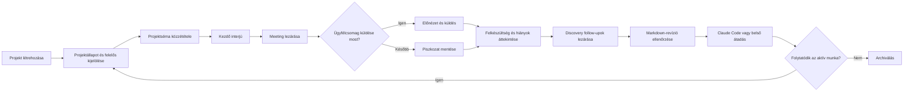
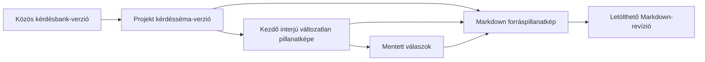

# Project Maker felhasználói kézikönyv

A Project Maker a discovery és az igények tisztázásának közös munkafelülete. Ez a kézikönyv úgy vezeti végig a napi használaton, mintha most kapnád meg először az alkalmazást.

Megmutatja, mit érdemes rögzíteni, mit jelent az eredmény, mikor történik külső hatás, és hogyan folytathatod biztonságosan, ha valami megszakad.

**Tartalom**

- [Hogyan használd ezt az útmutatót?](#hogyan-használd-ezt-az-útmutatót)
- [Project Maker öt percben](#project-maker-öt-percben)
- [Mielőtt dolgozni kezdesz](#mielőtt-dolgozni-kezdesz)
- [A felület térképe](#a-felület-térképe)
- [A teljes napi workflow](#a-teljes-napi-workflow)
- [Első projekted: vezetett gyorsindítás](#első-projekted-vezetett-gyorsindítás)
- [Projektek és a portfolio](#projektek-és-a-portfolio)
- [Projektállapot és Projektbeállítások](#projektállapot-és-projektbeállítások)
- [A közös kérdésbank kezelése](#a-közös-kérdésbank-kezelése)
- [Projektséma és kezdő interjú](#projektséma-és-kezdő-interjú)
- [Interjú lezárása és ügyfélcsomag](#interjú-lezárása-és-ügyfélcsomag)
- [Felkészültségi értékelés és hiányok](#felkészültségi-értékelés-és-hiányok)
- [Discovery follow-upok kezelése](#discovery-follow-upok-kezelése)
- [Ügyfél-emlékeztetők](#ügyfél-emlékeztetők)
- [Markdown-revíziók és átadási pillanatképek](#markdown-revíziók-és-átadási-pillanatképek)
- [Legutóbbi aktivitás és technikai audit](#legutóbbi-aktivitás-és-technikai-audit)
- [Archiválás, visszaállítás és végleges törlés](#archiválás-visszaállítás-és-végleges-törlés)
- [Hibahelyzetek és biztonságos folytatás](#hibahelyzetek-és-biztonságos-folytatás)
- [Fogalomtár és állapotreferencia](#fogalomtár-és-állapotreferencia)
- [Mit nem tud még a jelenlegi verzió?](#mit-nem-tud-még-a-jelenlegi-verzió)
- [Napi és átadási ellenőrzőlisták](#napi-és-átadási-ellenőrzőlisták)

## Hogyan használd ezt az útmutatót?

Ha még nem dolgoztál a Project Makerrel, olvasd végig a [vezetett gyorsindítást](#első-projekted-vezetett-gyorsindítás), majd haladj a részletes fejezetekkel a napi workflow sorrendjében. Ha már ismered az alapokat, a tartalomjegyzékből közvetlenül megnyithatod az adott műveletet vagy hibahelyzetet.

A leírás elsődleges olvasója PM, PO, BA vagy más discovery-munkatárs. A [közös kérdésbank](#a-közös-kérdésbank-kezelése) fejezete annak a kijelölt szervezeti gazdának is szól, aki a minden projektre ható kérdéskészletet gondozza.

Az alkalmazás felülete jelenleg részben angol, részben magyar. A kézikönyv az angol gomb- és mezőfeliratokat változtatás nélkül, `ilyen formában` idézi, majd magyarul elmagyarázza a jelentésüket. A képernyőn megjelenő felirat kismértékben változhat, de mindig a művelet üzleti hatását ellenőrizd.

Minden részletes workflow ugyanarra a hét kérdésre válaszol:

1. Mi a művelet üzleti célja?
2. Milyen állapotból szabad elkezdeni?
3. Pontosan mit kell megtenni?
4. Mi marad meg a rendszerben, vagy mi jut el külső címzetthez?
5. Miből látszik, hogy sikerült?
6. Mi akadályozhatja meg?
7. Mi a biztonságos következő lépés?

> **Fontos különbség:** a Project Maker discovery- és igénytisztázó eszköz. Nem általános projektmenedzsment-rendszer, nem feladatkezelő és nem erőforrás-tervező. A jelenlegi verzió felkészültségi értékelést, Decision Score-t és becslési ajánlást mutat, de nem rögzít formális Go/Conditional Go/No-Go döntést, és nem készít automatikus kimenetet.

## Project Maker öt percben

A Project Makerben egy projekt nem egyszerűen egy név. Egy közös munkatér, amely összeköti:

- az ügyfél kapcsolattartóját;
- az aktuális felelőst, következő lépést és határidőt;
- a projektre kiválasztott kérdéssémát;
- a vezetett kezdő interjú mentett válaszait és verziózott ügyfélcsomagjait;
- a nyitott és lezárt discovery-kérdéseket;
- az ügyfél-emlékeztetők állapotát;
- a változatlan Markdown-pillanatképeket;
- a fontosabb események auditnyomát.

Az alkalmazás napi használatának lényege röviden:

| Helyzet | Mit tegyél? | Mi lesz az eredmény? |
| --- | --- | --- |
| Új igény érkezett | Hozz létre projektet a kapcsolattartóval | Létrejön egy `DRAFT` projekt, és megnyílik a felmérés indítása |
| Elindul az igényfelmérés | Adj felelőst, következő lépést, határidőt, és válassz státuszt | A portfólióban mindenki ugyanazt az operatív állapotot látja |
| Megvan a workshop kérdésköre | Tedd közzé a projektsémát | Rögzül, mely kérdések tartoznak ehhez a projekthez |
| Elindul az interjú | Indíts kezdő interjúkört és rögzítsd a válaszokat | A kör saját kérdéspillanatképet kap |
| Befejeződik a meeting | Zárd le akkor is, ha maradt hiány, majd küldd az ügyfélcsomagot most vagy később | Verziózott piszkozat készül; a hiányok a readinessben maradnak láthatók |
| Tisztázottságot kell ellenőrizni | Nyisd meg a projekt `Felkészültség` oldalát, és kövesd a hiányok műveleteit | Aktuális kitöltöttség, felkészültség, tényezők és rendezett hiányok látszanak |
| Új bizonytalanság merült fel | Hozz létre discovery follow-upot felelőssel és dátummal | A tisztázandó pont számonkérhetően megmarad |
| Átadási pont vagy review következik | Generálj és ellenőrizz Markdown-revíziót | Letölthető, változatlan projektpillanatkép készül |
| Lezárult az aktív munka | Archiváld a projektet a `Projektbeállítások` veszélyzónájában | A történet megmarad, az aktív módosítások leállnak |

Az alkalmazás nem kényszerít végig egy varázslón. A jó minőségű adat és a helyes sorrend a munkát végző csapat felelőssége.

## Mielőtt dolgozni kezdesz

### Működési és hozzáférési határ

> **Biztonsági határ:** a jelenlegi alkalmazásban nincs bejelentkezés, felhasználói azonosítás vagy jogosultság-ellenőrzés. Csak a szervezet által kontrollált belső hálózaton vagy VPN-határon belül használd. Aki eléri a webappot, az projektadatot és a közös kérdésbankot is módosíthatja.

A `Settings` menüpont technikailag nincs adminszerephez kötve. Szervezetileg mégis csak a kijelölt kérdésbank-gazda használja, mert egyetlen mentés minden későbbi projektsémára ható új bankverziót hoz létre.

Az alkalmazás nem mutatja meg, ki végzett egy műveletet. Egyezzetek meg a csapatban arról, ki a projekt operatív gazdája, és változtatás előtt ellenőrizzétek, hogy nem dolgozik-e valaki ugyanazon az adaton.

### Adatbiztonsági alapszabályok

- Csak a discoveryhez szükséges üzleti adatot rögzítsd.
- Ne írj jelszót, hozzáférési tokent, privát kulcsot vagy más titkot válaszba, follow-upba, Markdownba vagy mezőbe.
- Ügyfélnek küldés előtt ellenőrizd a projekt létrehozásakor megadott kapcsolattartó e-mail-címét.
- A Claude Code-nak szánt Markdownot ne küldd ügyfélnek; ügyfélkommunikációhoz az interjú-átadást vagy az előnézett pinget használd.
- Hasznos történettel rendelkező projektet archiválj. A törlés csak üres, korai piszkozat eltávolítására való.
- Archivált projektet előbb állíts vissza, és csak utána hozz létre új tartalmat, még akkor is, ha egy közvetlen oldal technikailag megnyitható.

### Mit jelent a képernyő állapota?

| Jelenség | Jelentés | Teendő |
| --- | --- | --- |
| Forgó betöltésjelző | A webapp még adatot kér | Várj; ne indíts párhuzamos műveletet |
| Zöld sikerüzenet | A művelet választ kapott és sikerült | Ellenőrizd a megváltozott állapotot is |
| Piros hibaüzenet | A kérés nem fejeződött be | Olvasd el, mi maradt meg, majd a hiba szerinti helyreállítást kövesd |
| Letiltott gomb | Előfeltétel hiányzik, mentés folyik, vagy az állapot nem engedi a műveletet | Fejezd be a folyamatban lévő műveletet, mentsd a módosított beállítást, vagy állítsd vissza a projektet |
| `Try again`, `Retry` vagy `Újrapróbálás` | A betöltés vagy mentés megismételhető | Stabil kapcsolat mellett indítsd újra ugyanazt a kérést |

## A felület térképe

A felső navigáció két állandó kiindulópontot ad:

- `Projects`: a projektportfólió és minden projektkörnyezet bejárata;
- `Settings`: a szervezeti szintű közös kérdésbank.

Egy projekten belül a közös fejléc és a visszalépő link őrzi a munkafolyamatot: a visszalépés pontosan a korábbi Portfólió- vagy Aktív munkasor-állapotba visz, a projektfülek pedig ugyanabban a projektkörnyezetben maradnak.

| Felület | Mire való? | Legfontosabb műveletek |
| --- | --- | --- |
| `Projects` | Aktív és archivált projektek áttekintése | Új projekt, következő feladat megnyitása |
| `Projektállapot` | Napi munkaállapot és projektkoordináció | Következő lépés, felelős és határidő; Customer kommunikáció; legutóbbi aktivitás |
| `Felkészültség` | Readiness és discovery tisztázások | Hiányok javítása, discovery follow-upok létrehozása és lezárása |
| `Projektbeállítások` | Projektadminisztráció | Alapadatok, ügyfélkapcsolat, automatikus utánkövetés, életciklus, archiválás és törlés |
| `Projektinterjú` | Projektséma, kezdő interjú és ügyfélcsomag | Séma elfogadása és első kör indítása, válaszadás, meeting lezárása, előnézet és küldés |
| `Markdown specifikáció` | Változatlan kanonikus specifikációk | Revízió generálása, összehasonlítás, előnézet, letöltés |
| `Base question bank` | Minden projekt közös kérdéskészlete | Kérdés létrehozása, új verziót létrehozó szerkesztés |

Ha egy projekt vagy revízió közvetlen linkje már nem létező elemre mutat, térj vissza a projektlistára, és nyisd meg újra a kívánt elemet a felületről. Ne próbáld kézzel javítani az oldal címét.

## A teljes napi workflow

Az alábbi ábra a javasolt üzleti sorrendet mutatja. Nem rendszer által kikényszerített varázsló: a projekt státuszát és a lépések időzítését a csapat kézzel kezeli.

### 1. Indítás és közös kontextus

Hozd létre a projektet a megnevezett belső felelőssel. A `Projektállapot` oldalon jelöld, hogy a következő feladat a belső felelősnél vagy az ügyfél kapcsolattartójánál van, mi az egyetlen konkrét következő lépés, és mikorra esedékes. Az adminisztratív életciklus-állapotot a `Projektbeállítások` oldalon tartsd összhangban a valós helyzettel.

### 2. Kérdéskör rögzítése

Válaszd ki az aktív alapkérdések közül az adott projekthez szükségeseket, és tedd közzé a projektsémát. Ettől kezdve a csapat vissza tudja vezetni, melyik bankverzióból és mely kérdésekből indult az interjú.

### 3. Interjú és megszakításbiztos mentés

Indíts kezdő interjúkört. Szöveges válasz után várd meg a `Mentve` állapotot; választó, jelölő, szám- és dátumválasz azonnal ment. Megszakítás után ugyanaz a nyitott kör töltődik vissza. A meeting végén a kört a tartalmi teljességtől függetlenül lezárhatod, majd előnézetből azonnal elküldheted az ügyfélcsomagot, vagy piszkozatként későbbre hagyhatod.

### 4. Felkészültség és nyitott tisztázások

Az interjú értékelése után nyisd meg a projekt `Felkészültség` oldalát. Az interjú közben felmerülő, később megválaszolandó pontokat ne rejtsd el egy hosszú válaszban. Hozz létre külön discovery follow-upot kategóriával, felelőssel, valódi céldátummal és következő lépéssel. Lezáráskor a döntést vagy választ is rögzítsd.

### 5. Pillanatkép és kommunikáció

Belső, kézi munkához generálhatsz friss Markdown-revíziót, majd megnézheted a forráspillanatképet és az előnézetet. A Project Makerben automatizált Claude Code átadás még nem érhető el, és a `.md` fájl nem ügyfélkommunikáció. Ügyfélnek az interjú összegzését vagy a külön megírt follow-up pinget küldd; egyik levél sem csatolja és nem másolja be a Markdown-revíziót.

### 6. Megőrzés

Ha az aktív munka véget ér, archiválj. A projekt a listában és az auditban megmarad. Törölni csak valóban üres `DRAFT` projektet szabad és lehet.

## Első projekted: vezetett gyorsindítás

Ez a gyorsindítás egy teljes, biztonságos első kört mutat. A részletes szabályokat a hivatkozott fejezetekben találod.

### Előfeltétel

- A webapp a szervezet belső hálózatán elérhető.
- Ismered az ügyfél kapcsolattartójának helyes nevét és e-mail-címét.
- Tudod, ki a belső operatív felelős.
- A `Settings` kérdésbankban van legalább egy aktív kérdés.

### Lépések

1. Nyisd meg a `Projects` oldalt, és válaszd a `New project` gombot.
2. Add meg a projekt nevét, a kapcsolattartó nevét és e-mail-címét.
3. Válaszd a projekt létrehozását és a felmérés megnyitását.
4. A `Projektbeállítások` oldalon állítsd az életciklus-állapotot `Interjú folyamatban` értékre.
5. A `Projektállapot` oldalon válaszd ki a következő feladat gazdáját (`PO/PM` vagy `Ügyfél`), add meg a következő lépést és szükség szerint a határidőt, majd válaszd a `Koordináció mentése` gombot.
6. Nyisd meg az `Open project interview` oldalt.
7. Ellenőrizd a kijelölt kérdéseket, majd válaszd a `Séma elfogadása és interjú indítása` gombot. Ez egy műveletként menti a kérdéssémát és indítja el az első interjúkört.
8. Ha a séma mentése sikerült, de az interjú nem indult el, válaszd az `Interjú indításának újrapróbálása` gombot; a sémát ne hozd létre újra.
9. Rögzítsd a válaszokat. Szöveges mezőknél várd meg a `Mentve` visszajelzést.
10. A meeting végén válaszd a `Mentés, később küldöm` vagy a `Mentés és küldés` műveletet. A lezáráshoz nem kell minden üzleti hiányt kitölteni, de függőben lévő vagy hibás mentés nem maradhat.
11. Küldés előtt olvasd át az ügyfélcsomag előnézetét és ellenőrizd a címzettet. A sikeres küldés változatlan verziót hoz létre.
12. Ügyfél-módosítás esetén indíts új verziót, írd le a módosítás összefoglalását, szerkeszd a válaszokat, majd készíts új előnézetet és küldd el.
13. Nyisd meg a `Felkészültség` oldalt. Minden későbbi tisztázandó pontból hozz létre külön discovery follow-upot.
14. Átadás előtt nyisd meg az `Open Markdown plan` oldalt, és válaszd a `Generate Markdown revision` gombot.
15. Ellenőrizd a `Content preview` tartalmát és a revízió metaadatait.
16. Amikor már nincs aktív munka, nyisd meg a `Projektbeállítások` oldalt, és archiváld a projektet a veszélyzónában.

### A gyorsindítás akkor kész, ha

- a projektkártyán látszik a felelős és a következő lépés;
- a projektséma verziószáma megjelenik;
- nincs nyitott, mentési hibás válasz;
- a kezdő interjúkör lezárult;
- minden még nyitott bizonytalanságnak van follow-up gazdája és dátuma;
- a legfrissebb Markdown-revízió tartalmát valaki elolvasta;
- a `Projektállapot` oldalon a legutóbbi munkához szükséges aktivitások érthetően megjelentek.

## Projektek és a portfolio

*A projektlista a napi munka kiindulópontja; a státusz, a felelős és a következő lépés már a kártyán látható.*

### A projektlista értelmezése

A `Projects` oldalon minden projekt egy kártya. A kártya megmutatja:

- a projekt nevét;
- az aktuális lifecycle státuszt;
- a következő feladat konkrét gazdáját, vagy a `Nincs kijelölve` jelzést;
- a `Next action` értékét, vagy `Not defined` jelzést;
- a projekt aktuális elsődleges feladatához vezető belépési pontot.

A lista a projekt saját koordinációs vagy életciklus-mentésének legutóbbi ideje szerint rendezi előre a kártyákat. Egy interjúválasz vagy follow-up önmagában nem feltétlenül mozgatja előre a projektet.

Azonos módosítási idő esetén a sorrend stabil marad. Az archivált projekt nem tűnik el: `ARCHIVED` státusszal ugyanebben a listában marad, hogy a történet később is megtalálható legyen.

### Betöltés, üres lista és hiba

- `Loading projects…`: várd meg a betöltést.
- `No projects yet`: még nincs projekt. A `Create a project` gomb ugyanazt az űrlapot nyitja meg, mint a `New project`.
- `Projects could not be loaded`: a lista nem érhető el. A `Try again` megismétli a betöltést.

Betöltési hiba nem töröl projektet és nem hoz létre újat. Ha a `Try again` ismét hibázik, ne töltsd ki újra több böngészőlapon ugyanazt a projektet; jelezd az üzemeltetőnek, hogy a webapp vagy a háttérszolgáltatás nem elérhető.

### Aktív munkasor

*Az Aktív munkasor a teljes portfólió következő teendőit csoportosítja; minden sor egy projektet és annak egyetlen elsődleges következő műveletét mutatja.*

A portfólió fejlécében válaszd az `Aktív munkasor` gombot, ha nem egy előre kiválasztott projektből, hanem az összes aktív projekt közül szeretnéd eldönteni, mivel foglalkozz következőként. A csoportok mindig ebben a sürgősségi sorrendben jelennek meg:

1. új Customer-válasz érkezett;
2. lejárt a következő lépés;
3. hamarosan lejár;
4. folyamatban van, de nincs közeli határidő.

A projektnév-keresés, a sürgősségi és a felkészültségi jelölők együtt szűkítik a listát. A szűrés és a rendezés a szerveren történik, ezért a csoportok és a darabszámok nem csak a már letöltött tíz sort írják le. A képernyő külön jelzi, hány projekt látható az aktuális oldalon, és hány felel meg összesen. Az `Előző oldal` és `Következő oldal` gombokkal tízesével járhatod be az eredményt.

Minden sorban ellenőrizd a projekt nevét, a felkészültségi állapotot, a következő lépést, a felelőst és a határidőt. A sor végén lévő elsődleges művelet a projekt jelenlegi következő munkafelületét nyitja meg. A böngésző Vissza művelete visszaadja ugyanazt a keresést, szűrést és lapozott oldalt.

Az oldal nem rendeződik át automatikusan a háttérben. Ha tudatosan friss képet szeretnél, válaszd a `Munkasor frissítése` gombot. A frissítés az első oldalra áll, megtartja a szűrőket, kiírja az utolsó lekérés idejét, és képernyőolvasó számára is jelzi a sikert vagy a hibát.

Hiba esetén a biztonságos folytatás attól függ, volt-e már sikeresen betöltött oldal:

- kezdeti betöltési hibánál a lista helyett az `Újrapróbálás` jelenik meg;
- frissítési vagy lapozási hibánál az utolsó sikeres oldal látható marad `A lista elavult lehet.` jelzéssel; a `Sikertelen lekérés újrapróbálása` pontosan ugyanazt a lapot és szűrést kéri újra;
- lejárt vagy érvénytelen oldalhivatkozásnál a rendszer biztonságosan az első oldalra áll, és ezt külön üzenetben jelzi;
- ha a szűrők mellett nincs találat, a `Szűrők törlése` visszaállítja a teljes munkasort; ha egyáltalán nincs aktív projekt, innen visszatérhetsz a portfólióba vagy új projektet hozhatsz létre.

A kereső, a jelölők, a frissítés, a lapozás és a sorműveletek billentyűzettel is használhatók. Keskeny képernyőn a sorok egymás alá tördelik ugyanezeket az adatokat és műveleteket; a prioritási csoportok sorrendje nem változik.

### Új projekt létrehozása

**Mikor használd?** Amikor új, önálló discovery- vagy igénytisztázási munkatérre van szükség. Ne hozz létre második projektet pusztán azért, mert a meglévő projekt éppen várakozik vagy archivált; előbb ellenőrizd, hogy azt kell-e visszaállítani.

1. Válaszd a `New project` gombot.
2. Töltsd ki a `Project name` mezőt. Legyen egyértelmű, legfeljebb 255 karakteres név.
3. Töltsd ki a `Customer contact name` mezőt a tényleges kapcsolattartó nevével; a mező legfeljebb 255 karaktert fogad el.
4. Töltsd ki a `Customer contact email` mezőt érvényes, legfeljebb 320 karakteres e-mail-címmel.
5. Ellenőrizd még egyszer a címet. A jelenlegi felületen később sem a projekt neve, sem a kapcsolattartó neve vagy e-mail-címe nem szerkeszthető.
6. Válaszd a létrehozást és a felmérés megnyitását.

Siker esetén a webapp létrehoz egy `DRAFT` projektet, és közvetlenül a következő szükséges feladatra vezet. A projekt már a portfólióban is látható.

Ha meggondoltad magad, a `Cancel` bezárja az űrlapot és nem hoz létre projektet. Ha az űrlap mezőhibát jelez, javítsd a kiemelt értéket; a projekt csak sikeres szerverválasz után jön létre.

> **Kapcsolattartói adat javítása:** mivel jelenleg nincs szerkesztőművelet, hibás név vagy e-mail esetén ne küldj levelet.
>
> Ha a projekt még teljesen üres `DRAFT`, törölhető és helyesen újralétrehozható. Ha már van megőrzendő tevékenysége, archiváld, és a csapattal egyeztetett módon hozz létre helyes projektet. A régi történetet ne próbáld törléssel eltüntetni.

## Projektállapot és Projektbeállítások

A projekt közös fejlécében ugyanaz a szerver által számított munkaállapot, elsődleges feladat és visszatérési út látszik minden projektoldalon. A régi, mindent egy helyre zsúfoló projektoldal helyett két világos felelősségű felületet használj.

### Projektállapot: a napi munkaközpont

A `Projektállapot` oldal a projekt nevét és aktuális munkaállapotát, az egyetlen elsődleges feladatot, a projektkoordinációt, az ügyféllevelezés állapotát és az utolsó öt munkához szükséges aktivitást mutatja.

A koordinációban gyorsan szerkeszthető:

- a következő lépés felelőse: a megnevezett PO/PM vagy az ügyfélkapcsolattartó;
- az egyetlen konkrét következő lépés;
- a következő lépés határideje.

A `Koordináció mentése` csak ezt a három napi munkamezőt módosítja. Nem változtat projektnevet, kapcsolattartót, életciklus-állapotot, archiválást vagy automatikus ügyfél-utánkövetési beállítást. Sikeres mentés után a közös projektfejléc is a friss, szerver által számított állapotot mutatja.

Az `Ügyféllevelezés` kártya megmutatja az új válaszok számát és a szükséges teendőt, majd a Customer kommunikációs oldalra vezet. A `Legutóbbi aktivitás` legfeljebb öt, magyarul összefoglalt üzleti eseményt mutat. Nyers eseménykód, JSON payload, ügyfélszöveg vagy titok nem jelenik meg az alkalmazotti felületen.

### Projektbeállítások: adminisztráció és életciklus

A `Projektbeállítások` oldal kezeli:

- a projekt nevét, a belső PO/PM nevét és az ügyfélkapcsolattartó adatait;
- az automatikus ügyfél-utánkövetés engedélyezését, időközét és végdátumát;
- az adminisztratív életciklus-állapotot;
- az archiválást, visszaállítást és a jogosult korai piszkozat végleges törlését.

Az alapadatok csak az első kérdésséma elfogadásáig és aktív projektben szerkeszthetők. Ezután olvashatók maradnak, de a történeti azonosság védelmében nem írhatók át. Az automatikus ütemezés beállítása itt történik; a kézi ping megírása, előnézete, küldése és helyreállítása a Customer kommunikációs munkafelület feladata.

### Életciklus-állapotok

| Állapot | Mikor használd? | Mit nem jelent? |
| --- | --- | --- |
| `Előkészítés alatt` | A projekt még formálódik | Nem jelenti automatikusan, hogy törölhető |
| `Interjú folyamatban` | Aktív igényfelmérés, workshop vagy interjú folyik | Nem jelenti, hogy minden kérdésnek van válasza |
| `Belső feladatra vár` | A következő érdemi lépés belső információra vagy döntésre vár | Nem automatikus; a csapat tartja naprakészen |
| `Ügyfélre vár` | A következő érdemi lépés ügyfélválaszra vár | Önmagában nem küld levelet |
| `Becslésre kész` | A csapat üzletileg tervezésre késznek jelöli | Nem formális jóváhagyás és nem readiness-tanúsítvány |
| `Archivált` | Az aktív követés lezárt vagy szünetel, a történet megmarad | Nem törlés; visszaállítható |

A `Becslésre kész` állapotba lépés automatikusan létrehoz egy `MILESTONE` Markdown-revíziót `READY_FOR_PLANNING` mérföldkőnévvel. A revízió változatlan marad; téves állapotválasztást újabb helyes állapottal és szükség esetén új revízióval korrigálj.

### Archivált projekt

Archiválás és törlés kizárólag a `Projektbeállítások` elkülönített veszélyzónájában érhető el, és explicit megerősítést kér. Archiválás után a projektoldalak és beállítások olvashatók maradnak, a módosítások letiltódnak. Új munka előtt előbb válaszd a `Projekt visszaállítása` műveletet; a visszaállított életciklus-állapot mindig `Előkészítés alatt`.

## A közös kérdésbank kezelése

*A bankverzió azt jelzi, melyik változatból készülhetnek új projektsémák; egy korábbi projektpillanatképet a későbbi szerkesztés nem ír át.*

### Ki kezelje?

> **Szervezeti felelősség:** a `Settings` oldal technikailag minden alkalmazás-hozzáféréssel rendelkező személy számára elérhető. Mégis csak a kijelölt kérdésbank-gazda módosítsa, mert minden sikeres létrehozás vagy szerkesztés új, közös bankverziót publikál.

A kérdésbank célja, hogy a csapat ugyanazzal a discovery-szókészlettel és ellenőrzési logikával dolgozzon. Nem egy projekthez tartozik. Ha csak egyetlen projektben szeretnél kihagyni egy kérdést, ne inaktiváld globálisan; a projekt kérdéssémájában vedd ki a kijelölést.

### A lista olvasása

Az oldal tetején látható a `Published version` és a kérdések száma. Minden kártyán szerepel:

- a változatlan `Stable key`;
- a kérdés szövege és témája;
- a `Control point`, vagyis milyen tisztázottságot ellenőriz;
- a sorrend;
- a kérdéstípus;
- az aktív állapot;
- a `Required` állapot;
- a válaszadást segítő `Hint`, ha van.

Az `Edit` nem a régi sort írja felül. A módosított kérdéssel és a többi kérdés átvitt állapotával új, változatlan bankverzió készül.

Ha a bank üres, a `No base questions yet` állapot és a `Create a question` gomb jelenik meg; ez ugyanazt a létrehozó űrlapot nyitja meg. Egy kérdéskártyán látható `ARCHIVED` címke ezen az oldalon inaktív alapkérdést jelent, nem archivált projektet.

### Új alapkérdés létrehozása

**Mikor használd?** Ha a kérdés több projektben is értelmes, szervezetileg elfogadott, és megfogalmazása elég stabil ahhoz, hogy későbbi projektsémák alapja legyen.

1. Válaszd a `New base question` gombot.
2. Adj `Stable key` értéket. Legfeljebb 100 karakter lehet, csak kisbetűt, számot és kötőjelet tartalmazhat, például `customer-data-owner`.
3. Add meg a `Topic` értéket legfeljebb 255 karakterben.
4. A `Control point` mezőben fogalmazd meg, milyen állapotot vagy döntést igazol a válasz.
5. Válaszd ki a `Question type` értéket.
6. Írd be a `Question text` tartalmát úgy, ahogyan a workshopon feltennéd.
7. Add meg az `Order` egész számot. Új kérdésnél csak a jelenlegi lista érvényes pozíciója vagy annak vége használható.
8. Szükség esetén adj `Hint` szöveget. Ez segítség, nem helyettesíti a kérdést.
9. Választós típusnál írd be az `Options` értékeket, soronként egyet.
10. Állítsd be a négy viselkedési jelölőt.
11. Válaszd a `Create question` gombot.

Siker esetén a bank verziószáma eggyel nő, a kérdés megjelenik a beállított pozíción, és az utána következő kérdések sorrendje eltolódik. A sikerüzenet és az új `Published version` együtt igazolja a publikálást.

A `Cancel` elveti a megnyitott űrlap helyi tartalmát, és nem hoz létre új verziót.

### Meglévő kérdés szerkesztése

1. A megfelelő kártyán válaszd az `Edit` gombot.
2. Ellenőrizd, hogy valóban a legfrissebb bankverzió kérdését nyitottad meg.
3. Módosítsd a témát, ellenőrzési pontot, szöveget, típust, sorrendet, hintet, opciókat vagy jelölőket.
4. A `Stable key` nem szerkeszthető. Ez biztosítja, hogy a kérdés azonosítható maradjon a verziók között.
5. Válaszd a `Save changes` gombot.

Ha más közben új bankverziót publikált, a régi kártyáról indított mentés ütközhet. Töltsd újra az oldalt, olvasd el a legfrissebb kérdést, és csak azután ismételd meg a szándékos módosítást.

Kérdés törlése nincs. Ha egy kérdést a jövőben nem szabad új projektsémába választani, állítsd az `Active` jelölőt kikapcsolt állapotba. Ez a későbbi kiválasztásból kiveszi, de a korábbi projektsémák és interjúk történetét nem módosítja.

### A hét kérdéstípus

| Típus | Mire való? | Válasz az interjúban |
| --- | --- | --- |
| `TEXT` | Rövid, tömör szöveges tény | Egysoros szöveg |
| `LONG_TEXT` | Magyarázat, üzleti cél, folyamat vagy döntési háttér | Többsoros szöveg |
| `SINGLE_SELECT` | Pontosan egy előre meghatározott lehetőség | Egy elem a listából |
| `MULTI_SELECT` | Több, egymással együtt is igaz lehetőség | Egy vagy több jelölőnégyzet |
| `BOOLEAN` | Igen/nem állítás | Bejelölt állapot: igen; kikapcsolt, már mentett állapot: nem |
| `NUMBER` | Véges numerikus érték | Számmező |
| `DATE` | Naptári nap | `ÉÉÉÉ-HH-NN` dátum |

`SINGLE_SELECT` és `MULTI_SELECT` esetén legalább egy nem üres opciónak kell lennie. Soronként egy opciót írj; az üres sorokat a rendszer figyelmen kívül hagyja, az azonos opciókat viszont elutasítja. Más kérdéstípushoz nem tartozhat opciólista.

Típusváltáskor mindig ellenőrizd, hogy a kérdés jelentése és a korábbi válaszolási elvárás összhangban marad-e. A változtatás csak későbbi sémákra és körökre hat; a már elindított kör megőrzi a régi típust és opciókat.

### A négy viselkedési jelölő

| Jelölő | Jelenlegi tényleges hatás |
| --- | --- |
| `Required` | A readinessben és a későbbi tisztázásban hiányként látszik; a meeting lezárását önmagában nem akadályozza |
| `Required for estimate` | Metaadatként megmarad; önmagában nem módosítja a kör lezárását vagy a projektstátuszt |
| `Blocking` | A nyitott körben kiemelt tisztázási útmutatást mutat; önmagában nem akadályozza a lezárást |
| `Active` | Bekapcsolva megjelenik az új projektséma-választásban; kikapcsolva új sémába nem választható |

A `Required` és `Blocking` jelölő sem tartalmi lezárási kapu: kész, részben kész, nem releváns vagy hiányos eredménnyel is lezárható a meeting. Csak függőben lévő vagy hibás technikai mentés blokkolja a lezáró gombokat. A `Required for estimate` nem külön pontszámkapu, és nem helyettesít Decision Score-t, ajánlott döntést vagy automatikus projektstátusz-váltást. A felkészültségi értékeléshez a [forráskörnek](#ha-az-értékelés-nem-elérhető-vagy-nem-töltődik-be) a jelenlegi kanonikus sémának kell megfelelnie.

### Tipikus mentési hibák és helyreállítás

| Helyzet | Biztonságos folytatás |
| --- | --- |
| A stable key formátuma hibás vagy már létezik | Válassz egyedi, kisbetűs-kötőjeles kulcsot; meglévő fogalomnál inkább a régi kérdést szerkeszd |
| A sorrend kívül esik a listán | Adj 1 és az engedett utolsó pozíció közötti egész számot |
| Választós kérdésnek nincs opciója | Adj legalább egy nem üres sort |
| Két opció azonos | Egyesítsd vagy nevezd át őket úgy, hogy üzletileg is különbözzenek |
| A bank nem töltődik be | Válaszd a `Try again` gombot; ne hozz létre párhuzamos másolatot másik lapon |
| Mentés közben új bankverzió született | Töltsd újra az oldalt, hasonlítsd össze a friss állapotot, majd ismételd meg a szükséges módosítást |

## Projektséma és kezdő interjú

A projektséma azt rögzíti, hogy a közös kérdésbank aktuális kérdései közül melyek tartoznak az adott projekthez. A kezdő interjúkör pedig erről a sémáról készít saját, változatlan pillanatképet.

Egy későbbi kérdésbank-szerkesztés nem írja át a már közzétett projektsémát vagy a megkezdett interjúkört. A Markdown a létrehozás pillanatában elérhető projekt-, séma-, kör- és válaszadatot másolja saját forráspillanatképébe.

A discovery follow-upok és customer follow-up beállítások jelenleg nem részei ennek a Markdown-forrásnak.

*Bal oldalon a projekthez kiválasztott kérdések, jobb oldalon a változatlan körpillanatkép és a szerveren mentett válaszok láthatók.*

### Projektséma elfogadása és az első interjú indítása

**Előfeltétel:** van legalább egy aktív alapkérdés, és nincs nyitott kezdő interjúkör.

Első megnyitáskor a felület minden aktuálisan aktív alapkérdést kijelöl. Ez kiindulási ajánlás, nem kötelező teljes lista.

1. A projekt közös navigációjában nyisd meg a `Felmérés` oldalt.
2. Olvasd el az `Aktív alapkérdések kiválasztása` listát.
3. Hagyd kijelölve az adott projekthez szükséges kérdéseket, a nem relevánsakat vedd ki.
4. Legalább egy kérdésnek kijelölve kell maradnia.
5. Első alkalommal válaszd a `Séma elfogadása és interjú indítása` gombot.
6. Várd meg az `Elfogadott kérdésséma v… (bank v…)` visszajelzést és a folyamatban lévő interjú kérdéskártyáit.

A séma saját verziószáma azt mutatja, hányadik közzétett projektsémát látod. A bankverzió azt jelzi, melyik közös kérdésbankból készült. A két számnak nem kell azonosnak lennie.

Az első elfogadás előtt nincs külön kezdőinterjú-kártya vagy kézi körindító gomb. Az elfogadás változatlan projektsémát ment, majd pontosan egy kezdő interjúkört indít. Ha a séma már megmaradt, de a kör indítása megszakadt, a felület csak az `Interjú indításának újrapróbálása` műveletet kínálja; frissítés után is innen folytathatsz.

Ha nincs aktív alapkérdés, a felület `Nincs aktív alapkérdés` állapotot mutat. A projektindítási draft megmarad és később folytatható. Kérd meg a kijelölt kérdésbank-gazdát, hogy legalább egy megfelelő kérdést aktiváljon, majd töltsd újra az oldalt.

### Projektséma frissítése

**Mikor használd?** Ha a következő interjúkör kérdésköre változik, és nincs nyitott kör.

1. Módosítsd a kijelöléseket.
2. Válaszd a `Séma frissítése` gombot.
3. Ellenőrizd, hogy a sémaverzió eggyel nőtt.

A frissítés utódsémát hoz létre. Egy korábbi nyitott vagy lezárt kör kérdései nem változnak. Az új séma csak a később indított körre hat.

Nyitott kör alatt a jelölőnégyzetek és a publikálási gomb le vannak tiltva, és megjelenik: `A séma zárolva van, amíg a nyitott kezdő interjúkör fut.` Előbb fejezd be a mentéseket és zárd le a kört; a kör közben ne próbáld a kérdéslistát megváltoztatni.

### Kezdő interjúkör folytatása

A jelenlegi felület egyetlen körtípust szállít: `INITIAL_INTAKE`, magyarul kezdő interjú. Stakeholder- vagy clarification-kör jelenleg nincs.

Az első kezdő interjúkört a kérdésséma elfogadása automatikusan elindítja.

1. Várd meg a `Folyamatban` állapotot és a kérdéskártyákat.
2. Haladj a kérdéseken a workshop természetes sorrendjében.

Az indítás a projektséma teljes, változatlan pillanatképét másolja a körbe: kérdésszöveg, téma, ellenőrzési pont, típus, opciók, `Required`, `Blocking` és hint. Ezért egy későbbi bank- vagy sémamódosítás a futó körön nem látszik.

Ha elnavigálsz, bezárod a böngészőt vagy az alkalmazás újraindul, a következő megnyitáskor a `Folyamatban lévő kezdő interjúkör folytatása` állapot tölti vissza ugyanazt a nyitott kört és a szerveren mentett válaszokat.

Ne indíts pótkört megszakítás miatt. A szerver eleve megakadályozza, hogy ugyanahhoz a projekthez két nyitott kezdő kör legyen.

### A kérdéskártya értelmezése

Minden kérdésnél látható:

- a kérdés sorszáma és szövege;
- a téma és a válasz típusa;
- az ellenőrzési pont;
- a `Kötelező kérdés` jelzés, ha a hiány a felkészültségi értékelésben számít;
- a `Blokkoló tisztázás` jelzés és külön figyelmeztetés;
- a kérdésbanki hint;
- a típushoz tartozó válaszadási útmutató;
- választós kérdésnél az engedett opciók;
- a válasz mentési állapota.

Az útmutatás segít jó választ adni, de nem értékeli a tartalom szakmai minőségét. A rendszer például elfogadhat egy rövid szöveget technikailag, miközben az üzletileg még nem válaszolja meg a kérdést.

### Válaszadás a hét típusra

| Típus | Művelet | Mikor indul mentés? | Hogyan üríthető? |
| --- | --- | --- | --- |
| Rövid vagy hosszú szöveg | Gépelj a mezőbe | 750 ms gépelési szünet után | Töröld a teljes szöveget; az ürítés azonnal mentődik |
| Egyszeres választás | Válassz egy opciót | Azonnal | Válaszd a kezdeti üres lehetőséget |
| Többszörös választás | Jelölj egy vagy több opciót | Minden jelölésnél azonnal | Vedd ki az összes jelölést |
| Igen/nem | Jelöld be vagy kapcsold ki az `Igen` jelölést | Azonnal | Nincs külön „nincs válasz” gomb; egy már kezelt kikapcsolt állapot `nem` válasz |
| Szám | Írj véges számértéket | Érvényes változáskor azonnal | Ürítsd ki a mezőt |
| Dátum | Válassz vagy írj naptári napot | Változáskor azonnal | Ürítsd ki a dátummezőt |

Szöveges válasz után ne lépj azonnal tovább vagy ne zárd be az oldalt. Figyeld meg a kérdés alatti mentési állapotot.

| Látható állapot | Mit jelent? | Munkatársi teendő |
| --- | --- | --- |
| `Piszkozat – automatikus mentésre vár` | A helyi szöveg még nem jutott el a szerverre | Maradj az oldalon; 750 ms gépelési csend után indul a mentés |
| `Mentés folyamatban…` | A mentési kérés úton van | Várd meg a végét a lezárás vagy elnavigálás előtt |
| `Mentve` | A szerver megőrizte az értéket | Biztonságosan továbbléphetsz |
| `Még nincs mentve` | Nincs rögzített válasz | Kötelező kérdésnél adj választ |
| `Nem sikerült menteni…` | A szerver nem fogadta el vagy nem érte el a mentést | A piszkozat látható marad; stabil kapcsolat mellett válaszd a `Mentés újrapróbálása` gombot |

Ha egy sikertelen szöveges mentés után tovább gépelsz, a képernyőn lévő legfrissebb piszkozat marad a kiindulópont. Mindig azt olvasd vissza, majd próbáld újra. Ne másold át automatikusan új körbe, mert az eredeti kör és a helyi piszkozat még helyreállítható.

### A meeting lezárása

**Előfeltétel:** nincs várakozó automatikus mentés, nincs folyamatban lévő kérés és nincs mentési hiba. A meetinget minden esetben le lehet zárni: kész, részben kész vagy nem releváns tartalommal is. A hiányzó és részleges válaszok nem technikai lezárási akadályok; a readiness és a későbbi tisztázások továbbra is láthatóvá teszik őket.

1. Görgess végig a kérdéseken, és ellenőrizd a mentési állapotokat.
2. Válaszd a `Mentés, később küldöm` műveletet, ha még szerkesztenéd az ügyfélcsomagot, vagy a `Mentés és küldés` műveletet, ha rögtön előnézetet és küldést szeretnél.
3. Várd meg a `Meeting lezárva` állapotot és az 1. ügyfélcsomag-piszkozat megjelenését.

Függőben lévő vagy hibás technikai mentésnél a lezáró műveletek letiltva maradnak, hogy a képernyőn látható piszkozat ne vesszen el. A válasz tartalmi hiányossága azonban nem akadályozza meg a meeting lezárását.

## Interjú lezárása és ügyfélcsomag

*Az előnézet a ténylegesen küldendő szöveget mutatja; a hiányzó válaszok láthatók maradnak, de a meeting lezárását nem akadályozzák.*

### Első küldés most vagy később

A lezárás automatikusan létrehozza az 1. verziójú ügyfélcsomag `DRAFT` állapotát. A címzett a projekt megnevezett ügyfél-kapcsolattartója. Előnézet előtt válaszd a dedikált postafiókot, vagy add meg a PO/PM nevét és pontos `@pte.hu` címét; aldomain és hasonló domain nem fogadható el. A legutóbb sikeresen használt feladót a projekt megjegyzi, de minden előnézet előtt szerkeszthető.

- `Mentés, később küldöm`: a meeting lezárul, az ügyfélcsomag piszkozat marad, és később ugyanerről az oldalról folytatható.
- `Mentés és küldés`: a meeting lezárul, majd megnyílik az előnézet. A küldés csak a megerősítés után indul.

Küldés előtt mindig olvasd át a tárgyat, a címzett nevét és címét, valamint a HTML- és szöveges tartalmat. Az előnézet a válaszok aktuális tartalomverziójához kötött. Ha az előnézet után választ vagy értékelést módosítasz, készíts új előnézetet; az elavult előnézetet a szerver `409` konfliktussal visszautasítja.

### Állapotok és helyreállítás

| Állapot | Jelentés | Biztonságos következő lépés |
| --- | --- | --- |
| `DRAFT` | Szerkeszthető, még nem küldött verzió | Módosítás, előnézet, majd küldés |
| `SENDING` | A küldési kísérlet folyamatban van | Ne indíts második küldést; várj vagy töltsd újra |
| `SENT` | A levelezőrendszer elfogadta az átadást; ez nem kézbesítési vagy olvasási igazolás | Ügyfélmódosításhoz indíts új verziót |
| `FAILED` | A Microsoft Graph ismerten elutasította az átadást | Ellenőrizd az okot, majd válaszd az újrapróbálást |
| `UNKNOWN` | Nem bizonyítható, hogy a megszakadt kísérlet kézbesített-e | Előbb ellenőrizd a postafiókot/szolgáltatót; csak ezután válaszd a folytatást |

A `SENT` verzió nem szerkeszthető. A `FAILED` ugyanazt a változatlan előnézeti tartalmat próbálja újra. Az `UNKNOWN` nem automatikus újraküldési engedély: a rendszer azért áll meg, hogy ne küldjön észrevétlenül duplikált levelet.

### Ügyfél-visszajelzés és módosított újraküldés

1. Nyisd meg a korábban elküldött interjú ügyfélcsomagját.
2. Válaszd az `Új verzió készítése` műveletet.
3. Írd le röviden, mit kért az ügyfél; a módosítási összefoglaló a 2. és későbbi verzióknál kötelező.
4. Az új `DRAFT` feloldja az interjú válaszait és értékeléseit szerkesztésre. Módosítsd és várd meg minden mezőnél a mentést.
5. Készíts új előnézetet, ellenőrizd a teljes tartalmat, majd küldd el.

Az előző `SENT` verzió változatlanul megmarad. Egyszerre csak egy aktív, nem elküldött verzió lehet; ezért új verzió csak az előző sikeres küldése után indítható. Az új csomag nem külön interjúkör, hanem ugyanannak a lezárt meetingnek a következő, nyomon követhető átadási verziója.

Archivált projektben a korábbi ügyfélcsomagok és tartalmuk továbbra is megnyithatók, de új verzió, szerkesztés, előnézet, küldés és újrapróbálás nem indítható. Aktív munka folytatásához előbb állítsd vissza a projektet.

Lezárás után újabb kezdő interjúkört is indíthatsz. Az új kör az akkor legfrissebb projektsémáról készít új pillanatképet, és nem másolja automatikusan az előző kör válaszait.

## Felkészültségi értékelés és hiányok

*A `Felkészültség` oldalon látható értékelés a kanonikus kezdő interjú aktuális állapotát, a tényezőket és a következő biztonságos javítási irányt mutatja; nem Decision Score és nem ajánlott döntés.*

### Mikor jelöld `Részben megvan` vagy `Nem releváns` értékre?

Minden kérdéskártyán az `Értékelés` résznél a szerver által meghatározott tényleges állapot látható. Érvényes mentett válaszból `Kész`, válasz nélkül `Nincs meg` lesz. Az `Automatikus állapot` visszaállítja ezt a válaszból következő értéket.

- `Részben megvan`: akkor használd, ha van mentett, érvényes válasz, de az üzleti tartalom még hiányos vagy ellenőrzésre szorul. Ez fél értékként számít a felkészültségben, de a meeting lezárását nem akadályozza.
- `Nem releváns`: csak akkor használd, ha az adott kérdés valóban nem alkalmazható erre a projektre. Add meg az `Indoklás, miért nem releváns` szöveget, majd válaszd az `Indoklás mentése` gombot. Az indoklás kötelező, hogy a kizárás később értelmezhető legyen; az elem kimarad a kitöltöttségi és ellenőrzőlista-számításból.

Ne használd a `Nem releváns` választ a hiányos információ elfedésére. Ha a kérdés releváns, de a válasz még nem elég jó, maradjon `Részben megvan`, és kövesd a hiány javítását. Sikertelen értékelésmentésnél a beírt indoklás és a választott állapot a képernyőn marad; ellenőrizd a hibaüzenetet, majd válaszd az `Értékelés újrapróbálása` gombot. Lezárt interjúban a vezérlők csak aktív ügyfélcsomag-piszkozat mellett szerkeszthetők.

### Az értékelés olvasása és javítása

Az értékelés a `Felkészültség` oldalon töltődik be. Elérhető állapotban ezt látod:

- `Interjú kitöltöttsége`: a releváns ellenőrzőlista-elemek állapota; a `Nem releváns` elemeket nem számolja.
- `Felkészültség`: a súlyozott összkép; a sáv jelzi, hogy pontosítás szükséges, becslés előkészíthető, becslésre kész vagy fejlesztésre kész.
- `Értékelési tényezők`: külön mutatják az alapinformációk, az üzleti tisztázottság, a felelősség, az ellenőrzőlista és a discovery utánkövetés állapotát.
- `Rendezett hiányok`: a `Kritikus`, `Fontos`, majd `Pontosítás` sorrendben megjelenő, általánosított javítási jelzések. A lista nem jelenít meg interjúválaszt, `Nem releváns` indoklást vagy discovery follow-up tartalmat.

Minden hiány művelete a megfelelő munkafelületre vezet: a koordinációs hiány a `Projektállapot` szerkesztőjéhez, a kérdéshiány a megfelelő interjúkérdéshez, a Discovery-hiány pedig ugyanazon `Felkészültség` oldal follow-up listájához. Javítsd ott az adatot vagy zárd le a follow-upot, mentsd sikeresen, majd ellenőrizd a frissült értékelést.

### Ha az értékelés nem elérhető vagy nem töltődik be

| Látható helyzet | Jelentés | Biztonságos folytatás |
| --- | --- | --- |
| `Még nincs kezdő interjú` | A projekthez nincs kiértékelhető kezdő interjú | Nyisd meg az interjúoldalt, tegyél közzé megfelelő sémát, majd indíts kezdő interjút |
| `Az értékeléshez frissített interjúséma szükséges` | A forráskör nem a jelenlegi kanonikus kérdéskészletet tartalmazza | Frissítsd a projektsémát, majd indíts új kezdő interjút; ne próbáld a régi kört kézzel átírni |
| Betöltési hiba és `Újrapróbálás` | A felkészültségi kérés nem fejeződött be | Ellenőrizd a kapcsolatot, válaszd az `Újrapróbálás` gombot, és csak sikeres betöltés után hozz döntést az értékekből |

Az elérhetetlen vagy hibás értékelés nem akadályozza meg a projektkoordináció és a discovery follow-up kezelését. Mentsd ezeket a saját munkafelületükön; az értékelés helyreállása után ellenőrizd újra a hiányokat. A `Felkészültség` és a Decision Score egyaránt döntéstámogatás: egyik sem helyettesít üzleti döntést vagy készít automatikus kimenetet.

## Döntési értékelés és becslési ajánlás

A külön `Döntési értékelés` oldal hat, projekt-szintű 1–5 értékelést tart meg: üzleti érték, stratégiai illeszkedés, sürgősség, bizonyosság, komplexitás és kockázat. A komplexitás és a kockázat fordított irányban számít. Az értékeket egyszerre, a `Döntési értékelés mentése` gombbal menti a rendszer; a hiányos értékelés megmarad, de nem kap részpontszámot vagy részleges ajánlást.

**Előfeltétel a pontszámhoz:** mind a hat érték megvan, és a projekt aktuális kezdő interjúja a teljes, kanonikus sémából ad elérhető felkészültséget. Enélkül az oldal megmondja, hogy melyik feltétel hiányzik. A projektkoordináció és a discovery follow-upok ilyenkor is a megszokott módon szerkeszthetők.

A szerver jeleníti meg a `Decision Score`-t, annak `Magas` (legalább 65), `Közepes` (40–64) vagy `Alacsony` (40 alatti) címkéjét, a felkészültséget és a becslést blokkoló hiányok darabszámát. A kártya a súlyokat és a fordított irányt is megmutatja, de nem mutat külön dimenziónkénti részpontokat és nem tartalmaz kliensoldali pontszámítást.

Az ajánlás sorrendje szándékosan szigorú:

1. `Pontosítás szükséges`, ha van `Kritikus` hiány, a felkészültség 40% alatti, vagy kettőnél több becslést blokkoló hiány maradt.
2. `Becslésre kész`, ha a Score és a felkészültség is legalább 65, és nincs becslést blokkoló hiány.
3. `Becslés előkészíthető`, ha a Score legalább 40 és a felkészültség legalább 65.
4. Minden más esetben `Pontosítás szükséges`.

Ezek ajánlások, nem jóváhagyások: a rendszer nem változtat projektstátuszt, nem rögzít Go/Conditional Go/No-Go döntést, és nem készít becslést vagy generált dokumentumot. Ha új `INITIAL_INTAKE` kör lesz aktuális, a hat megadott érték megmarad, de a Score és az ajánlás az új forrás felkészültségéből frissül. Archivált projektben az értékelés látható, de csak olvasható; visszaállítás után ismét menthető. Mentési vagy betöltési hiba esetén az oldal saját hibája és `Újrapróbálás` művelete jelenik meg, a többi projektmunka nem akad el.

## Discovery follow-upok kezelése

A discovery follow-up olyan tisztázandó üzleti tétel, amelynek van egyértelmű kérdése, felelőse, céldátuma és következő lépése. Nem ugyanaz, mint a customer follow-up: előbbi belső discovery-munkaelem, utóbbi e-mail-küldési ütemezés.

*A lista külön mutatja a terminális döntést és a még nyitott, `Edit` vagy `Resolve` műveletre váró tisztázást.*

*A forrás csak a sorszámát, témáját és kontrollpontját mutatja; a teljes checklist-kérdés kizárólag kiválasztáskor látható.*

### Kategóriák

| Kategória | Mikor válaszd? | Példa |
| --- | --- | --- |
| `BUSINESS` | Üzleti cél, döntési jog, érték vagy sikerkritérium | Ki hagyja jóvá az MVP scope-ját? |
| `SCOPE` | Be- és kizárt funkció, fázishatár vagy prioritás | Része-e az első kiadásnak a tömeges import? |
| `TECHNICAL` | Technikai megvalósíthatóság vagy architekturális korlát | Mekkora válaszidő elvárt csúcsterhelésen? |
| `DATA` | Adatforrás, adatgazda, minőség vagy migráció | Mely mezők hiányoznak a meglévő törzsadatból? |
| `INTEGRATION` | Külső vagy belső rendszerkapcsolat | Melyik rendszer adja az ügyféltörzsadatot? |
| `SECURITY` | Hozzáférés, adatvédelem, megfelelőség vagy auditigény | Mely szerepkör láthat személyes adatot? |
| `OPERATIONS` | Élesítés, support, üzemeltetési felelős vagy folytonosság | Ki fogadja az éles hibajegyeket? |
| `OTHER` | Egyik fenti kategóriába sem illő, mégis számonkérendő kérdés | Melyik külső workshop időpontja végleges? |

### Új follow-up létrehozása

**Előfeltétel:** a projekt nem archivált, és nincs más discovery-módosítás folyamatban.

1. A `Felkészültség` oldal `Discovery follow-ups` részében válaszd ki a `Category` értéket.
2. A `Question` mezőbe egyetlen, megválaszolható tisztázást írj, legfeljebb 10 000 karakterben.
3. Az `Owner` mezőben nevezd meg azt a személyt vagy egyértelmű szerepet, akinél a következő labda van; legfeljebb 255 karakter használható.
4. A `Due date` mezőben valódi naptári céldátumot adj meg. Ez dátum, nem időpont.
5. Ha a tétel egy konkrét kezdő interjú checklist-eleméből ered, az opcionális `Initial Intake source` listában válaszd ki. A lista a teljes kérdésszöveget is mutatja, hogy biztosan a megfelelő eredetet válaszd.
6. A `Next step` mezőben írd le, mi történik a válasz megszerzéséért, legfeljebb 10 000 karakterben.
7. Válaszd a `Create discovery follow-up` gombot.

Üresen hagyhatod a forrást: a forrás nélküli follow-up ugyanúgy létrejön. Ha nincs aktuális kezdő interjú vagy nincs benne választható elem, ezt a lista jelzi, de a forrás nélküli létrehozást nem tiltja le. Ha a forráslista betöltése hibázik, válaszd az `Újrapróbálás` műveletet; a meglévő hivatkozások és a forrás nélküli létrehozás közben használható marad.

Siker esetén az űrlap kiürül, zöld sikerüzenet jelenik meg, és az új tétel `Nyitott` státusszal bekerül a listába. Audit-esemény is készül.

A lista a legkorábbi `Due date` szerint rendez. Azonos dátumnál a korábban létrehozott elem kerül előre. A rendszer jelenleg nem emeli ki automatikusan a lejárt tételt, ezért a dátumok napi ellenőrzése a munkát végző csapat feladata.

### Forrás kapcsolása, cseréje és eltávolítása

Nyitott, forrás nélküli tételnél válaszd a `Link source`, meglévő forrásnál a `Change source` műveletet. A megjelenő választóban jelölj ki egy elemet, majd válaszd a `Save source` gombot. A lista mindig az aktuális Initial Intake forrást használja: előbb a legutóbb létrehozott nyitott, ennek hiányában a legutóbb lezárt kezdő interjút. Egy később indított kör nem írja át a korábbi hivatkozást.

A forráskártya és az audit csak a `#sorszám · téma · kontrollpont` rövid hivatkozást mutatja. A teljes forráskérdés csak a választóban segít azonosítani az elemet; az azonosító, az interjúválasz és az értékelési indoklás nem jelenik meg itt.

Meglévő forrás eltávolításához válaszd a `Remove source`, majd az in-context megerősítésben a `Remove source` gombot. A `Cancel` semmit nem módosít. Erősítsd meg csak akkor, ha biztos vagy benne: egy későbbi Initial Intake miatt a régi forrás később már nem lesz visszaválasztható. A megerősítés alatt más discovery-módosítás nem indítható.

Ha mentéskor ütközés vagy elavult forrás jelenik meg, a választásod megmarad. Frissítsd a forrásjelölteket, ellenőrizd az aktuális Initial Intake állapotát, majd tudatosan válassz újra. Egyszerre csak egy `Edit`, `Resolve` vagy source-link űrlap lehet nyitva.

### Nyitott follow-up napi szerkesztése

Csak `Nyitott` follow-up szerkeszthető. A kívánt sorban válaszd az `Edit` gombot, majd szükség szerint módosítsd az öt munkamezőt: `Category`, `Question`, `Owner`, `Due date` és `Next step`. A státusz, a terminális döntés/válasz és az elem azonosítója nem szerkeszthető.

1. Ellenőrizd a sorba betöltött értékeket, és javítsd a szükséges mezőket.
2. A `Due date` mezőbe valódi naptári dátumot adj meg; ez nem időpont.
3. Válaszd a `Save changes` gombot. Siker esetén a lista az új dátum szerint rendeződik, és újratöltés után is a mentett értékeket mutatja.
4. Ha nem akarod megtartani a helyi változtatást, válaszd a `Cancel` gombot. Ez nem küld mentést.

Ha az öt mező a megnyitott értékkel azonos marad, nincs mentendő változás: a `Save changes` nem indít felesleges írást, a verzió és az audit sem változik. Egy valódi szerkesztés `DISCOVERY_FOLLOW_UP_UPDATED` audit-eseményt készít; az audit csak az elem azonosítóját és a megváltozott mezők nevét tartalmazza, a kérdés, felelős és következő lépés szövegét nem.

Egyszerre csak egy `Edit` vagy `Resolve` űrlap lehet nyitva. Ha más közben szerkeszti, lezárja vagy archiválja a projektet, a mentés ütközést jelezhet. Ilyenkor a beírt piszkozat megmarad, a lista a szerver aktuális állapotára frissül, és a mentés nem ír felül senkit. Ne töltsd újra általánosan az oldalt, mert ez eldobná a megőrzött helyi szerkesztőpiszkozatot. Ha a frissítés sikertelen, és megjelenik a `Retry current version refresh`, ezt válaszd először. Csak sikeres frissítés után válaszd nyitott tételnél a `Reload current version` gombot, hasonlítsd össze az értékeket, majd szükség esetén írd be újra a saját változtatásodat és mentsd el. Ha a frissített tétel már terminális, nem szerkeszthető és nem tölthető vissza szerkesztésre; nincs újraszerkesztés vagy újratöltés, a piszkozatot csak `Cancel` gombbal vetheted el.

### Follow-up lezárása

Egy nyitott elem csak egyszer zárható le, két terminális státusz egyikére:

- `Megválaszolva`: érdemi döntés vagy válasz született;
- `Nem releváns`: a kérdés már nem tartozik a projekthez, és ennek indokát meg kell őrizni.

1. A kívánt tételen válaszd a `Resolve` gombot.
2. Válaszd ki a terminális `Status` értéket.
3. A `Decision or answer` mezőben rögzítsd a választ, döntést vagy a nem releváns minősítés okát.
4. Ellenőrizd, hogy a szöveg önmagában is érthető egy későbbi átadásnál.
5. Válaszd a `Save resolution` gombot.

Egyszerre csak egy feloldó űrlap lehet nyitva; amíg az aktív, a többi `Resolve` gomb letiltva marad. A `Cancel` bezárja az űrlapot, és nem változtatja meg a follow-upot.

Siker után az `Edit` és a `Resolve` gomb is eltűnik, megjelenik a terminális státusz és a `Decision or answer`, valamint `DISCOVERY_FOLLOW_UP_RESOLVED` audit-esemény készül. Az audit payload a státuszt és az elem azonosítóját őrzi, nem másolja bele a döntés teljes bizalmas szövegét.

### Mi nem módosítható?

Terminális (`Megválaszolva` vagy `Nem releváns`) follow-up nem szerkeszthető, nem nyitható újra, és a megőrzött forrása sem módosítható. Follow-up törlése, illetve interjú- vagy readiness-oldalról közvetlen linked létrehozás nem elérhető. Hibás, még nyitott kérdés, felelős vagy dátum esetén az `Edit` folyamatot használd; lezárt tételt ne próbálj hamis válasszal helyesbíteni. Ha valóban új tisztázandó kérdés keletkezik, hozz létre új follow-upot.

### Archivált projekt

Archiválás után a discovery lista és a kompakt forráshivatkozások olvashatók maradnak, de az új elem létrehozása, az `Edit`, a `Resolve` és a source-link műveletek letiltottak. Ha archiváláskor nyitva volt egy helyi szerkesztő-, feloldó- vagy source-link űrlap, illetve eltávolítási megerősítés, annak be nem mentett állapota törlődik. Visszaállítás után a projekt `DRAFT` lesz, a meglévő follow-upok megmaradnak, és a nyitott elemek műveletei újra elérhetővé válnak.

Ha archivált állapotban kell valódi új döntést rögzíteni, előbb válaszd a `Restore project` műveletet, ellenőrizd a `DRAFT` állapotot, majd végezd el a follow-up műveletet.

## Ügyfél-emlékeztetők

A Customer utánkövetés két összetartozó, de külön munkafelületű műveletből áll:

1. a `Projektbeállítások` oldali utánkövetési beállítások egy jövőbeli automatikus emlékeztető-sorozatot vezérelnek;
2. a Customer kommunikációs oldalon a mentett ügyfél-ping piszkozatból ellenőrzött előnézet után egyetlen kézi levél küldhető.

Mindkettő a projekt létrehozásakor rögzített `Customer contact email` címre küld. A címzett nem írható felül. A kézi küldés előtt a rendszer pontos előnézetben mutatja a címzettet, a tárgyat és a teljes egyszerű szöveges levelet. A Claude Code-nak szánt Markdown és az interjúcsomag nem része ennek a levélnek.

Az Interview customer handoff az egyetlen teljes ügyfél-összefoglaló küldési folyamat. A Customer follow-up ping rövid, célzott emlékeztető: nem alternatív ügyfélcsomag, nem csatol Markdown-revíziót vagy `.md` fájlt, és nem továbbít belső Claude-instrukciót.

### Automatikus follow-up beállítása

**Mikor használd?** Ha előre meghatározott időközönként ugyanannak a kapcsolattartónak emlékeztetőt kell kapnia a nyitott discovery-válaszokról.

| Mező | Jelentés |
| --- | --- |
| `Enable automatic follow-up pings` | Bekapcsolja vagy kikapcsolja az automatikus ütemezést |
| `Cadence (minutes)` | Két tervezett ping közötti idő, 1 és 525 600 perc közötti egész szám |
| `Stop after` | Opcionális jövőbeli lejárati időpont; üresen nincs időalapú lejárat |

Az alapértelmezett cadence 10 080 perc, vagyis hét nap, de ez csak kiindulási érték. A projekt valós kommunikációs megállapodása szerint állítsd be.

1. A Customer kommunikációs oldalon előbb ments egy nem üres ügyfél-ping piszkozatot.
2. Nyisd meg a `Projektbeállítások` oldalt.
3. Állítsd be az engedélyezést, a cadence értéket és szükség esetén a `Stop after` időpontot.
4. Engedélyezett ütemezésnél a lejárat csak jövőbeli időpont lehet.
5. Válaszd a `Save follow-up settings` gombot.
6. Ellenőrizd az `Automatic pings`, `Cadence` és `Expires` összefoglalót.

Ha bekapcsolod az automatikát, a következő ping a mentés időpontjától számított cadence alapján ütemeződik. Ha kikapcsolod, a `Next ping` megszűnik. Üres `Stop after` esetén az ütemezés nem jár le magától; a csapatnak kell kikapcsolnia vagy archiválnia a projektet.

Engedélyezéskor a rendszer ellenőrzi, hogy a levélküldés szervezetileg be van-e állítva. Ha nincs, a mentés hibával leáll, és az előző beállítás marad érvényes. Ilyenkor ne próbálkozz másik címzettel vagy ismételt kattintással; kérd az üzemeltetőt a levélküldés beállításának ellenőrzésére.

Az automatikus küldés ugyanazt a mentett piszkozatot és opcionális Discovery follow-up hivatkozást használja, mint a kézi ping. Minden esedékességkor újraolvassa az aktuális ügyfélkapcsolatot, piszkozatot és hivatkozást. Üres piszkozat vagy időközben lezárt hivatkozás mellett nem küld levelet.

Ha az esedékességkor a piszkozat vagy a hivatkozás már nem érvényes, az automatikus ütemezés bekapcsolva marad, de a `Next ping` átmenetileg `Not scheduled` lesz, és megjelenik az `Az automatikus ügyfél-ping szünetel` figyelmeztetés. Javítsd vagy távolítsd el a hivatkozást, majd mentsd újra az érvényes piszkozatot; ezzel a rendszer új időpontot ütemez. Ilyenkor nem történt levélküldési kísérlet.

### A follow-up állapot értelmezése

| Megjelenő adat | Jelentés |
| --- | --- |
| `Enabled` / `Disabled` | Az automatikus ütemezés mentett állapota |
| `Last ping` | A legutóbbi automatikus vagy kézi ping kísérletének ideje; kezdetben `Never` |
| `Next ping` | A következő automatikus kísérlet tervezett ideje; kikapcsolva `Not scheduled` |
| `Last delivery` = `NEVER` | Még nem volt pingkézbesítési kísérlet |
| `Last delivery` = `SENT` | A legutóbbi ping küldése sikeres volt |
| `Last delivery` = `FAILED` | A legutóbbi ping küldése nem sikerült |
| `Delivery error` | Biztonságos hibakód, például `SUBMISSION_REJECTED` vagy `TEMPORARY_FAILURE`; nem tartalmaz levél- vagy hitelesítési titkot |

A `SENT` azt igazolja, hogy a levelezési szolgáltatás elfogadta a küldést. Nem bizonyítja, hogy a címzett elolvasta, jóváhagyta vagy válaszolt rá.

Ismert Microsoft Graph-elutasításkor a próbálkozás `FAILED`, a következő automatikus időpont pedig a beállított cadence szerint megmarad. A hibás próbálkozás külön kézzel is újrapróbálható. Bizonytalan kimenetnél az attempt `UNKNOWN`, és az automatikus ütemezés szünetel: előbb ellenőrizd a kimenő postafiókot, majd csak az explicit kockázatelfogadással indított újrapróbálás sikeres befejezése ütemezi a következő pinget.

Lejárat után az automatikus feldolgozás kikapcsolja az ütemezést és törli a következő ping időpontját. Archivált projekthez nem küld automatikus levelet; amikor az ütemező a következő esedékes tételt feldolgozza, az archivált projekt ütemezését is kikapcsolja.

### Egyetlen kézi emlékeztető küldése

> **Külső hatás — küldés előtt ellenőrizd:** a `Küldés az ügyfélnek` valódi Microsoft 365 levelet indít a pontos előnézetben mutatott feladótól a mutatott címzettnek. Ha bármelyik adat hibás, válaszd a `Mégse` gombot.

A kézi ping akkor is használható, ha az automatikus ütemezés `Disabled`. A piszkozat kötelező, a kapcsolódó nyitott Discovery follow-up opcionális. A levélbe csak a megírt üzenet, valamint választás esetén a kérdés, a következő lépés és a határidő kerül. A felelős, kategória, válasz/döntés, forráshivatkozás, azonosítók, auditadatok, Markdown és Claude-instrukciók kimaradnak. A piszkozat környező szóközeit a szerver levágja; a mentett tartalom nem lehet üres és legfeljebb 10 000 karakteres.

1. Nyisd meg a Customer kommunikációs oldalt, írd meg az `Üzenet az ügyfélnek` mezőt, és szükség esetén válassz egy nyitott Discovery follow-upot.
2. Válaszd a `Piszkozat mentése` gombot. Ha közben más mentett, a saját szöveged megmarad; csak az `Aktuális piszkozat újratöltése` írja felül. Az automatikus ütemezés ettől külön, a `Projektbeállítások` oldalon kezelhető.
3. Válaszd a dedikált postafiókot, vagy add meg a feladó nevét és pontos `@pte.hu` címét. A projekt a legutóbb sikeresen használt feladót megjegyzi; a jóváhagyott név és cím együtt kerül a Microsoft Graph levél `from` mezőjébe.
4. Válaszd a `Pontos előnézet` gombot, majd ellenőrizd a feladót, a címzettet, a tárgyat és a teljes levélszöveget.
5. A `Mégse` visszavisz az előnézetet megnyitó gombra. A `Küldés az ügyfélnek` egyszer használható előnézeti tokennel indítja a levelet.
6. Várd meg az `Átadva a levelezőrendszernek.` sikerüzenetet, majd ellenőrizd a legutóbbi ping és kézbesítési kísérlet állapotát. Ez a Graph-elfogadást bizonyítja, nem a kézbesítést vagy az olvasást.

Ha az előnézet óta megváltozik a feladó, a címzett, a piszkozat vagy a hivatkozott follow-up, a küldés konfliktussal leáll. Töltsd újra az aktuális állapotot, mentsd újra a szándékos módosítást, és készíts új előnézetet. Sikertelen Graph-küldéskor `FAILED` állapot, biztonságos hibakód és redaktált audit-esemény marad; az audit nem tartalmazza a címzettet vagy a levél szövegét. Ugyanazon logikai ping újrapróbálása megtartja az immutable outbound kommunikációt, a correspondence-et és a Reply-To azonosságát; egy későbbi új ping új azonosságokat kap.

Amíg egy kézi attempt `SENDING`, a ping munkafelület saját módosításai letiltva maradnak. A felület rövid időközönként újraolvassa ezt az állapotot, ezért a bizonyított siker, hiba vagy a 15 perces lease lejárata oldalfrissítés nélkül feloldja a zárolást. Ha a Graph-kérés eredménye a levél átadása után nem bizonyítható, vagy a lease lejár, a rendszer `UNKNOWN` állapotot őriz meg. Ellenőrizd a kimenő postafiókot. Változatlan piszkozatnál csak ezután válaszd az `Ellenőriztem, újraküldöm`, majd a `Kockázat elfogadása és újraküldés` műveletet. Ha közben szándékosan módosítottad a piszkozatot, mentsd el, készíts friss előnézetet, majd azon válaszd a `Kockázat elfogadása és friss küldés` műveletet. Mindkét elfogadás a felületen látható, és az adott bizonytalan attempt azonosítójához kötődik; a rendszer nem tölti ki csendben.

Archivált projektben a mentett ping olvasható marad, de a szerkesztés, előnézet és küldés letiltott. Ha a munka valóban újraindult, előbb állítsd vissza a projektet, ellenőrizd a címzettet és a hivatkozott follow-up nyitott állapotát, majd készíts friss előnézetet.

### Nem társított ügyfélüzenetek feldolgozása

A Portfólió `Customer postafiók` paneljéről nyisd meg a `Nem társított üzenetek` oldalt. Ide kerül az a beérkezett levél, amelyet a rendszer nem tud egyetlen Customer levelezéshez sem biztonságosan hozzárendelni. A bizonytalan automatikus levelek szintén itt maradnak kézi ellenőrzésre; önmagukban nem hoznak létre `Új válasz` állapotot.

1. Ellenőrizd a feladót, a tárgyat, a látható üzenetrészt, az időpontot és a mellékletek számát.
2. Ha valódi Customer-válasz, válaszd ki a megfelelő aktív projekt Customer levelezését, majd válaszd a `Társítás` műveletet.
3. Ha az üzenet nem tartozik projektmunkához, válaszd az `Elvetés` műveletet.
4. A döntés explicit, idempotens és auditált. A társítás után az üzenet egyszer jelenik meg a kiválasztott levelezésben, és egyszer növeli az olvasatlan számlálót.

A kézbesítési jelentések és az automatikus távolléti válaszok külön `Mail-system események` listában láthatók. Nem számítanak Customer-válasznak, ezért nem növelik az olvasatlan számlálót. A dedikált postafiókból visszaérkező saját leveleket a rendszer loopként figyelmen kívül hagyja. Outlookban végzett áthelyezés, olvasottra állítás vagy törlés nem módosítja a már importált Project Maker adatot.

Ha a postafiók kapcsolata átmenetileg megszakad, a rendszer korlátozott számú, késleltetett újrapróbálást végez; konfigurációs vagy jogosultsági hibánál nem indít ismétlési vihart. Lejárt Microsoft Graph cursor esetén új baseline készül: a már importált adatok megmaradnak, a baseline történeti levelei pedig nem jelennek meg új válaszként.

## Markdown-revíziók és átadási pillanatképek

*A bal oldali lista a verziótörténet, a jobb oldal az éppen kiválasztott, változatlan forrás- és tartalompillanatkép.*

### Mit jelent a Markdown-revízió?

A revízió egy adott időpont projektállapotának változatlan, kanonikus Markdown-specifikációja. A kiválasztott publikált sablon biztonságos placeholdereken keresztül jeleníti meg a projekt-, felmérési, readiness- és Decision Review adatokat. Nem a projekt élő nézete: egy későbbi adat- vagy sablonmódosítás nem írja át.

A forráspillanatkép jelenleg tartalmazza:

- a projekt nevét, kapcsolattartóját és koordinációs adatait;
- a létrehozáskor elérhető legfrissebb projektsémát és annak kérdéseit;
- a projekt addigi interjúköreit;
- a körök kérdéspillanatképeit és mentett válaszait;
- a revízió létrehozási okát, verzióját és időpontját.

Az opcionális sablonblokkok a közvetlenül előttük álló címsorral együtt kimaradnak, ha a hozzájuk tartozó adat még nem elérhető. A kötelező placeholder hiánya ehelyett az érintett előkészítési adat magyar nevét megadó hibaüzenettel leállítja a generálást. A revízió továbbra sem tartalmazza:

- a discovery follow-up listát, annak döntéseit vagy gazdáit;
- a customer follow-up ütemezést és pingállapotot;
- a később, más revízió után beírt adatokat.

Ezért átadáskor a Markdown mellett külön ellenőrizd a `Felkészültség` oldal discovery follow-up listáját is.

### Az első revízió létrehozása

Revízió nélkül a `Revision history` rész a `No Markdown revisions yet` állapotot mutatja.

1. A projekt közös navigációjában nyisd meg a `Markdown terv` oldalt.
2. A `Publikált sablon` mezőben válaszd ki a dokumentum szerkezetét. Az első alkalommal az `Alapértelmezett projektterv`, később a projekt utolsó sikeres választása jelenik meg.
3. A `Generation reason` mezőben válassz okot.
4. Szükség esetén add meg a `Milestone` nevet.
5. Válaszd a `Generate Markdown revision` gombot.
6. Várd meg, amíg a revízió megjelenik a listában és a `Revision details` betöltődik.

| Ok | Mikor használd? | Milestone mező |
| --- | --- | --- |
| `MANUAL` | Ad hoc belső ellenőrzés, átadás vagy küldés előtti friss pillanatkép | Hagyd üresen |
| `MILESTONE` | Névvel jelölt üzleti ellenőrzési pont | Kötelező, legfeljebb 255 karakter |

A `READY_FOR_PLANNING` státuszba lépés automatikusan `MILESTONE` revíziót hoz létre. Ezt nem kell még egyszer kézzel megismételni, hacsak egy későbbi adatmódosításról nem akarsz új pillanatképet.

### A verziótörténet olvasása

A legújabb revízió van elöl. Egy listaelem megmutatja a verziószámot, az okot, az opcionális mérföldkőnevet és a létrehozási időt. A kiválasztott elem kiemelt.

A részletek jelentése:

| Adat | Jelentés |
| --- | --- |
| `Created` | Mikor készült a változatlan revízió |
| `Milestone` | A névvel jelölt üzleti ellenőrzési pont, vagy `None` |
| `Source version` | A revízió saját forráspillanatképének verziója |
| `Sablon` | A generáláskor használt sablon neve és változatlan publikált verziója |
| `Previous revision` | Link a közvetlen előző revízióhoz, vagy `Initial revision` |
| `Change summary` | Rövid rendszer-összefoglaló arról, mely tartalmi területek változtak |
| `Content preview` | A letölthető Markdown tényleges szövege |

A change summary tájékoztató jellegű. Nem helyettesíti a teljes előnézet elolvasását, és nem minősíti üzletileg helyesnek a változást.

Készíthető új revízió akkor is, ha az adatok nem változtak. Ilyenkor új, változatlan verzió jön létre, és az összefoglaló jelezheti, hogy nincs érdemi tartalmi eltérés. Ne generálj ismételt revíziókat pusztán azért, mert nem vártál eleget a lista frissülésére.

### Letöltés és felhasználás

1. Válaszd ki a megfelelő revíziót a bal oldali listából.
2. Ellenőrizd a verziót, az okot, a forrásverziót és a change summaryt.
3. Olvasd végig a `Content preview` tartalmát, benne a kapcsolattartói és válaszadatokkal.
4. Válaszd a `Download Markdown` hivatkozást.

A letöltött fájl neve `execution-plan.md`. A fájl egy másolat; módosítása nem változtatja meg a Project Makerben tárolt revíziót. A webappban nincs revíziószerkesztés vagy törlés. Javítás esetén módosítsd az élő projektadatot, várd meg a válaszmentéseket, majd generálj új revíziót.

### Betöltési és létrehozási hiba

- Ha a lista nem töltődik be, válaszd a `Try again` gombot.
- Ha csak a kijelölt revízió részlete hibás, válaszd a revíziórészlet saját `Try again` műveletét vagy nyiss meg másik listatételt.
- Ha a revízió időközben nem található, térj vissza a listához, és válassz létező elemet.
- Ha generáláskor mezőhiba jelenik meg, javítsd a `Milestone` értéket.
- Ha a projektadat közben változott, töltsd újra az oldalt és szándékosan generálj új pillanatképet; egy korábbi revíziót ne tekints élő állapotnak.

> **Archivált projekt:** a revíziók olvashatók maradnak, de új Markdown-specifikáció nem generálható. Előbb állítsd vissza a projektet.

### Markdown sablonok kezelése

A globális navigáció `Markdown beállítások` oldalán több szervezeti sablon tartható fenn.

1. Válaszd az `Új sablon` gombot, adj nevet és szerkeszd a Markdown forrást.
2. A `Draft mentése` még nem módosítja a projektek számára elérhető publikált verziót.
3. Az `Előnézet` reprezentatív, nem production projektadatokkal ugyanazt a szerveroldali renderert futtatja.
4. A `Publikálás` változatlan, sorszámozott verziót hoz létre. A következő szerkesztés új draft és új publikált verzió lesz.
5. A projekt Markdown oldalán csak publikált verzió választható. Egy már létrejött revízió mindig megtartja a használt sablon nevét, verzióját és kész tartalmát.

A felsorolt placeholderek zárt, dokumentált készletet alkotnak; a felület mindegyiknél jelzi a magyar megnevezést és azt, hogy az adat mindig rendelkezésre áll-e, vagy opcionálisan elhagyható. A `?` jelölés (például `{{project.readiness?}}`) külön Markdown blokkban álló opcionális teljes blokkot jelent; ismeretlen, hibás vagy szövegbe ágyazott opcionális placeholderrel a draft nem menthető vagy publikálható. A sablon nem futtat kódot és nem fér hozzá raw audit payloadhoz.

## Legutóbbi aktivitás és technikai audit

A `Projektállapot` oldal `Legutóbbi aktivitás` kártyája az alkalmazotti munkához szükséges, legfeljebb öt legfrissebb üzleti eseményt mutatja magyar összefoglalóval és időponttal. A rendszer előbb kizárja a belső diagnosztikai eseményeket, és csak ezután választja ki az öt legfrissebbet.

A teljes technikai audit továbbra is megmarad üzemeltetési és bizonyítási célra, de nem része az alkalmazotti felületnek. Nyers eseménykódot, payloadot vagy Customer-tartalmat ne keress és ne másolj a napi projektmunkába. Ha részletes technikai bizonyíték szükséges, azt az üzemeltető a védett API- és adatbázis-határon ellenőrizze.

A Project Maker auditja nem teljes mezőszintű módosításnapló és nem bizonyítja, ki kattintott. Ha szervezeti felelősség vagy jóváhagyó személy bizonyítása szükséges, azt külön szervezeti kontrollnak kell biztosítania.

## Archiválás, visszaállítás és végleges törlés

Az archiválás és a törlés üzleti jelentése teljesen különböző:

- archiváláskor a projekt, a válaszok, follow-upok, revíziók és audit-események megmaradnak;
- törléskor maga a jogosult korai projekt végleg megszűnik.

### Archiválás — az alapértelmezett lezárási mód

**Mikor használd?** Ha az aktív discovery-követés befejeződött vagy szünetel, de a projekt története később még kellhet.

1. Győződj meg róla, hogy nincs koordinációmentés, follow-up feloldás vagy e-mail-küldés folyamatban.
2. Ellenőrizd, hogy a legfontosabb válaszok és döntések mentve vannak.
3. Szükség esetén generálj záró Markdown-revíziót.
4. Válaszd az `Archive project` gombot.
5. Várd meg a `Project archived.` sikerüzenetet és az `ARCHIVED` státuszt.

Az archivált projekt a portfólióban marad. A koordináció, a Customer utánkövetési műveletek, valamint a discovery follow-up létrehozás és feloldás letiltott. A projektoldalak, a megőrzött tartalom és a legutóbbi üzleti aktivitás továbbra is olvasható.

A jelenlegi kiadásban az interjú- és Markdown-oldal közvetlen útvonala archiválás után is megnyitható lehet. Ezt ne értelmezd engedélyként új tartalom létrehozására. A biztonságos szabály: előbb `Restore project`, utána új séma, kör, válasz vagy revízió.

### Visszaállítás

1. Nyisd meg az `ARCHIVED` projektet a portfólióból.
2. Válaszd a `Restore project` gombot.
3. Várd meg a `Project restored to DRAFT.` sikerüzenetet.
4. Állítsd be újra a valós aktív státuszt, felelőst, következő lépést és határidőt.

A visszaállítás mindig `DRAFT` állapotot ad. Nem emlékszik az archiválás előtti aktív státuszra. A megőrzött sémák, körök, follow-upok, revíziók és audit-események megmaradnak.

Ha archiválás előtt nyitva maradt egy be nem mentett discovery-feloldó űrlap, annak piszkozata nem áll vissza. Nyisd meg újra a tételt, és a forrásból ellenőrzött választ rögzítsd.

### Végleges törlés

> **Visszafordíthatatlan művelet:** a sikeres `Delete project` után nincs visszaállítás, kuka vagy undo. Csak olyan korai `DRAFT` projektet törölj, amelyről meggyőződtél, hogy nem kell megőrizni. Hasznos történetnél mindig archiválj.

A törlési kártya csak `DRAFT` státuszban látható, de ez nem garantálja a törölhetőséget. A szerver csak akkor engedi a törlést, ha nincs megőrzendő kapcsolódó aktivitás vagy auditnyom.

Törlést akadályoz többek között:

- bármely audit-esemény;
- közzétett projektséma;
- elindított interjúkör;
- Markdown-revízió;
- discovery follow-up;
- mentett customer follow-up állapot, amely beállítás vagy ping során is létrejöhet.

A projekt neve, felelőse, következő lépése vagy határideje önmagában nem helyettesíti ezt a szerveroldali ellenőrzést. Mindig a törlési válasz az irányadó.

1. Válaszd a `Delete project` gombot.
2. Olvasd el a `Delete project?` megerősítést.
3. Ha bizonytalan vagy, válaszd a `Cancel` gombot; semmi nem változik.
4. Ha biztos vagy benne, válaszd a párbeszédablak `Delete project` gombját.

Siker esetén visszakerülsz a projektlistára, és a projekt többé nem érhető el. Ütközés esetén a projekt teljes egészében megmarad, hibaüzenet jelenik meg, és nem történt részleges törlés. Ilyenkor ne próbáld a megőrzött adatokat eltávolítani a törlés kedvéért; válaszd az archiválást.

## Hibahelyzetek és biztonságos folytatás

A Project Maker gyorsan jelez, ha egy kérés nem hajtható végre. A hibaüzenet nem jelenti automatikusan azt, hogy minden helyi adat elveszett, és a sikerüzenet sem helyettesíti a látható eredmény ellenőrzését.

### Általános helyreállítási sorrend

1. Állj meg, és olvasd el a teljes hibaüzenetet.
2. Ellenőrizd, látszik-e helyi piszkozat vagy korábbi mentett állapot.
3. Ne indíts ugyanabból a műveletből több párhuzamos példányt.
4. Ha mentés folyik, várd meg. Ha betöltési hiba van, használd az oldal saját retry műveletét.
5. Ütközésnél töltsd újra az oldalt, és hasonlítsd össze a friss szerverállapotot a szándékoddal.
6. Külső e-mail-hibánál ne kattints ismét automatikusan. Ellenőrizd a feladót, a címzettet, a handoff vagy ping pontos előnézetét és az attempt `FAILED` vagy `UNKNOWN` állapotát. `UNKNOWN` esetén a kimenő postafiókot is ellenőrizd, és csak a felület külön kockázatelfogadó műveletével próbáld újra.
7. Ismétlődő elérhetőségi vagy szolgáltatási hibát a projekt nevével, az oldal nevével, az időponttal és a látható hibaszöveggel jelezz az üzemeltetőnek. Titkot vagy teljes ügyféladatot ne másolj hibajegybe.

### Hiba- és helyreállítási mátrix

| Látható helyzet | Mi marad biztonságban? | Következő felhasználói lépés |
| --- | --- | --- |
| A webapp vagy az API nem elérhető | A korábban sikeresen mentett szerveradat megmarad; a még nem mentett szöveges piszkozat csak az aktuális lapon lehet látható | Ne nyiss párhuzamos másolatot. Várj a kapcsolat helyreállására, majd az oldal saját retry gombjával vagy frissítéssel ellenőrizd az állapotot |
| Portfólió-, projektoldal-, interjú-, kérdésbank- vagy Markdown-betöltési hiba | A betöltés nem módosít adatot | Válaszd az oldal saját `Try again`, `Retry` vagy `Újrapróbálás` műveletét. A közös projektfejlécből vagy visszalépő linkkel biztonságosan visszatérhetsz; ismételt hiba esetén jelezd az üzemeltetőnek |
| A projekt nem található | Más projekt nem változik | Térj vissza a `Projects` listára. Ellenőrizd, hogy a projektet nem törölték-e, és a listából nyisd meg újra |
| A kiválasztott Markdown-revízió nem található | A többi revízió és projektadat megmarad | Térj vissza a revision historyhoz, és válassz létező revíziót |
| `409` ütközés vagy elavult oldalállapot | A szerver az egyik érvényes állapotot megőrizte; az elutasított kérés nem írta felül | Discovery follow-up szerkesztési ütközésnél ne ezt az általános oldal-újratöltést használd; lásd a következő sort. Más esetben töltsd újra az oldalt, olvasd el a friss állapotot, majd csak szükség esetén ismételd meg a módosítást |
| Discovery follow-up szerkesztési ütközés | A helyi szerkesztőpiszkozat és a szerver aktuális listája megmarad; a régi verziós mentés nem ír felül adatot | Ne töltsd újra általánosan az oldalt, mert ez eldobná a megőrzött piszkozatot. Ha a frissítés sikertelen és megjelenik a `Retry current version refresh`, ezt válaszd először. Csak sikeres frissítés után válaszd nyitott tételnél a `Reload current version` gombot, ellenőrizd az új értékeket, majd szükség esetén javítsd és mentsd újra; terminális tételnél nincs újraszerkesztés vagy újratöltés, csak `Cancel` |
| Hibás vagy hiányzó űrlapmező | A korábban mentett állapot változatlan | Javítsd a megjelölt mezőt. Ne kerüld meg a validációt rövidebb, de félrevezető adattal |
| `Piszkozat – automatikus mentésre vár` | A szöveg a böngészőlapon látható, de még nem szerveradat | Maradj az oldalon, és hagyj legalább 750 ms gépelési szünetet |
| `Mentés folyamatban…` | A legutóbbi mentett érték megmarad, az új kérés még bizonytalan | Ne zárd le a kört és ne navigálj el; várd meg a végállapotot |
| `Nem sikerült menteni…` egy interjúválasznál | A sikertelen helyi piszkozat látható marad, a korábbi mentett válasz nem sérül | Ellenőrizd a piszkozatot, majd válaszd a `Mentés újrapróbálása` gombot |
| A meeting lezárása nem indítható | A kör nyitott, a mentett válaszok változatlanok | Várd meg a függő mentést vagy próbáld újra a hibás mentést; tartalmi hiány önmagában nem akadály |
| Az ügyfélcsomag előnézete elavult | Semmi nem ment ki | Töltsd újra az előnézetet a legutóbbi mentett válaszokból, majd erősítsd meg újra a küldést |
| A küldés állapota `UNKNOWN` | A kézbesítés és a duplikáció kockázata nem ismert | Ellenőrizd a Microsoft 365 kimenő postafiókot; csak ezután folytasd a felületen |
| Nincs elfogadott projektséma | Interjúkör nem jön létre | Jelölj ki legalább egy aktív kérdést, majd válaszd a `Séma elfogadása és interjú indítása` gombot |
| Nincs aktív alapkérdés | A korábbi bankverziók és projektek nem sérülnek | A kijelölt kérdésbank-gazda aktiváljon megfelelő kérdést, majd töltsd újra az interjúoldalt |
| A séma zárolt | A nyitott kör pillanatképe változatlan marad | Fejezd be és zárd le a nyitott kört; az utódsémát csak utána publikáld |
| Már van nyitott kezdő kör | A meglévő kör és válaszai megmaradnak | Ne indíts újat. Töltsd újra az interjúoldalt, és folytasd a visszatöltött aktív kört |
| A levélküldés nincs beállítva | Projekt, revízió és follow-up állapot nem vész el; engedélyezési vagy küldési kérés sikertelen | Ne ismételd vakon. Kérd az üzemeltetőt a levélküldés ellenőrzésére |
| Az ügyfél-ping előnézete elavult | Nem ment ki levél, a helyi piszkozat megmaradt | Töltsd újra az aktuális piszkozatot, ellenőrizd a címzettet és a hivatkozást, majd készíts új előnézetet |
| E-mail-küldés `FAILED` | A projekt és a revízió megmarad; auditban hibakód rögzül | Ellenőrizd a címzettet és a szolgáltatás állapotát. Csak az ok tisztázása után ismételd meg a megfelelő küldést |
| Az e-mail gomb letiltott módosított follow-up űrlap mellett | Semmi nem ment ki | Mentsd a follow-up beállítást, vagy állítsd vissza a mezőket a mentett értékre |
| Archivált projektben módosítás vagy küldés nem engedett | Minden megőrzött projektadat változatlan | Ha valóban újraindul a munka, a `Projektbeállítások` oldalon állítsd vissza, rögzíts friss koordinációt, majd folytasd |
| Discovery follow-up már le van zárva | Az első terminális döntés megmarad | Töltsd újra a `Felkészültség` oldalt. Ne hozz létre második feloldást; szükséges új kérdésből készíts új follow-upot |
| Törlési konfliktus | A teljes projekt és minden kapcsolódó adat megmarad | Ne távolíts el történetet a törlés kedvéért; archiváld a projektet |

### Mikor ne próbáld újra ugyanazt azonnal?

Ne kattints újra automatikusan, ha:

- a művelet e-mailt küldhetett;
- a hiba ütközést jelez;
- a projektet másik munkatárs is módosíthatja;
- a képernyőn még `Mentés folyamatban…` látszik;
- a törlés eredménye nem egyértelmű;
- a kérdésbank verziója közben megváltozott.

Ezekben az esetekben előbb töltsd vissza a szerver által ismert állapotot vagy ellenőrizd az auditot, és csak utána dönts az ismétlésről.

## Fogalomtár és állapotreferencia

### Alapfogalmak

| Fogalom | Jelentés a Project Makerben |
| --- | --- |
| Projekt | Egy ügyféligény önálló discovery-munkatere, saját kapcsolattartóval és történettel |
| Portfolio / portfólió | Az aktív és archivált projektek közös `Projects` listája |
| Projektállapot | A napi munkaközpont: kanonikus munkaállapot, elsődleges feladat, koordináció, Customer kommunikáció és legutóbbi aktivitás |
| Projektbeállítások | A projekt adminisztratív felülete: alapadatok, Customer konfiguráció, életciklus és veszélyzóna |
| Belső felelős | A projektet vivő, név szerint rögzített PO/PM munkatárs |
| Következő feladat gazdája | A belső felelős vagy az ügyfél kapcsolattartója; a felület mindig a kiválasztott konkrét nevet mutatja |
| Next action | Az egyetlen konkrét művelet, amely a projektet a következő állapot felé viszi |
| Közös kérdésbank | Verziózott szervezeti kérdéskészlet, amelyből a projektsémák készülnek |
| Stable key | Egy alapkérdés változatlan, verziókon átívelő azonosítója |
| Projektséma | Az adott projekthez kiválasztott aktív kérdések közzétett, verziózott készlete |
| Interjúkör | A projektsémáról készített változatlan kérdéspillanatkép és a hozzá mentett válaszok |
| Discovery follow-up | Külön számon tartott tisztázandó pont felelőssel, dátummal, következő lépéssel és terminális döntéssel |
| Customer follow-up | E-mail-emlékeztetők automatikus ütemezése és kézi pingállapota; nem discovery munkaelemlista |
| Markdown-revízió | Változatlan, verziózott projekt- és interjúpillanatkép előnézettel és letöltéssel |
| Audit event | Fontos projektmérföldkő vagy küldési kísérlet időbélyeges eseménye, felhasználói attribúció nélkül |

### Projektstátuszok röviden

| Státusz | Rövid jelentés | Tipikus következő ellenőrzés |
| --- | --- | --- |
| `DRAFT` | Előkészítés | Van-e felelős és következő lépés? |
| `INTAKE_IN_PROGRESS` | Aktív igényfelmérés | Minden szöveges válasz `Mentve`? |
| `WAITING_INTERNAL` | Belső válaszra vagy döntésre vár | Van-e megnevezett belső owner és dátum? |
| `WAITING_CUSTOMER` | Ügyfélválaszra vár | Helyes-e a címzett, és kell-e ping? |
| `READY_FOR_PLANNING` | Kézzel tervezésre késznek jelölt | Ellenőrizték-e az automatikus milestone Markdownot? |
| `ARCHIVED` | Aktív munka lezárva | Új tartalom előtt visszaállították-e `DRAFT` állapotba? |

### Egyéb állapotok

| Terület | Állapot | Jelentés |
| --- | --- | --- |
| Interjúkör | `Nyitott` / `OPEN` | Válaszolható és később folytatható |
| Interjúkör | `Meeting lezárva` / `ENDED` | A meeting véget ért; csak aktív ügyfélcsomag-piszkozat mellett szerkeszthető |
| Ügyfélcsomag | `DRAFT` | Aktív, szerkeszthető verzió |
| Ügyfélcsomag | `SENDING` | Küldési kísérlet folyamatban |
| Ügyfélcsomag | `SENT` | Elküldött, változatlan verzió |
| Ügyfélcsomag | `FAILED` | Ismert hiba után újrapróbálható |
| Ügyfélcsomag | `UNKNOWN` | Kézi kézbesítési ellenőrzést igényel |
| Discovery follow-up | `Nyitott` | Döntésre vagy válaszra vár |
| Discovery follow-up | `Megválaszolva` | Terminális, érdemi válasz rögzítve |
| Discovery follow-up | `Nem releváns` | Terminális, az elvetés indoka rögzítve |
| Pingkézbesítés | `NEVER` | Még nem volt kísérlet |
| Pingkézbesítés | `SENT` | A legutóbbi küldési kísérlet sikeres |
| Pingkézbesítés | `FAILED` | A legutóbbi küldési kísérlet sikertelen |
| Markdown ok | `MANUAL` | Felhasználó által kezdeményezett pillanatkép |
| Markdown ok | `MILESTONE` | Névvel ellátott mérföldkő-pillanatkép |

## Mit nem tud még a jelenlegi verzió?

Az alábbiak nem elrejtett funkciók és nem más menüpontban találhatók; a jelenlegi kiadásban még nem elérhetők. A lista segít, hogy a kézikönyvben leírt működésből ne következtess többre a tényleges képességeknél.

### Hozzáférés és együttműködés

- Nincs authentication vagy authorization: nincs bejelentkezés, szerepkör, projektjogosultság vagy technikailag kikényszerített admin.
- Nincs felhasználóhoz rendelt audit, ezért nem bizonyítható a webappból, ki végzett egy műveletet.
- Nincs kiforrott többfelhasználós konfliktuskezelés vagy közös szerkesztési jelenlétjelzés.
- Nincs projektkeresés, szűrés, csoportos művelet vagy külön archivált nézet.

### Projekt- és intake-munka

- A projekt neve és az ügyfélkapcsolati adatok az első kérdésséma elfogadásáig szerkeszthetők; utána olvashatók maradnak.
- Csak kezdő, `INITIAL_INTAKE` kör indítható; külön stakeholder- és clarification-kör nincs.
- A jelenlegi felület az aktuális kezdő interjúhoz tartozó ügyfélcsomag-verziókat mutatja; több külön történeti interjúkör összevont böngészője nincs.
- A felkészültségi sáv nem állít át lifecycle státuszt, és nem helyettesíti a csapat üzleti döntését.
- A `Blocking` és `Required` jelölés a readiness és a döntéstámogatás része; a meeting technikai lezárását egyik sem akadályozza.
- A Decision Score és a becslési ajánlás döntéstámogatás, nem formális Go/Conditional Go/No-Go döntés és nem automatikusan generált kimenet.

### Follow-up és kommunikáció

- Discovery follow-up újranyitása és törlése nem elérhető. Forráskapcsolat a `Felkészültség` oldalon, nyitott follow-uphoz kezelhető.
- Nincs automatikus lejártság-kiemelés vagy overdue riasztás a discovery listában.
- Az interjú ügyfélcsomagja a projekt kapcsolattartójának küldhető, előnézettel és megerősítéssel; nincs címzett-felülírás, olvasási visszaigazolás vagy szabad levélsablon-szerkesztő.
- A levélküldés nem rendelkezik felhasználói outboxszal vagy ismételt küldést láthatóan deduplikáló kezelőfelülettel.

### Dokumentumok és intelligens funkciók

- A Markdown nem tartalmaz discovery follow-upot vagy customer follow-up állapotot.
- Nincs automatikusan generált acceptance criteria- vagy user story-csomag.
- Nincs PDF-, Excel- vagy más spreadsheet-export.
- Nincs telepíthető PWA vagy offline működés; a mentéshez hálózati kapcsolat kell.
- Nincs live AI enrichment. A magyar útmutatás a verziózott, determinisztikus kérdésadatból származik.
- Csak a `general` v1 playbook a szállított alap; további playbookok nem választhatók.

### Lifecycle és megőrzés

- Az aktív státuszok közötti sorrend nincs kikényszerítve és nincs automatikusan számítva.
- A visszaállítás nem hozza vissza az archiválás előtti státuszt; mindig `DRAFT` lesz.
- Az archiválási read-only határ nem egységes minden közvetlen útvonalon: az interjú- és Markdown-oldal technikailag elérhető maradhat. Új tartalom előtt mindig állítsd vissza a projektet.
- Nincs revízió- vagy audit-esemény szerkesztés és törlés.
- A végfelhasználói felület nem biztosít platformszintű backup- vagy restore-műveletet.

## Napi és átadási ellenőrzőlisták

### Munkanap elején

- [ ] A helyes projektet nyitottam meg a `Projects` listából.
- [ ] A lifecycle státusz megfelel a valós helyzetnek.
- [ ] A belső felelős konkrét személy, és a következő feladat gazdája a helyes megnevezett fél.
- [ ] A `Next action` konkrét és még aktuális.
- [ ] A `Due` érték reális, és az időzóna minden érintett számára egyértelmű.
- [ ] A legkorábbi discovery follow-up dátumokat átnéztem.
- [ ] Nincs előző napról megmaradt `FAILED` ping vagy mentési hiba.

### Ügyfélnek küldés előtt

- [ ] A projekt nem archivált.
- [ ] A `Projektbeállítások` oldalon szereplő kapcsolattartói név és e-mail-cím helyes.
- [ ] A follow-up beállítási űrlapon nincs nem mentett módosítás.
- [ ] Ügyfél-ping esetén a mentett piszkozat és a pontos előnézet aktuális.
- [ ] A legfrissebb revízió verzióját és `Content preview` tartalmát végigolvastam.
- [ ] Tudom, hogy interjú-összegzést vagy rövid pinget küldök; a Claude Markdown egyik levélbe sem kerül.
- [ ] Küldés után ellenőriztem a sikerüzenetet és a kézbesítési kísérlet látható állapotát.

### Belső vagy ügyfél-átadás előtt

- [ ] Nincs függő vagy hibás interjúmentés, és a meeting lezárt.
- [ ] Az ügyfélcsomag címzettjét és legfrissebb előnézetét ellenőriztem; módosítás esetén új verzió készült.
- [ ] A blokkoló kérdések üzletileg is megválaszoltak, nem csak technikailag kitöltöttek.
- [ ] Minden fennmaradó bizonytalanságnak van külön discovery follow-upja.
- [ ] Minden follow-uphoz tartozik owner, valódi dátum és következő lépés.
- [ ] A terminális follow-upok döntésszövege önmagában érthető.
- [ ] Friss Markdown-revízió készült, és a change summary mellett a teljes előnézetet is ellenőriztem.
- [ ] Az átvevő tudja, hogy a Markdown nem tartalmazza a discovery és customer follow-up állapotot.
- [ ] A `Projektállapot` legutóbbi aktivitásai és a munkafelületek mentett állapotai összhangban vannak.

### Az aktív munka végén

- [ ] Nincs `Piszkozat`, `Mentés folyamatban…` vagy mentési hiba.
- [ ] A projektkoordináció és az életciklus-állapot legutolsó változata mentve van.
- [ ] Nincs gazdátlan vagy dátum nélküli nyitott tisztázás.
- [ ] Az automatikus pinget kikapcsoltam, ha nincs rá többé szükség.
- [ ] Szükség esetén záró Markdown-revízió készült.
- [ ] Hasznos történet esetén archiválást választottam törlés helyett.
- [ ] Archiválás után ellenőriztem az `Archivált` állapotot és a csak olvasható projektfelületeket.

Ha a fenti ellenőrzőlisták teljesülnek, a következő munkatárs a `Projektállapot`, a `Felkészültség`, a Customer kommunikáció, a `Projektbeállítások` és a Markdown-történet alapján ugyanazt a projektállapotot tudja rekonstruálni, amelyből te befejezted a munkát.
