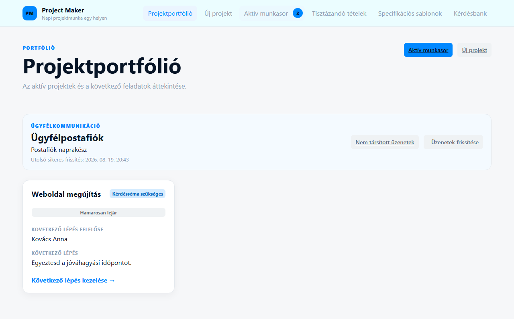
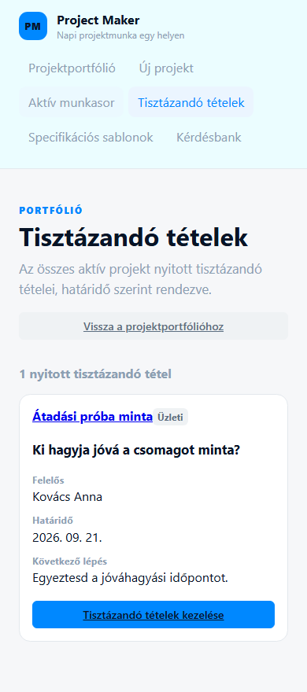
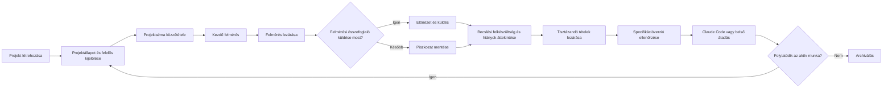
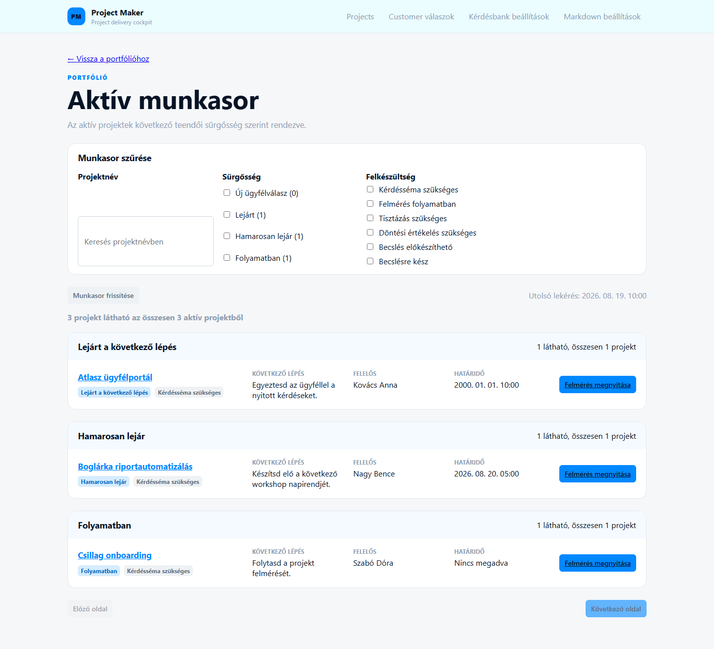
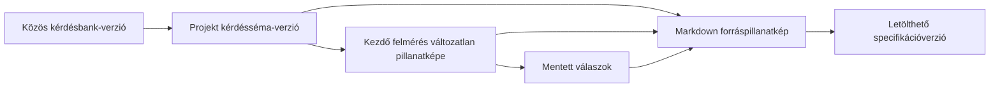
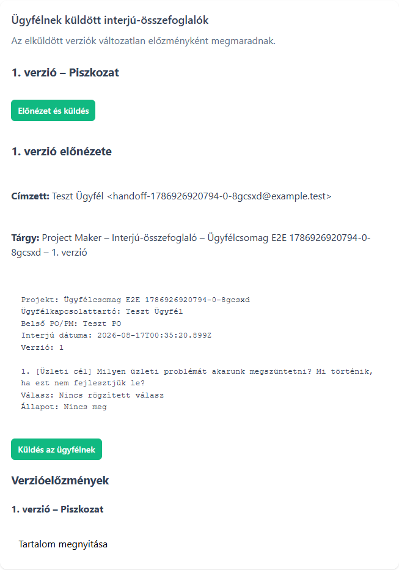
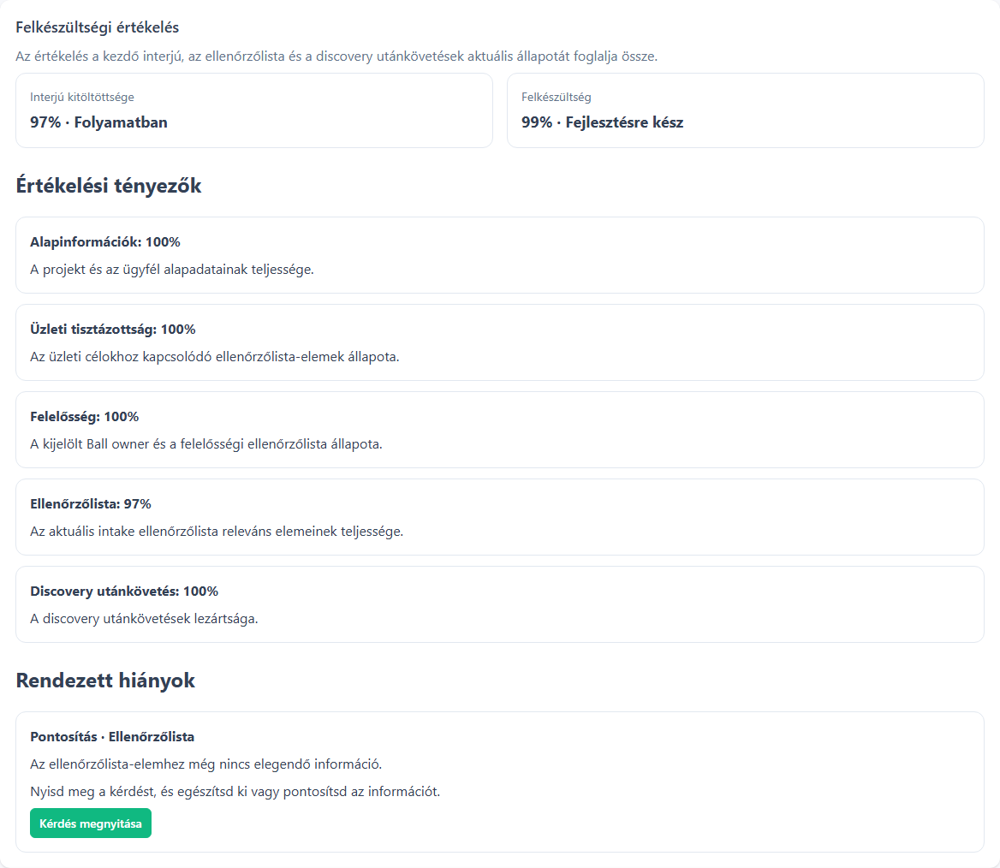
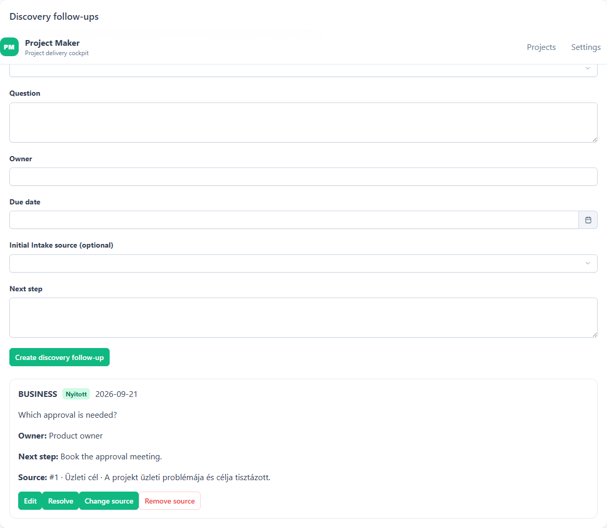

# Project Maker felhasználói kézikönyv

A Project Maker az igényfelmérés és -tisztázás közös munkafelülete. Ez a kézikönyv úgy vezeti végig a napi használaton, mintha most kapnád meg először az alkalmazást.

Megmutatja, mit érdemes rögzíteni, mit jelent az eredmény, mikor történik külső hatás, és hogyan folytathatod biztonságosan, ha valami megszakad.

**Tartalom**

- [Hogyan használd ezt az útmutatót?](#hogyan-használd-ezt-az-útmutatót)
- [Project Maker öt percben](#project-maker-öt-percben)
- [Mielőtt dolgozni kezdesz](#mielőtt-dolgozni-kezdesz)
- [A felület térképe](#a-felület-térképe)
- [A teljes napi workflow](#a-teljes-napi-workflow)
- [Első projekted: vezetett gyorsindítás](#első-projekted-vezetett-gyorsindítás)
- [Projektek áttekintése](#projektek-áttekintése)
- [Projektállapot és Projektbeállítások](#projektállapot-és-projektbeállítások)
- [A közös kérdésbank kezelése](#a-közös-kérdésbank-kezelése)
- [Projektséma és kezdő felmérés](#projektséma-és-kezdő-felmérés)
- [Felmérés lezárása és felmérési összefoglaló](#felmérés-lezárása-és-felmérési-összefoglaló)
- [Felkészültségi értékelés és hiányok](#felkészültségi-értékelés-és-hiányok)
- [Tisztázandó tételek kezelése](#tisztázandó-tételek-kezelése)
- [Ügyfél-emlékeztetők](#ügyfél-emlékeztetők)
- [Specifikációverziók és átadási pillanatképek](#specifikációverziók-és-átadási-pillanatképek)
- [Legutóbbi aktivitás és technikai audit](#legutóbbi-aktivitás-és-technikai-audit)
- [Archiválás, visszaállítás és végleges törlés](#archiválás-visszaállítás-és-végleges-törlés)
- [Hibahelyzetek és biztonságos folytatás](#hibahelyzetek-és-biztonságos-folytatás)
- [Fogalomtár és állapotreferencia](#fogalomtár-és-állapotreferencia)
- [Mit nem tud még a jelenlegi verzió?](#mit-nem-tud-még-a-jelenlegi-verzió)
- [Napi és átadási ellenőrzőlisták](#napi-és-átadási-ellenőrzőlisták)

## Hogyan használd ezt az útmutatót?

Ha még nem dolgoztál a Project Makerrel, olvasd végig a [vezetett gyorsindítást](#első-projekted-vezetett-gyorsindítás), majd haladj a részletes fejezetekkel a napi workflow sorrendjében. Ha már ismered az alapokat, a tartalomjegyzékből közvetlenül megnyithatod az adott műveletet vagy hibahelyzetet.

A leírás elsődleges olvasója PM, PO, BA vagy más projektmunkatárs. A [közös kérdésbank](#a-közös-kérdésbank-kezelése) fejezete annak a kijelölt szervezeti gazdának is szól, aki a minden projektre ható kérdéskészletet gondozza.

Az alkalmazás felülete magyar. A kézikönyv a képernyőn látható gomb- és mezőfeliratokat `ilyen formában` idézi. Mindig a művelet üzleti hatását ellenőrizd, ne csak a gomb helyét jegyezd meg.

Minden részletes workflow ugyanarra a hét kérdésre válaszol:

1. Mi a művelet üzleti célja?
2. Milyen állapotból szabad elkezdeni?
3. Pontosan mit kell megtenni?
4. Mi marad meg a rendszerben, vagy mi jut el külső címzetthez?
5. Miből látszik, hogy sikerült?
6. Mi akadályozhatja meg?
7. Mi a biztonságos következő lépés?

> **Fontos különbség:** a Project Maker igényfelmérő és -tisztázó eszköz. Nem általános projektmenedzsment-rendszer, nem feladatkezelő és nem erőforrás-tervező. A jelenlegi verzió felkészültségi értékelést, döntési pontszámot és becslési ajánlást mutat, de nem rögzít formális Go/Conditional Go/No-Go döntést, és nem készít automatikus kimenetet.

## Project Maker öt percben

A Project Makerben egy projekt nem egyszerűen egy név. Egy közös munkatér, amely összeköti:

- az ügyfél kapcsolattartóját;
- az aktuális felelőst, következő lépést és határidőt;
- a projektre kiválasztott kérdéssémát;
- a vezetett kezdő felmérés mentett válaszait és verziózott felmérési összefoglalóit;
- a nyitott és lezárt tisztázási kérdéseket;
- az ügyfél-emlékeztetők állapotát;
- a változatlan Markdown-pillanatképeket;
- a fontosabb események auditnyomát.

Az alkalmazás napi használatának lényege röviden:

| Helyzet | Mit tegyél? | Mi lesz az eredmény? |
| --- | --- | --- |
| Új igény érkezett | Hozz létre projektet a kapcsolattartóval | Létrejön egy `Előkészítés alatt` projekt, és megnyílik a felmérés indítása |
| Elindul az igényfelmérés | Adj felelőst, következő lépést, határidőt, és válassz státuszt | A portfólióban mindenki ugyanazt az operatív állapotot látja |
| Megvan a workshop kérdésköre | Tedd közzé a projektsémát | Rögzül, mely kérdések tartoznak ehhez a projekthez |
| Elindul a felmérés | Indíts kezdő felmérési kört és rögzítsd a válaszokat | A kör saját kérdéspillanatképet kap |
| Befejeződik a felmérés | Zárd le akkor is, ha maradt hiány, majd küldd a felmérési összefoglalót most vagy később | Verziózott piszkozat készül; a hiányok a felkészültségben maradnak láthatók |
| Tisztázottságot kell ellenőrizni | Nyisd meg a projekt `Becslési felkészültség` oldalát, és kövesd a hiányok műveleteit | Aktuális kitöltöttség, felkészültség, tényezők és rendezett hiányok látszanak |
| Új bizonytalanság merült fel | Hozz létre tisztázandó tételt felelőssel és dátummal | A tisztázandó pont számonkérhetően megmarad |
| Átadási pont vagy review következik | Generálj és ellenőrizz specifikációverziót | Letölthető, változatlan projektpillanatkép készül |
| Lezárult az aktív munka | Archiváld a projektet a `Projektbeállítások` veszélyzónájában | A történet megmarad, az aktív módosítások leállnak |

Az alkalmazás nem kényszerít végig egy varázslón. A jó minőségű adat és a helyes sorrend a munkát végző csapat felelőssége.

## Mielőtt dolgozni kezdesz

### Működési és hozzáférési határ

> **Biztonsági határ:** az alkalmazást csak a szervezet által kontrollált belső hálózaton vagy VPN-határon belül használd. Minden dolgozó saját e-mail-címével és jelszavával regisztrál, majd ugyanazokat a belső képességeket kapja. Nincsenek szerepkörök, projektjogosultságok vagy külön adminfiókok.

A `Kérdésbank` menüpontot minden aktív belső felhasználó eléri. Egy mentés minden későbbi projektsémára ható új bankverziót hoz létre, ezért a csapat egyezzen meg arról, ki és mikor módosítja.

Az auditnapló a bejelentkezett belső felhasználóhoz köti a műveleteket. Ez nem helyettesíti a csapaton belüli egyeztetést: változtatás előtt ellenőrizd, hogy nem dolgozik-e valaki ugyanazon az adaton.

### Adatbiztonsági alapszabályok

- Csak az igényfelméréshez és -tisztázáshoz szükséges üzleti adatot rögzítsd.
- Ne írj jelszót, hozzáférési tokent, privát kulcsot vagy más titkot válaszba, tisztázandó tételbe, Markdownba vagy mezőbe.
- Ügyfélnek küldés előtt ellenőrizd a projekt létrehozásakor megadott kapcsolattartó e-mail-címét.
- A Claude Code-nak szánt Markdownot ne küldd ügyfélnek; ügyfélkommunikációhoz a felmérési összefoglalót vagy az előnézett ügyfél-emlékeztetőt használd.
- Hasznos történettel rendelkező projektet archiválj. A törlés csak üres, korai piszkozat eltávolítására való.
- Archivált projektet előbb állíts vissza, és csak utána hozz létre új tartalmat, még akkor is, ha egy közvetlen oldal technikailag megnyitható.

### Mit jelent a képernyő állapota?

| Jelenség | Jelentés | Teendő |
| --- | --- | --- |
| Forgó betöltésjelző | A webapp még adatot kér | Várj; ne indíts párhuzamos műveletet |
| Zöld sikerüzenet | A művelet választ kapott és sikerült | Ellenőrizd a megváltozott állapotot is |
| Piros hibaüzenet | A kérés nem fejeződött be | Olvasd el, mi maradt meg, majd a hiba szerinti helyreállítást kövesd |
| Letiltott gomb | Előfeltétel hiányzik, mentés folyik, vagy az állapot nem engedi a műveletet | Fejezd be a folyamatban lévő műveletet, mentsd a módosított beállítást, vagy állítsd vissza a projektet |
| Az oldal nevével jelölt `… újratöltése` művelet | A betöltés vagy mentés megismételhető | Stabil kapcsolat mellett indítsd újra ugyanazt a kérést |

## A felület térképe

A felső navigáció hat állandó kiindulópontot ad:

- `Projektportfólió`: az aktív projektek és minden projekt bejárata;
- `Új projekt`: új ügyfélprojekt rögzítése;
- `Aktív munkasor`: a következő projektfeladatok priorizált munkasora;
- `Tisztázandó tételek`: az összes aktív projekt nyitott tisztázandó tétele;
- `Specifikációs sablonok`: a Markdown-kimenet szervezeti sablonjai;
- `Kérdésbank`: a szervezeti szintű közös kérdésbank.

*Az asztali Projektportfólióban az ügyfélválaszok száma közvetlenül a szűrt munkasorba vezet. A képen kizárólag fiktív mintaadat szerepel.*

*390 képpont szélességen minden mező címkéje, értéke és művelete elérhető marad. A képen kizárólag fiktív mintaadat szerepel.*

Egy projekten belül a közös fejléc és a visszalépő link őrzi a munkafolyamatot: a visszalépés pontosan a `Projektportfólió`, az `Aktív munkasor` vagy a `Tisztázandó tételek` korábbi állapotába visz, a projektfülek pedig ugyanabban a projektben maradnak.

| Felület | Mire való? | Legfontosabb műveletek |
| --- | --- | --- |
| `Projektportfólió` | Aktív projektek áttekintése | Új projekt, következő feladat megnyitása |
| `Projektállapot` | Napi munkaállapot és projektkoordináció | Következő lépés, felelős és határidő; ügyféllevelezés; legutóbbi aktivitás |
| `Becslési felkészültség` | Felkészültségi értékelés és tisztázások | Hiányok javítása, tisztázandó tételek létrehozása és lezárása |
| `Projektbeállítások` | Projektadminisztráció | Alapadatok, ügyfélkapcsolat, automatikus ügyfél-emlékeztető, adminisztratív projektfázis, archiválás és törlés |
| `Felmérés` | Projektséma, kezdő felmérés és felmérési összefoglaló | Séma elfogadása és első kör indítása, válaszadás, felmérés lezárása, előnézet és küldés |
| `Projekt-specifikáció` | Változatlan kanonikus specifikációk | Specifikációverzió generálása, összehasonlítás, előnézet, Markdown letöltése |
| `Kérdésbank` | Minden projekt közös kérdéskészlete | Kérdés létrehozása, új verziót létrehozó szerkesztés |

Ha egy projekt vagy specifikációverzió közvetlen linkje már nem létező elemre mutat, térj vissza a projektlistára, és nyisd meg újra a kívánt elemet a felületről. Ne próbáld kézzel javítani az oldal címét.

## A teljes napi workflow

Az alábbi ábra a javasolt üzleti sorrendet mutatja. Nem rendszer által kikényszerített varázsló: a projekt státuszát és a lépések időzítését a csapat kézzel kezeli.

### 1. Indítás és közös kontextus

Hozd létre a projektet a megnevezett belső projektgazdával. A `Projektállapot` oldalon jelöld, hogy a következő feladat a belső projektgazdánál vagy az ügyfélkapcsolattartónál van, mi az egyetlen konkrét következő lépés, és mikorra esedékes. Az `Adminisztratív projektfázis` mezőt a `Projektbeállítások` oldalon tartsd összhangban a valós üzleti helyzettel; ez nem a számított felkészültségi állapot.

### 2. Kérdéskör rögzítése

Válaszd ki az aktív alapkérdések közül az adott projekthez szükségeseket, és tedd közzé a projektsémát. Ettől kezdve a csapat vissza tudja vezetni, melyik bankverzióból és mely kérdésekből indult a felmérés.

### 3. Felmérés és megszakításbiztos mentés

Indíts kezdő felmérési kört. Szöveges válasz után várd meg a `Mentve` állapotot; választó, jelölő, szám- és dátumválasz azonnal ment. Megszakítás után ugyanaz a nyitott kör töltődik vissza. A felmérés végén a kört a tartalmi teljességtől függetlenül lezárhatod, majd előnézetből azonnal elküldheted a felmérési összefoglalót, vagy piszkozatként későbbre hagyhatod.

### 4. Becslési felkészültség és nyitott tisztázandó tételek

A felmérés értékelése után nyisd meg a projekt `Becslési felkészültség` oldalát. A felmérés közben felmerülő, később megválaszolandó pontokat ne rejtsd el egy hosszú válaszban. Hozz létre külön tisztázandó tételt kategóriával, felelőssel, valódi céldátummal és következő lépéssel. Lezáráskor a döntést vagy választ is rögzítsd.

### 5. Pillanatkép és kommunikáció

Belső munkához generálhatsz friss specifikációverziót, abból fejlesztési csomagot készíthetsz, majd letöltheted vagy pontos előnézet után Gitbe adhatod. Saját Claude Code előfizetésedet a `Fiókbeállítások` oldalon kapcsolhatod a Project Makerhez, így a specifikációt és a fejlesztési csomagot másolgatás nélkül kezelheted. A `.md` fájl és az MCP-kapcsolat nem ügyfélkommunikáció: ügyfélnek a felmérési összefoglalót vagy a külön megírt ügyfél-emlékeztetőt küldd.

### 6. Megőrzés

Ha az aktív munka véget ér, archiválj. A projekt a listában és az auditban megmarad. Törölni csak valóban üres, `Előkészítés alatt` állapotú projektet szabad és lehet.

## Első projekted: vezetett gyorsindítás

Ez a gyorsindítás egy teljes, biztonságos első kört mutat. A részletes szabályokat a hivatkozott fejezetekben találod.

### Előfeltétel

- A webapp a szervezet belső hálózatán elérhető.
- Ismered az ügyfél kapcsolattartójának helyes nevét és e-mail-címét.
- Tudod, ki a belső operatív felelős.
- A `Kérdésbank` oldalon van legalább egy aktív kérdés.

### Lépések

1. Nyisd meg a `Projektportfólió` oldalt, és válaszd az `Új projekt` gombot.
2. Add meg a projekt nevét, a kapcsolattartó nevét és e-mail-címét.
3. Válaszd a projekt létrehozását és a felmérés megnyitását.
4. A `Projektbeállítások` oldalon állítsd az adminisztratív projektfázist `Felmérési szakasz` értékre.
5. A `Projektállapot` oldalon válaszd ki a következő feladat gazdáját (`Belső projektgazda` vagy `Ügyfélkapcsolattartó`), add meg a következő lépést és szükség szerint a határidőt, majd válaszd a `Koordináció mentése` gombot.
6. Nyisd meg a `Felmérés` oldalt.
7. Ellenőrizd a kijelölt kérdéseket, majd válaszd a `Kérdésséma elfogadása és felmérés indítása` gombot. Ez egy műveletként menti a kérdéssémát és indítja el az első felmérési kört.
8. Ha a séma mentése sikerült, de a felmérés nem indult el, válaszd a `Felmérés indításának újrapróbálása` gombot; a sémát ne hozd létre újra.
9. Rögzítsd a válaszokat. Szöveges mezőknél várd meg a `Mentve` visszajelzést.
10. A felmérés végén válaszd a `Felmérés lezárása és hiányok áttekintése` vagy a `Lezárás és felmérési összefoglaló előnézete` műveletet. A lezáráshoz nem kell minden üzleti hiányt kitölteni, de függőben lévő vagy hibás mentés nem maradhat.
11. Küldés előtt olvasd át a felmérési összefoglaló előnézetét és ellenőrizd a címzettet. A sikeres küldés változatlan verziót hoz létre.
12. Ügyfél-módosítás esetén indíts új verziót, írd le a módosítás összefoglalását, szerkeszd a válaszokat, majd készíts új előnézetet és küldd el.
13. Nyisd meg a `Becslési felkészültség` oldalt. Minden későbbi tisztázandó pontból hozz létre külön tisztázandó tételt.
14. Átadás előtt nyisd meg a `Projekt-specifikáció` oldalt, és válaszd a `Specifikációverzió generálása` gombot.
15. Ellenőrizd a `Tartalmi előnézet` részt és a specifikációverzió metaadatait.
16. Amikor már nincs aktív munka, nyisd meg a `Projektbeállítások` oldalt, és archiváld a projektet a veszélyzónában.

### A gyorsindítás akkor kész, ha

- a projektkártyán látszik a felelős és a következő lépés;
- a projektséma verziószáma megjelenik;
- nincs nyitott, mentési hibás válasz;
- a kezdő felmérési kör lezárult;
- minden még nyitott bizonytalanságnak van felelőse és határideje;
- a legfrissebb specifikációverzió tartalmát valaki elolvasta;
- a `Projektállapot` oldalon a legutóbbi munkához szükséges aktivitások érthetően megjelentek.

## Projektek áttekintése

*A projektlista a napi munka kiindulópontja; a státusz, a felelős és a következő lépés már a kártyán látható.*

### A projektlista értelmezése

A `Projektportfólió` oldalon minden projekt egy kártya. A kártya megmutatja:

- a projekt nevét;
- az aktuális adminisztratív projektfázist;
- a következő feladat konkrét gazdáját, vagy a `Nincs kijelölve` jelzést;
- a `Következő lépés` értékét, vagy a `Nincs megadva` jelzést;
- a projekt aktuális elsődleges feladatához vezető belépési pontot.

A lista a projekt saját koordinációs vagy adminisztratív projektfázis-mentésének legutóbbi ideje szerint rendezi előre a kártyákat. Egy felmérési válasz vagy tisztázandó tétel önmagában nem feltétlenül mozgatja előre a projektet.

Azonos módosítási idő esetén a sorrend stabil marad. Az archivált projekt nem tűnik el: `Archivált` állapottal ugyanebben a listában marad, hogy a történet később is megtalálható legyen.

### Betöltés, üres lista és hiba

- `A projektek betöltése…`: várd meg a betöltést.
- `Még nincs projekt`: még nincs rögzített projekt. Az `Új projekt létrehozása` gomb ugyanazt az űrlapot nyitja meg, mint az `Új projekt` navigációs pont.
- `A projektek nem tölthetők be`: a lista nem érhető el. A `Projektlista újratöltése` megismétli a betöltést.

Betöltési hiba nem töröl projektet és nem hoz létre újat. Ha a `Projektlista újratöltése` ismét hibázik, ne töltsd ki újra több böngészőlapon ugyanazt a projektet; jelezd az üzemeltetőnek, hogy a webapp vagy a háttérszolgáltatás nem elérhető.

### Aktív munkasor

*Az Aktív munkasor nézete a teljes portfólió következő teendőit csoportosítja; minden sor egy projektet és annak egyetlen elsődleges következő műveletét mutatja.*

A Projektportfólió fejlécében válaszd az `Aktív munkasor` gombot, ha nem egy előre kiválasztott projektből, hanem az összes aktív projekt közül szeretnéd eldönteni, mivel foglalkozz következőként. A csoportok mindig ebben a sürgősségi sorrendben jelennek meg:

1. új ügyfélválasz érkezett;
2. lejárt a következő lépés;
3. hamarosan lejár;
4. folyamatban van, de nincs közeli határidő.

A projektnév-keresés, a sürgősségi és a felkészültségi jelölők együtt szűkítik a listát. A szűrés és a rendezés a szerveren történik, ezért a csoportok és a darabszámok nem csak a már letöltött tíz sort írják le. A képernyő külön jelzi, hány projekt látható az aktuális oldalon, és hány felel meg összesen. Az `Előző oldal` és `Következő oldal` gombokkal tízesével járhatod be az eredményt.

Minden sorban ellenőrizd a projekt nevét, a felkészültségi állapotot, a következő lépést, a felelőst és a határidőt. A sor végén lévő elsődleges művelet a projekt jelenlegi következő munkafelületét nyitja meg. A böngésző Vissza művelete visszaadja ugyanazt a keresést, szűrést és lapozott oldalt.

Az oldal nem rendeződik át automatikusan a háttérben. Ha tudatosan friss képet szeretnél, válaszd a `Lista frissítése` gombot. A frissítés az első oldalra áll, megtartja a szűrőket, kiírja az utolsó lekérés idejét, és képernyőolvasó számára is jelzi a sikert vagy a hibát.

Hiba esetén a biztonságos folytatás attól függ, volt-e már sikeresen betöltött oldal:

- kezdeti betöltési hibánál a lista helyett az `Újrapróbálás` jelenik meg;
- frissítési vagy lapozási hibánál az utolsó sikeres oldal látható marad `A lista elavult lehet.` jelzéssel; a `Sikertelen lekérés újrapróbálása` pontosan ugyanazt a lapot és szűrést kéri újra;
- lejárt vagy érvénytelen oldalhivatkozásnál a rendszer biztonságosan az első oldalra áll, és ezt külön üzenetben jelzi;
- ha a szűrők mellett nincs találat, a `Szűrők törlése` visszaállítja a teljes munkasort; ha egyáltalán nincs aktív projekt, innen visszatérhetsz a Projektportfólióhoz vagy új projektet hozhatsz létre.

A kereső, a jelölők, a frissítés, a lapozás és a sorműveletek billentyűzettel is használhatók. Keskeny képernyőn a sorok egymás alá tördelik ugyanezeket az adatokat és műveleteket; a prioritási csoportok sorrendje nem változik.

### Új projekt létrehozása

**Mikor használd?** Amikor új, önálló igényfelmérési vagy -tisztázási munkatérre van szükség. Ne hozz létre második projektet pusztán azért, mert a meglévő projekt éppen várakozik vagy archivált; előbb ellenőrizd, hogy azt kell-e visszaállítani.

1. Válaszd az `Új projekt` gombot.
2. Töltsd ki a `Projekt neve` mezőt. Legyen egyértelmű, legfeljebb 255 karakteres név.
3. Töltsd ki az `Ügyfél kapcsolattartó neve` mezőt a tényleges kapcsolattartó nevével; a mező legfeljebb 255 karaktert fogad el.
4. Töltsd ki az `Ügyfél kapcsolattartó e-mail-címe` mezőt érvényes, legfeljebb 320 karakteres e-mail-címmel.
5. Ellenőrizd még egyszer a címet. A jelenlegi felületen később sem a projekt neve, sem a kapcsolattartó neve vagy e-mail-címe nem szerkeszthető.
6. Válaszd a létrehozást és a felmérés megnyitását.

Siker esetén a webapp létrehoz egy `Előkészítés alatt` adminisztratív projektfázisú projektet, és közvetlenül a következő szükséges feladatra vezet. A projekt már a Projektportfólióban is látható.

Ha meggondoltad magad, a `Mégse` bezárja az űrlapot és nem hoz létre projektet. Ha az űrlap mezőhibát jelez, javítsd a kiemelt értéket; a projekt csak sikeres szerverválasz után jön létre.

> **Kapcsolattartói adat javítása:** mivel jelenleg nincs szerkesztőművelet, hibás név vagy e-mail esetén ne küldj levelet.
>
> Ha a projekt még teljesen üres és `Előkészítés alatt` állapotú, törölhető és helyesen újralétrehozható. Ha már van megőrzendő tevékenysége, archiváld, és a csapattal egyeztetett módon hozz létre helyes projektet. A régi történetet ne próbáld törléssel eltüntetni.

## Projektállapot és Projektbeállítások

A projekt közös fejlécében ugyanaz a szerver által számított munkaállapot, elsődleges feladat és visszatérési út látszik minden projektoldalon. A régi, mindent egy helyre zsúfoló projektoldal helyett két világos felelősségű felületet használj.

### Projektállapot: a napi munkaközpont

A `Projektállapot` oldal a projekt nevét és aktuális munkaállapotát, az egyetlen elsődleges feladatot, a projektkoordinációt, az ügyféllevelezés állapotát és az utolsó öt munkához szükséges aktivitást mutatja.

A koordinációban gyorsan szerkeszthető:

- a következő lépés felelőse: a megnevezett belső projektgazda vagy az ügyfélkapcsolattartó;
- az egyetlen konkrét következő lépés;
- a következő lépés határideje.

A `Koordináció mentése` csak ezt a három napi munkamezőt módosítja. Nem változtat projektnevet, kapcsolattartót, adminisztratív projektfázist, archiválást vagy automatikus ügyfél-emlékeztető beállítást. Sikeres mentés után a közös projektfejléc is a friss, szerver által számított állapotot mutatja.

Az `Ügyféllevelezés` kártya megmutatja az új válaszok számát és a szükséges teendőt, majd az `Ügyféllevelezés` oldalra vezet. A `Legutóbbi aktivitás` legfeljebb öt, magyarul összefoglalt üzleti eseményt mutat. Nyers eseménykód, technikai adattartalom, ügyfélszöveg vagy titok nem jelenik meg az alkalmazotti felületen.

### Projektbeállítások: adminisztráció

A `Projektbeállítások` oldal kezeli:

- a projekt nevét, a belső projektgazda nevét és az ügyfélkapcsolattartó adatait;
- az automatikus ügyfél-emlékeztető engedélyezését, időközét és végdátumát;
- az adminisztratív projektfázist;
- az archiválást, visszaállítást és a jogosult korai piszkozat végleges törlését.

Az alapadatok csak az első kérdésséma elfogadásáig és aktív projektben szerkeszthetők. Ezután olvashatók maradnak, de a történeti azonosság védelmében nem írhatók át. Az automatikus ütemezés beállítása itt történik; a kézi ügyfél-emlékeztető megírása, előnézete, küldése és helyreállítása az `Ügyféllevelezés` munkafelület feladata.

### Adminisztratív projektfázis

Ez egy kézzel rögzített üzleti fázis, nem a szerver által számított felkészültségi állapot, és nem teljes szállítási életciklus.

| Állapot | Mikor használd? | Mit nem jelent? |
| --- | --- | --- |
| `Előkészítés alatt` | A projekt még formálódik | Nem jelenti automatikusan, hogy törölhető |
| `Felmérési szakasz` | Aktív igényfelmérés vagy workshop folyik | Nem jelenti, hogy minden kérdésnek van válasza |
| `Belső egyeztetésre vár` | A következő érdemi lépés belső információra vagy döntésre vár | Nem automatikus; a csapat tartja naprakészen |
| `Ügyfél-visszajelzésre vár` | A következő érdemi lépés ügyfélválaszra vár | Önmagában nem küld levelet |
| `Tervezésre átadva` | A csapat üzletileg tervezésre átadottnak jelöli | Nem formális jóváhagyás és nem felkészültségi tanúsítvány |
| `Archivált` | Az aktív követés lezárt vagy szünetel, a történet megmarad | Nem törlés; visszaállítható |

A `Tervezésre átadva` fázis beállítása továbbra is automatikusan létrehozza a meglévő `Mérföldkő elérése` okú specifikációverziót. A verzió változatlan marad; téves fázisválasztást újabb helyes fázissal és szükség esetén új specifikációverzióval korrigálj.

### Archivált projekt

Archiválás és törlés kizárólag a `Projektbeállítások` elkülönített `Archiválás és törlés` részében érhető el, és explicit megerősítést kér. Archiválás után a projektoldalak és beállítások olvashatók maradnak, a módosítások letiltódnak. Új munka előtt előbb válaszd a `Projekt visszaállítása` műveletet; a visszaállított adminisztratív projektfázis mindig `Előkészítés alatt`.

## A közös kérdésbank kezelése

*A bankverzió azt jelzi, melyik változatból készülhetnek új projektsémák; egy korábbi projektpillanatképet a későbbi szerkesztés nem ír át.*

### Ki kezelje?

> **Szervezeti felelősség:** a `Kérdésbank` oldal technikailag minden alkalmazás-hozzáféréssel rendelkező személy számára elérhető. Mégis csak a kijelölt kérdésbank-gazda módosítsa, mert minden sikeres létrehozás vagy szerkesztés új, közös bankverziót publikál.

A kérdésbank célja, hogy a csapat ugyanazzal az igényfelmérési szókészlettel és ellenőrzési logikával dolgozzon. Nem egy projekthez tartozik. Ha csak egyetlen projektben szeretnél kihagyni egy kérdést, ne inaktiváld globálisan; a projekt kérdéssémájában vedd ki a kijelölést.

### A lista olvasása

Az oldal tetején látható a `Publikált verzió` és a kérdések száma. Minden kártyán szerepel:

- a változatlan `Kérdésazonosító`;
- a kérdés szövege és témája;
- az `Ellenőrzési pont`, vagyis milyen tisztázottságot ellenőriz;
- a sorrend;
- a kérdéstípus;
- az aktív állapot;
- a `Kötelező` állapot;
- a válaszadást segítő `Útmutatás`, ha van.

Az `Alapkérdés szerkesztése` nem a régi sort írja felül. A módosított kérdéssel és a többi kérdés átvitt állapotával új, változatlan bankverzió készül.

Ha a bank üres, a `Még nincs alapkérdés` állapot és az `Alapkérdés létrehozása` gomb jelenik meg; ez ugyanazt a létrehozó űrlapot nyitja meg. Egy kérdéskártyán látható `Archivált` címke ezen az oldalon inaktív alapkérdést jelent, nem archivált projektet.

### Új alapkérdés létrehozása

**Mikor használd?** Ha a kérdés több projektben is értelmes, szervezetileg elfogadott, és megfogalmazása elég stabil ahhoz, hogy későbbi projektsémák alapja legyen.

1. Válaszd az `Új alapkérdés` gombot.
2. Adj `Kérdésazonosító` értéket. Legfeljebb 100 karakter lehet, csak kisbetűt, számot és kötőjelet tartalmazhat, például `ugyfeladat-felelose`.
3. Add meg a `Témakör` értékét legfeljebb 255 karakterben.
4. Az `Ellenőrzési pont` mezőben fogalmazd meg, milyen állapotot vagy döntést igazol a válasz.
5. Válaszd ki a `Választípus` értékét.
6. Írd be a `Kérdés szövege` tartalmát úgy, ahogyan a workshopon feltennéd.
7. Add meg a `Sorrend` egész számot. Új kérdésnél csak a jelenlegi lista érvényes pozíciója vagy annak vége használható.
8. Szükség esetén adj `Útmutatás` szöveget. Ez segítség, nem helyettesíti a kérdést.
9. Választós típusnál írd be a `Válaszlehetőségek` értékeit, soronként egyet.
10. Állítsd be a négy viselkedési jelölőt.
11. Válaszd az `Alapkérdés létrehozása` gombot.

Siker esetén a bank verziószáma eggyel nő, a kérdés megjelenik a beállított pozíción, és az utána következő kérdések sorrendje eltolódik. A sikerüzenet és az új `Publikált verzió` együtt igazolja a publikálást.

A `Mégse` elveti a megnyitott űrlap helyi tartalmát, és nem hoz létre új verziót.

### Meglévő kérdés szerkesztése

1. A megfelelő kártyán válaszd a `Szerkesztés` gombot.
2. Ellenőrizd, hogy valóban a legfrissebb bankverzió kérdését nyitottad meg.
3. Módosítsd a témát, ellenőrzési pontot, szöveget, típust, sorrendet, hintet, opciókat vagy jelölőket.
4. A `Kérdésazonosító` nem szerkeszthető. Ez biztosítja, hogy a kérdés azonosítható maradjon a verziók között.
5. Válaszd a `Módosítások mentése` gombot.

Ha más közben új bankverziót publikált, a régi kártyáról indított mentés ütközhet. Töltsd újra az oldalt, olvasd el a legfrissebb kérdést, és csak azután ismételd meg a szándékos módosítást.

Kérdés törlése nincs. Ha egy kérdést a jövőben nem szabad új projektsémába választani, kapcsold ki az `Aktív` jelölőt. Ez a későbbi kiválasztásból kiveszi, de a korábbi projektsémák és felmérések történetét nem módosítja.

### A hét kérdéstípus

| Típus | Mire való? | Válasz a felmérésben |
| --- | --- | --- |
| `Rövid szöveg` | Rövid, tömör szöveges tény | Egysoros szöveg |
| `Hosszú szöveg` | Magyarázat, üzleti cél, folyamat vagy döntési háttér | Többsoros szöveg |
| `Egyszeres választás` | Pontosan egy előre meghatározott lehetőség | Egy elem a listából |
| `Többszörös választás` | Több, egymással együtt is igaz lehetőség | Egy vagy több jelölőnégyzet |
| `Igen vagy nem` | Igen/nem állítás | Bejelölt állapot: igen; kikapcsolt, már mentett állapot: nem |
| `Szám` | Véges numerikus érték | Számmező |
| `Dátum` | Naptári nap | `ÉÉÉÉ-HH-NN` dátum |

`Egyszeres választás` és `Többszörös választás` esetén legalább egy nem üres opciónak kell lennie. Soronként egy opciót írj; az üres sorokat a rendszer figyelmen kívül hagyja, az azonos opciókat viszont elutasítja. Más kérdéstípushoz nem tartozhat opciólista.

Típusváltáskor mindig ellenőrizd, hogy a kérdés jelentése és a korábbi válaszolási elvárás összhangban marad-e. A változtatás csak későbbi sémákra és körökre hat; a már elindított kör megőrzi a régi típust és opciókat.

### A négy viselkedési jelölő

| Jelölő | Jelenlegi tényleges hatás |
| --- | --- |
| `Kötelező` | A felkészültségben és a későbbi tisztázásban hiányként látszik; a felmérés lezárását önmagában nem akadályozza |
| `Becsléshez szükséges` | Metaadatként megmarad; önmagában nem módosítja a kör lezárását vagy a projektállapotot |
| `Blokkoló` | A nyitott körben kiemelt tisztázási útmutatást mutat; önmagában nem akadályozza a lezárást |
| `Aktív` | Bekapcsolva megjelenik az új projektséma-választásban; kikapcsolva új sémába nem választható |

A `Kötelező` és `Blokkoló` jelölő sem tartalmi lezárási kapu: kész, részben kész, nem releváns vagy hiányos eredménnyel is lezárható a felmérés. Csak függőben lévő vagy hibás technikai mentés blokkolja a lezáró gombokat. A `Becsléshez szükséges` nem külön pontszámkapu, és nem helyettesít döntési pontszámot, ajánlott döntést vagy automatikus projektállapot-váltást. A felkészültségi értékeléshez a [forráskörnek](#ha-az-értékelés-nem-elérhető-vagy-nem-töltődik-be) a jelenlegi kanonikus sémának kell megfelelnie.

### Tipikus mentési hibák és helyreállítás

| Helyzet | Biztonságos folytatás |
| --- | --- |
| A kérdésazonosító formátuma hibás vagy már létezik | Válassz egyedi, kisbetűs-kötőjeles azonosítót; meglévő fogalomnál inkább a régi kérdést szerkeszd |
| A sorrend kívül esik a listán | Adj 1 és az engedett utolsó pozíció közötti egész számot |
| Választós kérdésnek nincs opciója | Adj legalább egy nem üres sort |
| Két opció azonos | Egyesítsd vagy nevezd át őket úgy, hogy üzletileg is különbözzenek |
| A bank nem töltődik be | Válaszd a `Kérdésbank újratöltése` gombot; ne hozz létre párhuzamos másolatot másik lapon |
| Mentés közben új bankverzió született | Töltsd újra az oldalt, hasonlítsd össze a friss állapotot, majd ismételd meg a szükséges módosítást |

## Projektséma és kezdő felmérés

A projektséma azt rögzíti, hogy a közös kérdésbank aktuális kérdései közül melyek tartoznak az adott projekthez. A kezdő felmérési kör pedig erről a sémáról készít saját, változatlan pillanatképet.

Egy későbbi kérdésbank-szerkesztés nem írja át a már közzétett projektsémát vagy a megkezdett felmérési kört. A Markdown a létrehozás pillanatában elérhető projekt-, séma-, kör- és válaszadatot másolja saját forráspillanatképébe.

A tisztázandó tételek és az ügyfél-emlékeztető beállításai jelenleg nem részei ennek a Markdown-forrásnak.

*Bal oldalon a projekthez kiválasztott kérdések, jobb oldalon a változatlan körpillanatkép és a szerveren mentett válaszok láthatók.*

### Projektséma elfogadása és az első felmérés indítása

**Előfeltétel:** van legalább egy aktív alapkérdés, és nincs nyitott kezdő felmérési kör.

Első megnyitáskor a felület minden aktuálisan aktív alapkérdést kijelöl. Ez kiindulási ajánlás, nem kötelező teljes lista.

1. A projekt közös navigációjában nyisd meg a `Felmérés` oldalt.
2. Olvasd el az `Aktív alapkérdések kiválasztása` listát.
3. Hagyd kijelölve az adott projekthez szükséges kérdéseket, a nem relevánsakat vedd ki.
4. Legalább egy kérdésnek kijelölve kell maradnia.
5. Első alkalommal válaszd a `Kérdésséma elfogadása és felmérés indítása` gombot.
6. Várd meg az `Elfogadott kérdésséma v… (bank v…)` visszajelzést és a folyamatban lévő felmérés kérdéskártyáit.

A séma saját verziószáma azt mutatja, hányadik közzétett projektsémát látod. A bankverzió azt jelzi, melyik közös kérdésbankból készült. A két számnak nem kell azonosnak lennie.

Az első elfogadás előtt nincs külön kezdőfelmérés-kártya vagy kézi körindító gomb. Az elfogadás változatlan projektsémát ment, majd pontosan egy kezdő felmérési kört indít. Ha a séma már megmaradt, de a kör indítása megszakadt, a felület csak a `Felmérés indításának újrapróbálása` műveletet kínálja; frissítés után is innen folytathatsz.

Ha nincs aktív alapkérdés, a felület `Nincs aktív alapkérdés` állapotot mutat. A projektindítási piszkozat megmarad és később folytatható. Kérd meg a kijelölt kérdésbank-gazdát, hogy legalább egy megfelelő kérdést aktiváljon, majd töltsd újra az oldalt.

### Projektséma frissítése

**Mikor használd?** Ha a következő felmérési kör kérdésköre változik, és nincs nyitott kör.

1. Módosítsd a kijelöléseket.
2. Válaszd a `Séma frissítése` gombot.
3. Ellenőrizd, hogy a sémaverzió eggyel nőtt.

A frissítés utódsémát hoz létre. Egy korábbi nyitott vagy lezárt kör kérdései nem változnak. Az új séma csak a később indított körre hat.

Nyitott kör alatt a jelölőnégyzetek és a publikálási gomb le vannak tiltva, és megjelenik: `A kérdésséma zárolva van, amíg a nyitott kezdő felmérési kör fut.` Előbb fejezd be a mentéseket és zárd le a kört; a kör közben ne próbáld a kérdéslistát megváltoztatni.

### Kezdő felmérési kör folytatása

A jelenlegi felület egyetlen körtípust szállít: a kezdő felmérést. További körtípus jelenleg nincs.

Az első kezdő felmérési kört a kérdésséma elfogadása automatikusan elindítja.

1. Várd meg a `Folyamatban` állapotot és a kérdéskártyákat.
2. Haladj a kérdéseken a workshop természetes sorrendjében.

Az indítás a projektséma teljes, változatlan pillanatképét másolja a körbe: kérdésszöveg, téma, ellenőrzési pont, típus, opciók, `Kötelező`, `Blokkoló` és `Útmutatás`. Ezért egy későbbi bank- vagy sémamódosítás a futó körön nem látszik.

Ha elnavigálsz, bezárod a böngészőt vagy az alkalmazás újraindul, a következő megnyitáskor a `Folyamatban lévő kezdő felmérési kör folytatása` állapot tölti vissza ugyanazt a nyitott kört és a mentett válaszokat.

Ne indíts pótkört megszakítás miatt. A szerver eleve megakadályozza, hogy ugyanahhoz a projekthez két nyitott kezdő kör legyen.

### A kérdéskártya értelmezése

Minden kérdésnél látható:

- a kérdés sorszáma és szövege;
- a téma és a válasz típusa;
- az ellenőrzési pont;
- a `Kötelező kérdés` jelzés, ha a hiány a felkészültségi értékelésben számít;
- a `Blokkoló tisztázás` jelzés és külön figyelmeztetés;
- a kérdésbanki hint;
- a típushoz tartozó válaszadási útmutató;
- választós kérdésnél az engedett opciók;
- a válasz mentési állapota.

Az útmutatás segít jó választ adni, de nem értékeli a tartalom szakmai minőségét. A rendszer például elfogadhat egy rövid szöveget technikailag, miközben az üzletileg még nem válaszolja meg a kérdést.

### Válaszadás a hét típusra

| Típus | Művelet | Mikor indul mentés? | Hogyan üríthető? |
| --- | --- | --- | --- |
| Rövid vagy hosszú szöveg | Gépelj a mezőbe | 750 ms gépelési szünet után | Töröld a teljes szöveget; az ürítés azonnal mentődik |
| Egyszeres választás | Válassz egy opciót | Azonnal | Válaszd a kezdeti üres lehetőséget |
| Többszörös választás | Jelölj egy vagy több opciót | Minden jelölésnél azonnal | Vedd ki az összes jelölést |
| Igen/nem | Jelöld be vagy kapcsold ki az `Igen` jelölést | Azonnal | Nincs külön „nincs válasz” gomb; egy már kezelt kikapcsolt állapot `nem` válasz |
| Szám | Írj véges számértéket | Érvényes változáskor azonnal | Ürítsd ki a mezőt |
| Dátum | Válassz vagy írj naptári napot | Változáskor azonnal | Ürítsd ki a dátummezőt |

Szöveges válasz után ne lépj azonnal tovább vagy ne zárd be az oldalt. Figyeld meg a kérdés alatti mentési állapotot.

| Látható állapot | Mit jelent? | Munkatársi teendő |
| --- | --- | --- |
| `Piszkozat – automatikus mentésre vár` | A helyi szöveg még nem jutott el a szerverre | Maradj az oldalon; 750 ms gépelési csend után indul a mentés |
| `Mentés folyamatban…` | A mentési kérés úton van | Várd meg a végét a lezárás vagy elnavigálás előtt |
| `Mentve` | A szerver megőrizte az értéket | Biztonságosan továbbléphetsz |
| `Még nincs mentve` | Nincs rögzített válasz | Kötelező kérdésnél adj választ |
| `Nem sikerült menteni…` | A szerver nem fogadta el vagy nem érte el a mentést | A piszkozat látható marad; stabil kapcsolat mellett válaszd a `Mentés újrapróbálása` gombot |

Ha egy sikertelen szöveges mentés után tovább gépelsz, a képernyőn lévő legfrissebb piszkozat marad a kiindulópont. Mindig azt olvasd vissza, majd próbáld újra. Ne másold át automatikusan új körbe, mert az eredeti kör és a helyi piszkozat még helyreállítható.

### A felmérés lezárása

**Előfeltétel:** nincs várakozó automatikus mentés, nincs folyamatban lévő kérés és nincs mentési hiba. A felmérést minden esetben le lehet zárni: kész, részben kész vagy nem releváns tartalommal is. A hiányzó és részleges válaszok nem technikai lezárási akadályok; a felkészültségi értékelés és a későbbi tisztázások továbbra is láthatóvá teszik őket.

1. Görgess végig a kérdéseken, és ellenőrizd a mentési állapotokat.
2. Válaszd a `Mentés, később küldöm` műveletet, ha még szerkesztenéd a felmérési összefoglalót, vagy a `Mentés és küldés` műveletet, ha rögtön előnézetet és küldést szeretnél.
3. Várd meg a `Felmérési kör lezárva` állapotot és az 1. felmérési összefoglaló piszkozatának megjelenését.

Függőben lévő vagy hibás technikai mentésnél a lezáró műveletek letiltva maradnak, hogy a képernyőn látható piszkozat ne vesszen el. A válasz tartalmi hiányossága azonban nem akadályozza meg a felmérés lezárását.

## Felmérés lezárása és felmérési összefoglaló

*Az előnézet a ténylegesen küldendő szöveget mutatja; a hiányzó válaszok láthatók maradnak, de a felmérés lezárását nem akadályozzák.*

### Első küldés most vagy később

A lezárás automatikusan létrehozza az 1. verziójú felmérési összefoglaló `Piszkozat` állapotát. A címzett a projekt megnevezett ügyfélkapcsolattartója. Előnézet előtt a rendszer a konfigurált dedikált levelezési azonosítást mutatja; ez a küldő, nem szerkeszthető és nem választható helyette személyes postafiók.

- `Felmérés lezárása és hiányok áttekintése`: a felmérés lezárul, majd a `Becslési felkészültség` oldal nyílik meg; a felmérési összefoglaló később készíthető elő.
- `Lezárás és felmérési összefoglaló előnézete`: a felmérés lezárul, majd megnyílik az előnézet. A küldés csak a megerősítés után indul.

Küldés előtt mindig olvasd át a tárgyat, a címzett nevét és címét, valamint a HTML- és szöveges tartalmat. Az előnézet a válaszok aktuális tartalomverziójához kötött. Ha az előnézet után választ vagy értékelést módosítasz, készíts új előnézetet; az elavult előnézetet a szerver `409` konfliktussal visszautasítja.

### Állapotok és helyreállítás

| Állapot | Jelentés | Biztonságos következő lépés |
| --- | --- | --- |
| `Piszkozat` | Szerkeszthető, még nem küldött verzió | Módosítás, előnézet, majd küldés |
| `Átadás folyamatban` | A küldési kísérlet folyamatban van | Ne indíts második küldést; várj vagy töltsd újra |
| `Átadva a levelezőrendszernek` | A levelezőrendszer elfogadta az átadást; ez nem kézbesítési vagy olvasási igazolás | Ügyfélmódosításhoz indíts új verziót |
| `Sikertelen` | A levelezési gateway ismerten elutasította az átadást | Ellenőrizd az okot, majd válaszd az újrapróbálást |
| `Ellenőrzést igényel` | Nem bizonyítható, hogy a megszakadt kísérlet kézbesített-e | Előbb ellenőrizd a postafiókot/szolgáltatót; csak ezután válaszd a folytatást |

Az `Átadva a levelezőrendszernek` verzió nem szerkeszthető. A `Sikertelen` ugyanazt a változatlan előnézeti tartalmat próbálja újra. Az `Ellenőrzést igényel` nem automatikus újraküldési engedély: a rendszer azért áll meg, hogy ne küldjön észrevétlenül duplikált levelet.

### Ügyfél-visszajelzés és módosított újraküldés

1. Nyisd meg a korábban elküldött felmérési összefoglalót.
2. Válaszd az `Új verzió készítése` műveletet.
3. Írd le röviden, mit kért az ügyfél; a módosítási összefoglaló a 2. és későbbi verzióknál kötelező.
4. Az új piszkozat feloldja a felmérés válaszait és értékeléseit szerkesztésre. Módosítsd és várd meg minden mezőnél a mentést.
5. Készíts új előnézetet, ellenőrizd a teljes tartalmat, majd küldd el.

Az előző, elküldött verzió változatlanul megmarad. Egyszerre csak egy aktív, nem elküldött verzió lehet; ezért új verzió csak az előző sikeres küldése után indítható. Az új összefoglaló nem külön felmérési kör, hanem ugyanannak a lezárt felmérésnek a következő, nyomon követhető átadási verziója.

Archivált projektben a korábbi felmérési összefoglalók és tartalmuk továbbra is megnyithatók, de új verzió, szerkesztés, előnézet, küldés és újrapróbálás nem indítható. Aktív munka folytatásához előbb állítsd vissza a projektet.

Lezárás után újabb kezdő felmérési kört is indíthatsz. Az új kör az akkor legfrissebb projektsémáról készít új pillanatképet, és nem másolja automatikusan az előző kör válaszait.

## Felkészültségi értékelés és hiányok

*A `Becslési felkészültség` oldalon látható értékelés a kanonikus kezdő felmérés aktuális állapotát, a tényezőket és a következő biztonságos javítási irányt mutatja; nem döntési pontszám és nem ajánlott döntés.*

### Mikor jelöld `Részben megvan` vagy `Nem releváns` értékre?

Minden kérdéskártyán az `Értékelés` résznél a szerver által meghatározott tényleges állapot látható. Érvényes mentett válaszból `Kész`, válasz nélkül `Nincs meg` lesz. Az `Automatikus állapot` visszaállítja ezt a válaszból következő értéket.

- `Részben megvan`: akkor használd, ha van mentett, érvényes válasz, de az üzleti tartalom még hiányos vagy ellenőrzésre szorul. Ez fél értékként számít a felkészültségben, de a felmérés lezárását nem akadályozza.
- `Nem releváns`: csak akkor használd, ha az adott kérdés valóban nem alkalmazható erre a projektre. Add meg az `Indoklás, miért nem releváns` szöveget, majd válaszd az `Indoklás mentése` gombot. Az indoklás kötelező, hogy a kizárás később értelmezhető legyen; az elem kimarad a kitöltöttségi és ellenőrzőlista-számításból.

Ne használd a `Nem releváns` választ a hiányos információ elfedésére. Ha a kérdés releváns, de a válasz még nem elég jó, maradjon `Részben megvan`, és kövesd a hiány javítását. Sikertelen értékelésmentésnél a beírt indoklás és a választott állapot a képernyőn marad; ellenőrizd a hibaüzenetet, majd válaszd az `Értékelés újrapróbálása` gombot. Lezárt felmérésben a vezérlők csak aktív felmérési összefoglaló piszkozata mellett szerkeszthetők.

### Az értékelés olvasása és javítása

Az értékelés a `Becslési felkészültség` oldalon töltődik be. Elérhető állapotban ezt látod:

- `Felmérés kitöltöttsége`: a releváns ellenőrzőlista-elemek állapota; a `Nem releváns` elemeket nem számolja.
- `Felkészültség`: a súlyozott összkép; a sáv jelzi, hogy pontosítás szükséges, becslés előkészíthető, becslésre kész vagy fejlesztésre kész.
- `Értékelési tényezők`: külön mutatják az alapinformációk, az üzleti tisztázottság, a felelősség, az ellenőrzőlista és a tisztázandó tételek állapotát.
- `Rendezendő hiányok`: a `Kritikus`, `Fontos`, majd `Pontosítás` sorrendben megjelenő, általánosított javítási jelzések. A lista nem jelenít meg felmérési választ, `Nem releváns` indoklást vagy tisztázandó tétel tartalmát.

Minden hiány művelete a megfelelő munkafelületre vezet: a koordinációs hiány a `Projektállapot` szerkesztőjéhez, a kérdéshiány a megfelelő felmérési kérdéshez, a tisztázási hiány pedig ugyanazon `Becslési felkészültség` oldal tisztázandó tételeihez. Javítsd ott az adatot vagy zárd le a tételt, mentsd sikeresen, majd ellenőrizd a frissült értékelést.

### Ha az értékelés nem elérhető vagy nem töltődik be

| Látható helyzet | Jelentés | Biztonságos folytatás |
| --- | --- | --- |
| `Még nincs kezdő felmérés` | A projekthez nincs kiértékelhető kezdő felmérés | Nyisd meg a `Felmérés` oldalt, tegyél közzé megfelelő sémát, majd indíts kezdő felmérést |
| `Az értékeléshez frissített kérdésséma szükséges` | A forráskör nem a jelenlegi kanonikus kérdéskészletet tartalmazza | Frissítsd a projektsémát, majd indíts új kezdő felmérést; ne próbáld a régi kört kézzel átírni |
| Betöltési hiba és `Újrapróbálás` | A felkészültségi kérés nem fejeződött be | Ellenőrizd a kapcsolatot, válaszd az `Újrapróbálás` gombot, és csak sikeres betöltés után hozz döntést az értékekből |

Az elérhetetlen vagy hibás értékelés nem akadályozza meg a projektkoordináció és a tisztázandó tételek kezelését. Mentsd ezeket a saját munkafelületükön; az értékelés helyreállása után ellenőrizd újra a hiányokat. A felkészültségi értékelés és a döntési pontszám egyaránt döntéstámogatás: egyik sem helyettesít üzleti döntést vagy készít automatikus kimenetet.

## Döntési értékelés és becslési ajánlás

A külön `Döntési értékelés` oldal hat, projekt-szintű 1–5 értékelést tart meg: üzleti érték, stratégiai illeszkedés, sürgősség, bizonyosság, komplexitás és kockázat. A komplexitás és a kockázat fordított irányban számít. Az értékeket egyszerre, a `Döntési értékelés mentése` gombbal menti a rendszer; a hiányos értékelés megmarad, de nem kap részpontszámot vagy részleges ajánlást.

**Előfeltétel a pontszámhoz:** mind a hat érték megvan, és a projekt aktuális kezdő felmérése a teljes, kanonikus sémából ad elérhető felkészültséget. Enélkül az oldal megmondja, hogy melyik feltétel hiányzik. A projektkoordináció és a tisztázandó tételek ilyenkor is a megszokott módon szerkeszthetők.

A felület megjeleníti a `Döntési pontszámot`, annak `Magas` (legalább 65), `Közepes` (40–64) vagy `Alacsony` (40 alatti) címkéjét, a felkészültséget és a becslést blokkoló hiányok darabszámát. A kártya a súlyokat és a fordított irányt is megmutatja, de nem mutat külön dimenziónkénti részpontokat.

Az ajánlás sorrendje szándékosan szigorú:

1. `Pontosítás szükséges`, ha van `Kritikus` hiány, a felkészültség 40% alatti, vagy kettőnél több becslést blokkoló hiány maradt.
2. `Becslésre kész`, ha a Score és a felkészültség is legalább 65, és nincs becslést blokkoló hiány.
3. `Becslés előkészíthető`, ha a Score legalább 40 és a felkészültség legalább 65.
4. Minden más esetben `Pontosítás szükséges`.

Ezek ajánlások, nem jóváhagyások: a rendszer nem változtat projektstátuszt, nem rögzít Go/Conditional Go/No-Go döntést, és nem készít becslést vagy generált dokumentumot. Ha új `INITIAL_INTAKE` kör lesz aktuális, a hat megadott érték megmarad, de a Score és az ajánlás az új forrás felkészültségéből frissül. Archivált projektben az értékelés látható, de csak olvasható; visszaállítás után ismét menthető. Mentési vagy betöltési hiba esetén az oldal saját hibája és `Újrapróbálás` művelete jelenik meg, a többi projektmunka nem akad el.

## Tisztázandó tételek kezelése

A tisztázandó tétel olyan üzleti munkaelem, amelynek van egyértelmű kérdése, felelőse, céldátuma és következő lépése. Nem ugyanaz, mint az ügyfél-emlékeztető: előbbi belső projektmunka, utóbbi ügyfélnek küldött üzenet.

*A lista külön mutatja a végleges döntést és a még nyitott, szerkesztésre vagy lezárásra váró tisztázást.*

*A forrás csak a sorszámát, témáját és kontrollpontját mutatja; a teljes checklist-kérdés kizárólag kiválasztáskor látható.*

### Kategóriák

| Kategória | Mikor válaszd? | Példa |
| --- | --- | --- |
| `BUSINESS` | Üzleti cél, döntési jog, érték vagy sikerkritérium | Ki hagyja jóvá az MVP scope-ját? |
| `SCOPE` | Be- és kizárt funkció, fázishatár vagy prioritás | Része-e az első kiadásnak a tömeges import? |
| `TECHNICAL` | Technikai megvalósíthatóság vagy architekturális korlát | Mekkora válaszidő elvárt csúcsterhelésen? |
| `DATA` | Adatforrás, adatgazda, minőség vagy migráció | Mely mezők hiányoznak a meglévő törzsadatból? |
| `INTEGRATION` | Külső vagy belső rendszerkapcsolat | Melyik rendszer adja az ügyféltörzsadatot? |
| `SECURITY` | Hozzáférés, adatvédelem, megfelelőség vagy auditigény | Mely szerepkör láthat személyes adatot? |
| `OPERATIONS` | Élesítés, support, üzemeltetési felelős vagy folytonosság | Ki fogadja az éles hibajegyeket? |
| `OTHER` | Egyik fenti kategóriába sem illő, mégis számonkérendő kérdés | Melyik külső workshop időpontja végleges? |

### Új tisztázandó tétel létrehozása

**Előfeltétel:** a projekt nem archivált, és nincs más tisztázandó tétel módosítása folyamatban.

1. A `Becslési felkészültség` oldal `Tisztázandó tételek` részében válaszd ki a `Kategória` értékét.
2. A `Tisztázandó kérdés` mezőbe egyetlen, megválaszolható tisztázást írj, legfeljebb 10 000 karakterben.
3. A `Felelős` mezőben nevezd meg azt a személyt vagy egyértelmű szerepet, akinél a következő feladat van; legfeljebb 255 karakter használható.
4. A `Határidő` mezőben valódi naptári céldátumot adj meg. Ez dátum, nem időpont.
5. Ha a tétel egy konkrét kezdő felmérési ellenőrzőpontból ered, a nem kötelező `Felmérési forrás` listában válaszd ki. A lista a teljes kérdésszöveget is mutatja, hogy biztosan a megfelelő eredetet válaszd.
6. A `Következő lépés` mezőben írd le, mi történik a válasz megszerzéséért, legfeljebb 10 000 karakterben.
7. Válaszd a `Tisztázandó tétel létrehozása` gombot.

Üresen hagyhatod a forrást: a forrás nélküli tétel ugyanúgy létrejön. Ha nincs aktuális kezdő felmérés vagy nincs benne választható elem, ezt a lista jelzi, de a forrás nélküli létrehozást nem tiltja le. Ha a forráslista betöltése hibázik, válaszd a `Forráslista újrapróbálása` műveletet; a meglévő hivatkozások és a forrás nélküli létrehozás közben használható marad.

Siker esetén az űrlap kiürül, zöld sikerüzenet jelenik meg, és az új tétel `Nyitott` státusszal bekerül a listába. Audit-esemény is készül.

A lista a legkorábbi `Határidő` szerint rendez. Azonos dátumnál a korábban létrehozott elem kerül előre. A rendszer jelenleg nem emeli ki automatikusan a lejárt tételt, ezért a dátumok napi ellenőrzése a munkát végző csapat feladata.

### Forrás kapcsolása, cseréje és eltávolítása

Nyitott, forrás nélküli tételnél válaszd a `Forrás hozzárendelése`, meglévő forrásnál a `Forrás módosítása` műveletet. A megjelenő választóban jelölj ki egy elemet, majd válaszd a `Forrás mentése` gombot. A lista mindig az aktuális felmérési forrást használja: előbb a legutóbb létrehozott nyitott, ennek hiányában a legutóbb lezárt kezdő felmérést. Egy később indított kör nem írja át a korábbi hivatkozást.

A forráskártya csak a `#sorszám · téma · ellenőrzési pont` rövid hivatkozást mutatja. A teljes forráskérdés csak a választóban segít azonosítani az elemet; az azonosító, a felmérési válasz és az értékelési indoklás nem jelenik meg itt.

Meglévő forrás eltávolításához válaszd a `Forráshivatkozás törlése`, majd a megerősítésben ugyanezt a gombot. A `Mégse` semmit nem módosít. Erősítsd meg csak akkor, ha biztos vagy benne: egy későbbi kezdő felmérés miatt a régi forrás később már nem lesz visszaválasztható. A megerősítés alatt más tisztázási módosítás nem indítható.

Ha mentéskor ütközés vagy elavult forrás jelenik meg, a választásod megmarad. Frissítsd a forrásjelölteket, ellenőrizd az aktuális kezdő felmérés állapotát, majd tudatosan válassz újra. Egyszerre csak egy szerkesztési, lezárási vagy forráshivatkozási űrlap lehet nyitva.

### Nyitott tisztázandó tétel napi szerkesztése

Csak `Nyitott` tisztázandó tétel szerkeszthető. A kívánt sorban válaszd a `Tisztázandó tételek szerkesztése` gombot, majd szükség szerint módosítsd az öt munkamezőt: `Kategória`, `Tisztázandó kérdés`, `Felelős`, `Határidő` és `Következő lépés`. Az állapot, a végleges döntés vagy válasz és az elem azonosítója nem szerkeszthető.

1. Ellenőrizd a sorba betöltött értékeket, és javítsd a szükséges mezőket.
2. A `Határidő` mezőbe valódi naptári dátumot adj meg; ez nem időpont.
3. Válaszd a `Módosítások mentése` gombot. Siker esetén a lista az új dátum szerint rendeződik, és újratöltés után is a mentett értékeket mutatja.
4. Ha nem akarod megtartani a helyi változtatást, válaszd a `Mégse` gombot. Ez nem küld mentést.

Ha az öt mező a megnyitott értékkel azonos marad, nincs mentendő változás: a `Módosítások mentése` nem indít felesleges írást, és a verzió sem változik.

Egyszerre csak egy szerkesztési vagy lezárási űrlap lehet nyitva. Ha más közben szerkeszti, lezárja vagy archiválja a projektet, a mentés ütközést jelezhet. Ilyenkor a beírt piszkozat megmarad, a lista a legfrissebb állapotra frissül, és a mentés nem ír felül senkit. Ne töltsd újra általánosan az oldalt, mert ez eldobná a megőrzött helyi szerkesztőpiszkozatot. Ha a frissítés sikertelen, válaszd a `Frissítés újrapróbálása` műveletet. Csak sikeres frissítés után válaszd nyitott tételnél az `Aktuális verzió betöltése` gombot, hasonlítsd össze az értékeket, majd szükség esetén írd be újra a saját változtatásodat és mentsd el. Ha a frissített tétel már lezárt, nem szerkeszthető és nem tölthető vissza szerkesztésre; a piszkozatot csak a `Mégse` gombbal vetheted el.

### Tisztázandó tétel lezárása

Egy nyitott elem csak egyszer zárható le, két terminális státusz egyikére:

- `Megválaszolva`: érdemi döntés vagy válasz született;
- `Nem releváns`: a kérdés már nem tartozik a projekthez, és ennek indokát meg kell őrizni.

1. A kívánt tételen válaszd a `Lezárás` gombot.
2. Válaszd ki a `Lezárás módja` értéket.
3. A `Döntés vagy válasz` mezőben rögzítsd a választ, döntést vagy a nem releváns minősítés okát.
4. Ellenőrizd, hogy a szöveg önmagában is érthető egy későbbi átadásnál.
5. Válaszd a `Lezárás mentése` gombot.

Egyszerre csak egy lezárási űrlap lehet nyitva; amíg az aktív, a többi `Lezárás` gomb letiltva marad. A `Mégse` bezárja az űrlapot, és nem változtatja meg a tételt.

Siker után a `Tisztázandó tételek szerkesztése` és a `Lezárás` gomb is eltűnik, megjelenik a végleges állapot és a `Döntés vagy válasz`.

### Mi nem módosítható?

Lezárt (`Megválaszolva` vagy `Nem releváns`) tisztázandó tétel nem szerkeszthető, nem nyitható újra, és a megőrzött forrása sem módosítható. Tételtörlés nem elérhető. Hibás, még nyitott kérdés, felelős vagy dátum esetén a `Tisztázandó tételek szerkesztése` folyamatot használd; lezárt tételt ne próbálj hamis válasszal helyesbíteni. Ha valóban új tisztázandó kérdés keletkezik, hozz létre új tételt.

### Archivált projekt

Archiválás után a tisztázandó tételek listája és a kompakt forráshivatkozások olvashatók maradnak, de az új elem létrehozása, a `Tisztázandó tételek szerkesztése`, a `Lezárás` és a forráshivatkozási műveletek letiltottak. Ha archiváláskor nyitva volt egy helyi szerkesztő-, lezárási vagy forráshivatkozási űrlap, illetve eltávolítási megerősítés, annak be nem mentett állapota törlődik. Visszaállítás után a projekt piszkozat állapotú lesz, a meglévő tételek megmaradnak, és a nyitott elemek műveletei újra elérhetővé válnak.

Ha archivált állapotban kell valódi új döntést rögzíteni, előbb válaszd a `Projekt visszaállítása` műveletet, ellenőrizd a piszkozat állapotot, majd végezd el a tisztázási műveletet.

## Ügyfél-emlékeztetők

A projekt ügyfél-emlékeztető folyamata két összetartozó, de külön munkafelületű műveletből áll:

1. a `Projektbeállítások` oldali emlékeztető-beállítások egy jövőbeli automatikus emlékeztető-sorozatot vezérelnek;
2. az `Ügyféllevelezés` oldalon a mentett piszkozatból ellenőrzött előnézet után egyetlen kézi ügyfél-emlékeztető küldhető.

Mindkettő a projekt létrehozásakor rögzített `Ügyfélkapcsolattartó e-mail-címe` mező értékére küld. A címzett nem írható felül. A kézi küldés előtt a rendszer küldési előnézetben mutatja a címzettet, a tárgyat és a teljes egyszerű szöveges levelet. A Claude Code-nak szánt Markdown és a felmérési összefoglaló nem része ennek a levélnek.

A felmérési összefoglaló az egyetlen teljes ügyfél-összefoglaló küldési folyamat. Az ügyfél-emlékeztető rövid, célzott levél: nem alternatív felmérési összefoglaló, nem csatol specifikációverziót vagy `.md` fájlt, és nem továbbít belső Claude-instrukciót.

### Automatikus emlékeztető beállítása

**Mikor használd?** Ha előre meghatározott időközönként ugyanannak a kapcsolattartónak emlékeztetőt kell kapnia egy nyitott tisztázási kérdésről.

| Mező | Jelentés |
| --- | --- |
| `Automatikus ügyfél-emlékeztetők engedélyezése` | Bekapcsolja vagy kikapcsolja az automatikus ütemezést |
| `Küldési időköz percben` | Két tervezett emlékeztető közötti idő, 1 és 525 600 perc közötti egész szám |
| `Automatikus küldés vége` | Nem kötelező jövőbeli lejárati időpont; üresen nincs időalapú lejárat |

Az alapértelmezett időköz 10 080 perc, vagyis hét nap, de ez csak kiindulási érték. A projekt valós kommunikációs megállapodása szerint állítsd be.

1. Az `Ügyféllevelezés` oldalon előbb ments egy nem üres ügyfél-emlékeztető piszkozatot.
2. Nyisd meg a `Projektbeállítások` oldalt.
3. Állítsd be az engedélyezést, a küldési időközt és szükség esetén az automatikus küldés végét.
4. Engedélyezett ütemezésnél a lejárat csak jövőbeli időpont lehet.
5. Válaszd az `Emlékeztető beállításainak mentése` gombot.
6. Ellenőrizd az `Automatikus emlékeztetők`, `Küldési időköz` és `Automatikus küldés vége` összefoglalót.

Ha bekapcsolod az automatikát, a következő emlékeztető a mentés időpontjától számított időköz alapján ütemeződik. Ha kikapcsolod, a `Következő automatikus emlékeztető` megszűnik. Üres végdátum esetén az ütemezés nem jár le magától; a csapatnak kell kikapcsolnia vagy archiválnia a projektet.

Engedélyezéskor a rendszer ellenőrzi, hogy a levélküldés szervezetileg be van-e állítva. Ha nincs, a mentés hibával leáll, és az előző beállítás marad érvényes. Ilyenkor ne próbálkozz másik címzettel vagy ismételt kattintással; kérd az üzemeltetőt a levélküldés beállításának ellenőrzésére.

Az automatikus küldés ugyanazt a mentett piszkozatot és nem kötelező tisztázási hivatkozást használja, mint a kézi emlékeztető. Minden esedékességkor újraolvassa az aktuális ügyfélkapcsolatot, piszkozatot és hivatkozást. Üres piszkozat vagy időközben lezárt hivatkozás mellett nem küld levelet.

Ha az esedékességkor a piszkozat vagy a hivatkozás már nem érvényes, az automatikus ütemezés bekapcsolva marad, de a következő emlékeztető átmenetileg `Nincs ütemezve` állapotú lesz, és megjelenik az `Az automatikus ügyfél-emlékeztető szünetel` figyelmeztetés. Javítsd vagy távolítsd el a hivatkozást, majd mentsd újra az érvényes piszkozatot; ezzel a rendszer új időpontot ütemez. Ilyenkor nem történt levélküldési kísérlet.

### Az emlékeztető állapotának értelmezése

| Megjelenő adat | Jelentés |
| --- | --- |
| `Engedélyezve` / `Kikapcsolva` | Az automatikus ütemezés mentett állapota |
| `Legutóbbi emlékeztető` | A legutóbbi automatikus vagy kézi küldési kísérlet ideje; kezdetben `Még nem volt küldés` |
| `Következő automatikus emlékeztető` | A következő automatikus kísérlet tervezett ideje; kikapcsolva `Nincs ütemezve` |
| `Még nem történt küldés` | Még nem volt kézbesítési kísérlet |
| `Sikeresen elküldve` | A legutóbbi emlékeztető küldése sikeres volt |
| `Sikertelen küldés` | A legutóbbi emlékeztető küldése nem sikerült |
| `Kézbesítési hiba` | Biztonságos, magyar hibaértelmezés; nem tartalmaz levél- vagy hitelesítési titkot |

A `Sikeresen elküldve` azt igazolja, hogy a levelezési szolgáltatás elfogadta a küldést. Nem bizonyítja, hogy a címzett elolvasta, jóváhagyta vagy válaszolt rá.

Ismert gateway-elutasításkor a felület `Sikertelen küldés` állapotot mutat, a következő automatikus időpont pedig a beállított időköz szerint megmarad. A hibás próbálkozás külön kézzel is újrapróbálható. Bizonytalan kimenetnél az automatikus ütemezés szünetel: előbb ellenőrizd a kimenő postafiókot, majd csak a külön kockázatelfogadással indított újrapróbálás sikeres befejezése ütemezi a következő emlékeztetőt.

Lejárat után az automatikus feldolgozás kikapcsolja az ütemezést és törli a következő emlékeztető időpontját. Archivált projekthez nem küld automatikus levelet; amikor az ütemező a következő esedékes tételt feldolgozza, az archivált projekt ütemezését is kikapcsolja.

### Egyetlen kézi emlékeztető küldése

> **Külső hatás — küldés előtt ellenőrizd:** a `Küldés az ügyfélnek` valódi levelet indít az üzemeltető szervezet konfigurált dedikált levelezési azonosításától a mutatott címzettnek. Ha bármelyik adat hibás, válaszd a `Mégse` gombot.

A kézi emlékeztető akkor is használható, ha az automatikus ütemezés kikapcsolt. A piszkozat kötelező, a kapcsolódó nyitott tisztázandó tétel nem kötelező. A levélbe csak a megírt üzenet, valamint választás esetén a kérdés, a következő lépés és a határidő kerül. A felelős, kategória, válasz vagy döntés, forráshivatkozás, azonosítók, belső eseményadatok, Markdown és Claude-instrukciók kimaradnak. A piszkozat környező szóközeit a rendszer levágja; a mentett tartalom nem lehet üres és legfeljebb 10 000 karakteres.

1. Nyisd meg az `Ügyféllevelezés` oldalt, írd meg az `Üzenet az ügyfélnek` mezőt, és szükség esetén válassz egy nyitott tisztázandó tételt.
2. Válaszd a `Piszkozat mentése` gombot. Ha közben más mentett, a saját szöveged megmarad; csak az `Aktuális piszkozat újratöltése` írja felül. Az automatikus ütemezés ettől külön, a `Projektbeállítások` oldalon kezelhető.
3. Ellenőrizd a mutatott dedikált levelezési azonosítást. Ez az üzemeltető szervezet által konfigurált, rögzített küldő; személyes vagy másik feladó nem választható.
4. Válaszd a `Küldési előnézet` gombot, majd ellenőrizd a feladót, a címzettet, a tárgyat és a teljes levélszöveget.
5. A `Mégse` visszavisz az előnézetet megnyitó gombra. A `Küldés az ügyfélnek` egyszer használható előnézeti tokennel indítja a levelet.
6. Várd meg az `Átadva a levelezőrendszernek.` sikerüzenetet, majd ellenőrizd a legutóbbi emlékeztető és kézbesítési kísérlet állapotát. Ez a levelezőrendszer elfogadását bizonyítja, nem a kézbesítést vagy az olvasást.

Ha az előnézet óta megváltozik a címzett, a piszkozat vagy a hivatkozott tisztázandó tétel, a küldés konfliktussal leáll. Töltsd újra az aktuális állapotot, mentsd újra a szándékos módosítást, és készíts új előnézetet. Sikertelen gateway-küldéskor biztonságos állapot és redaktált belső esemény marad; a címzett és a levél szövege nem kerül a technikai eseményadatokba. Ugyanazon küldés újrapróbálása megtartja a levél tartalmát és válaszcímét; egy későbbi új emlékeztető új küldési azonosságot kap.

Amíg egy kézi küldés folyamatban van, az emlékeztető munkafelület saját módosításai letiltva maradnak. A felület rövid időközönként újraolvassa ezt az állapotot, ezért a bizonyított siker, hiba vagy a 15 perces zárolás lejárata oldalfrissítés nélkül feloldja a műveleteket. Ha a gateway-kérés eredménye a levél átadása után nem bizonyítható, a rendszer bizonytalan állapotot őriz meg. Ellenőrizd a kimenő postafiókot. Változatlan piszkozatnál csak ezután válaszd az `Ellenőriztem, újraküldöm`, majd a `Kockázat elfogadása és újraküldés` műveletet. Ha közben szándékosan módosítottad a piszkozatot, mentsd el, készíts friss előnézetet, majd azon válaszd a `Kockázat elfogadása és friss küldés` műveletet.

Archivált projektben a mentett emlékeztető olvasható marad, de a szerkesztés, előnézet és küldés letiltott. Ha a munka valóban újraindult, előbb állítsd vissza a projektet, ellenőrizd a címzettet és a hivatkozott tisztázandó tétel nyitott állapotát, majd készíts friss előnézetet.

### Nem társított ügyfélüzenetek feldolgozása

A `Projektportfólió` `Ügyfélpostafiók` paneljéről nyisd meg a `Nem társított üzenetek` oldalt. Ide kerül az a beérkezett levél, amelyet a rendszer nem tud egyetlen ügyféllevelezéshez sem biztonságosan hozzárendelni. A bizonytalan automatikus levelek szintén itt maradnak kézi ellenőrzésre; önmagukban nem hoznak létre `Új válasz` állapotot.

1. Ellenőrizd a feladót, a tárgyat, a látható üzenetrészt, az időpontot és a mellékletek számát.
2. Ha valódi ügyfélválasz, válaszd ki a megfelelő aktív projekt ügyféllevelezését, majd válaszd az `Üzenet társítása` műveletet.
3. Ha az üzenet nem tartozik projektmunkához, válaszd a `Nem releváns` műveletet.
4. A döntés explicit, idempotens és auditált. A társítás után az üzenet egyszer jelenik meg a kiválasztott levelezésben, és egyszer növeli az olvasatlan számlálót.

A kézbesítési jelentések és az automatikus távolléti válaszok külön `Levelezőrendszer-események` listában láthatók. Nem számítanak ügyfélválasznak, ezért nem növelik az olvasatlan számlálót. A dedikált postafiókból visszaérkező saját leveleket a rendszer figyelmen kívül hagyja. Outlookban végzett áthelyezés, olvasottra állítás vagy törlés nem módosítja a már importált Project Maker adatot.

Ha a postafiók kapcsolata átmenetileg megszakad, a rendszer korlátozott számú, késleltetett újrapróbálást végez; konfigurációs vagy hitelesítési hibánál nem indít ismétlési vihart. Érvénytelen IMAP UIDVALIDITY ellenőrzőpont esetén új baseline készül: a már importált adatok megmaradnak, a baseline történeti levelei pedig nem jelennek meg új válaszként.

## Specifikációverziók és átadási pillanatképek

*A bal oldali lista a verziótörténet, a jobb oldal az éppen kiválasztott, változatlan forrás- és tartalompillanatkép.*

### Mit jelent a specifikációverzió?

A specifikációverzió egy adott időpont projektállapotának változatlan, kanonikus Markdown-specifikációja. A kiválasztott publikált sablon biztonságos helyőrzőkön keresztül jeleníti meg a projekt-, felmérési, felkészültségi és döntési értékelési adatokat. Nem a projekt élő nézete: egy későbbi adat- vagy sablonmódosítás nem írja át.

A forráspillanatkép jelenleg tartalmazza:

- a projekt nevét, kapcsolattartóját és koordinációs adatait;
- a létrehozáskor elérhető legfrissebb projektsémát és annak kérdéseit;
- a projekt addigi felmérési köreit;
- a körök kérdéspillanatképeit és mentett válaszait;
- a specifikációverzió létrehozási okát, verzióját és időpontját.

A nem kötelező sablonblokkok a közvetlenül előttük álló címsorral együtt kimaradnak, ha a hozzájuk tartozó adat még nem elérhető. A kötelező helyőrző hiánya ehelyett az érintett előkészítési adat magyar nevét megadó hibaüzenettel leállítja a generálást. A specifikációverzió továbbra sem tartalmazza:

- a tisztázandó tételek listáját, döntéseit vagy felelőseit;
- az ügyfél-emlékeztető ütemezését és állapotát;
- a később, más specifikációverzió után beírt adatokat.

Ezért átadáskor a Markdown mellett külön ellenőrizd a `Becslési felkészültség` oldal tisztázandó tételeit is.

### Az első specifikációverzió létrehozása

Specifikációverzió nélkül a `Verziótörténet` rész a `Még nincs specifikációverzió` állapotot mutatja.

1. A projekt közös navigációjában nyisd meg a `Projekt-specifikáció` oldalt.
2. A `Publikált sablon` mezőben válaszd ki a dokumentum szerkezetét. Az első alkalommal az `Alapértelmezett projektterv`, később a projekt utolsó sikeres választása jelenik meg.
3. A `Létrehozás oka` mezőben válassz okot.
4. Szükség esetén add meg a `Mérföldkő` nevét.
5. Válaszd a `Specifikációverzió generálása` gombot.
6. Várd meg, amíg a verzió megjelenik a listában és a `Specifikációverzió részletei` betöltődik.

| Ok | Mikor használd? | Mérföldkő mező |
| --- | --- | --- |
| `Kézi generálás` | Ad hoc belső ellenőrzés, átadás vagy küldés előtti friss pillanatkép | Hagyd üresen |
| `Mérföldkő elérése` | Névvel jelölt üzleti ellenőrzési pont | Kötelező, legfeljebb 255 karakter |

A `Tervezésre átadva` adminisztratív projektfázis beállítása automatikusan `Mérföldkő elérése` okú specifikációverziót hoz létre. Ezt nem kell még egyszer kézzel megismételni, hacsak egy későbbi adatmódosításról nem akarsz új pillanatképet.

### A verziótörténet olvasása

A legújabb specifikációverzió van elöl. Egy listaelem megmutatja a verziószámot, az okot, az opcionális mérföldkőnevet és a létrehozási időt. A kiválasztott elem kiemelt.

A részletek jelentése:

| Adat | Jelentés |
| --- | --- |
| `Létrehozva` | Mikor készült a változatlan specifikációverzió |
| `Mérföldkő` | A névvel jelölt üzleti ellenőrzési pont, vagy `Nincs` |
| `Forrásverzió` | A specifikációverzió saját forráspillanatképének verziója |
| `Sablon` | A generáláskor használt sablon neve és változatlan publikált verziója |
| `Előző verzió` | Link a közvetlen előző specifikációverzióhoz, vagy `Első verzió` |
| `Változásösszefoglaló` | Rövid rendszer-összefoglaló arról, mely tartalmi területek változtak |
| `Tartalmi előnézet` | A letölthető Markdown tényleges szövege |

A változásösszefoglaló tájékoztató jellegű. Nem helyettesíti a teljes előnézet elolvasását, és nem minősíti üzletileg helyesnek a változást.

Készíthető új specifikációverzió akkor is, ha az adatok nem változtak. Ilyenkor új, változatlan verzió jön létre, és az összefoglaló jelezheti, hogy nincs érdemi tartalmi eltérés. Ne generálj ismételt verziókat pusztán azért, mert nem vártál eleget a lista frissülésére.

### Letöltés és felhasználás

1. Válaszd ki a megfelelő specifikációverziót a bal oldali listából.
2. Ellenőrizd a verziót, az okot, a forrásverziót és a változásösszefoglalót.
3. Olvasd végig a `Tartalmi előnézet` részt, benne a kapcsolattartói és válaszadatokkal.
4. Válaszd a `Markdown letöltése` hivatkozást.

A letöltött fájl neve `execution-plan.md`. A fájl egy másolat; módosítása nem változtatja meg a Project Makerben tárolt specifikációverziót. A webappban nincs verziószerkesztés vagy törlés. Javítás esetén módosítsd az élő projektadatot, várd meg a válaszmentéseket, majd generálj új specifikációverziót.

### Betöltési és létrehozási hiba

- Ha a lista nem töltődik be, válaszd a `Verziók újratöltése` gombot.
- Ha csak a kijelölt specifikációverzió részlete hibás, válaszd a `Specifikációverzió újratöltése` műveletet vagy nyiss meg másik listatételt.
- Ha a specifikációverzió időközben nem található, térj vissza a listához, és válassz létező elemet.
- Ha generáláskor mezőhiba jelenik meg, javítsd a `Mérföldkő` értékét.
- Ha a projektadat közben változott, töltsd újra az oldalt és szándékosan generálj új pillanatképet; egy korábbi specifikációverziót ne tekints élő állapotnak.

> **Archivált projekt:** a specifikációverziók olvashatók maradnak, de új verzió nem generálható. Előbb állítsd vissza a projektet.

### Specifikációs sablonok kezelése

A globális navigáció `Specifikációs sablonok` oldalán több szervezeti specifikációs sablon tartható fenn.

1. Válaszd az `Új sablon` gombot, adj nevet és szerkeszd a Markdown forrást.
2. A `Piszkozat mentése` még nem módosítja a projektek számára elérhető publikált verziót.
3. Az `Előnézet` reprezentatív, nem éles projektadatokkal ugyanazt a szerveroldali renderert futtatja.
4. A `Publikálás` változatlan, sorszámozott verziót hoz létre. A következő szerkesztés új piszkozat és új publikált verzió lesz.
5. A `Projekt-specifikáció` oldalon csak publikált verzió választható. Egy már létrejött specifikációverzió mindig megtartja a használt sablon nevét, verzióját és kész tartalmát.

A felsorolt helyőrzők zárt, dokumentált készletet alkotnak; a felület mindegyiknél jelzi a magyar megnevezést és azt, hogy az adat mindig rendelkezésre áll-e, vagy nem kötelezően elhagyható. A `?` jelölés (például `{{project.readiness?}}`) külön Markdown blokkban álló, nem kötelező teljes blokkot jelent; ismeretlen, hibás vagy szövegbe ágyazott nem kötelező helyőrzővel a piszkozat nem menthető vagy publikálható. A sablon nem futtat kódot és nem fér hozzá nyers belső eseményadatokhoz.

## Fejlesztési csomag, Git-átadás és Claude Code

### Fejlesztési csomag készítése

A projekt `Fejlesztési csomag` oldalán válassz egy pontos specifikációverziót, majd szerkeszd a fejlesztési tételek címét, user story-ját és elfogadási kritériumait. A forrásrészlet nem kötelező kézi szerkesztésnél, de ha megadod, annak szó szerint szerepelnie kell a kiválasztott specifikációban. A mentés közös fejlesztési csomagot hoz létre; nincs külön jóváhagyási státusz vagy kötelező második személy.

A mentett fejlesztési csomagból közvetlenül elérhető:

- a Markdown letöltés;
- a magyar karaktereket megtartó CSV;
- a böngésző nyomtatási nézete, amelyből PDF menthető.

Archivált projektben a megtartott fejlesztési csomag és kimenetei továbbra is olvashatók és letölthetők, de új mentéshez előbb vissza kell állítani a projektet.

### Közös Git setup és átadás

A globális `Git setupok` oldalon bármely belső felhasználó létrehozhatja és szerkesztheti a telepítés közös SSH- vagy HTTPS-beállításait. A név, remote, branch, opcionális repository-link és a credential menthető; a listában a credential tartalma nem jelenik meg. Nincs setup-tulajdonos vagy külön kezelői jogosultság.

Git-átadáshoz:

1. Mentsd a fejlesztési csomag aktuális változatát.
2. Válaszd ki a közös Git setupot.
3. Készíts `Git-előnézetet`, és ellenőrizd a remote-ot, branchet, fájlnevet, commitüzenetet és a teljes átadandó tartalmat.
4. Csak ezután válaszd az `Előnézet megerősítése és Gitbe küldése` műveletet.
5. Ellenőrizd az átadási történetben a sikeres állapotot és a commit SHA-t.

Ha a fejlesztési csomag vagy a Git setup az előnézet után megváltozik, a megerősítés nem használja a régi előnézetet: készíts újat. Bizonytalan push-eredménynél a rendszer az elvárt commit SHA-val ellenőrzi a remote-ot; csak a meg nem erősített hiba marad kézzel újrapróbálható. Az ügyféllevelezés egyik ága sem használja ezt a fejlesztési csomagot vagy Git setupot.

### Claude Code egyszeri összekapcsolása

A Project Maker nem futtat AI-modellt, és nem kér Claude API-kulcsot. A saját Claude Code előfizetésed végzi a modellhasználatot; a Project Maker MCP-kapcsolata csak a meglévő alkalmazásműveleteket teszi elérhetővé.

1. Jelentkezz be a webappba, és nyisd meg a `Fiókbeállítások` oldalt.
2. A `Claude Code-kapcsolat` kártyán válaszd a `Kapcsolati token készítése` gombot.
3. Másold ki és egyszer futtasd a mutatott `claude mcp add` parancsot a saját gépeden.
4. Claude Code-ban a `/mcp` paranccsal vagy a `claude mcp get project-maker` paranccsal ellenőrizd a kapcsolatot.

A token csak létrehozáskor látható. Ha elveszett, az `Új token készítése` azonnal lecseréli a régit; a `Kapcsolat megszüntetése` és a fiók letiltása érvényteleníti. Ez nem új szerepkör: mindenki pontosan a saját belső felhasználójaként, a webappal azonos képességekkel dolgozik.

Claude Code a kapcsolaton keresztül tudja:

- listázni a projekteket, lekérni a projektkontextust és olvasni vagy generálni a specifikációverziót;
- menteni a fejlesztési csomagot;
- listázni a közös Git setupokat, majd külön előnézetet kérni és annak tokenjével megerősíteni az átadást;
- olvasni és módosítani a Question Bankot;
- listázni, menteni és publikálni a Markdown sablonokat.

Nincs általános adatbázis- vagy fájlrendszer-hozzáférés, és nincs ügyféllevél-küldő MCP művelet. A Git-átadás Claude Code-ból is ugyanazt a kétlépcsős előnézet–megerősítés szabályt használja: a megerősítő tool minden alkalommal külön emberi jóváhagyást kér, akkor is, ha más Project Maker toolokat korábban már engedélyeztél.

## Legutóbbi aktivitás és technikai audit

A `Projektállapot` oldal `Legutóbbi aktivitás` kártyája az alkalmazotti munkához szükséges, legfeljebb öt legfrissebb üzleti eseményt mutatja magyar összefoglalóval és időponttal. A rendszer előbb kizárja a belső diagnosztikai eseményeket, és csak ezután választja ki az öt legfrissebbet.

A teljes technikai audit továbbra is megmarad üzemeltetési és bizonyítási célra, de nem része az alkalmazotti felületnek. Nyers eseménykódot, technikai adattartalmat vagy ügyféltartalmat ne keress és ne másolj a napi projektmunkába. Ha részletes technikai bizonyíték szükséges, azt az üzemeltető a védett API- és adatbázis-határon ellenőrizze.

A Project Maker auditja azonosítja a bejelentkezett belső felhasználót, de nem teljes mezőszintű módosításnapló és nem formális jóváhagyási bizonyíték. Ha külön jóváhagyó személy vagy szervezeti felelősségi folyamat szükséges, azt továbbra is külön szervezeti kontrollnak kell biztosítania.

## Archiválás, visszaállítás és végleges törlés

Az archiválás és a törlés üzleti jelentése teljesen különböző:

- archiváláskor a projekt, a válaszok, tisztázandó tételek, specifikációverziók és belső események megmaradnak;
- törléskor maga a jogosult korai projekt végleg megszűnik.

### Archiválás — az alapértelmezett lezárási mód

**Mikor használd?** Ha az aktív igényfelmérés és -tisztázás befejeződött vagy szünetel, de a projekt története később még kellhet.

1. Győződj meg róla, hogy nincs koordinációmentés, tisztázandó tétel lezárása vagy e-mail-küldés folyamatban.
2. Ellenőrizd, hogy a legfontosabb válaszok és döntések mentve vannak.
3. Szükség esetén generálj záró specifikációverziót.
4. Válaszd a `Projekt archiválása` gombot.
5. Várd meg az `A projekt archiválva lett.` sikerüzenetet és az `Archivált` állapotot.

Az archivált projekt megőrzött adatai elérhetők maradnak. A koordináció, az ügyfél-emlékeztető műveletei, valamint a tisztázandó tétel létrehozása és lezárása letiltott. A projektoldalak, a megőrzött tartalom és a legutóbbi üzleti aktivitás továbbra is olvasható.

A jelenlegi kiadásban a `Felmérés` és a `Projekt-specifikáció` közvetlen útvonala archiválás után is megnyitható lehet. Ezt ne értelmezd engedélyként új tartalom létrehozására. A biztonságos szabály: előbb `Projekt visszaállítása`, utána új séma, kör, válasz vagy specifikációverzió.

### Visszaállítás

1. Nyisd meg az `Archivált` projektet a Projektportfólióból.
2. Válaszd a `Projekt visszaállítása` gombot.
3. Várd meg az `A projekt visszaállt az Előkészítés alatt adminisztratív projektfázisba.` sikerüzenetet.
4. Állítsd be újra a valós aktív státuszt, felelőst, következő lépést és határidőt.

A visszaállítás mindig `Előkészítés alatt` adminisztratív projektfázist ad. Nem emlékszik az archiválás előtti aktív fázisra. A megőrzött sémák, körök, tisztázandó tételek, specifikációverziók és belső események megmaradnak.

Ha archiválás előtt nyitva maradt egy be nem mentett tisztázási lezáró űrlap, annak piszkozata nem áll vissza. Nyisd meg újra a tételt, és a forrásból ellenőrzött választ rögzítsd.

### Végleges törlés

> **Visszafordíthatatlan művelet:** a sikeres `Projekt végleges törlése` után nincs visszaállítás vagy kuka. Csak olyan korai, `Előkészítés alatt` állapotú projektet törölj, amelyről meggyőződtél, hogy nem kell megőrizni. Hasznos történetnél mindig archiválj.

A törlési kártya csak `Előkészítés alatt` állapotban látható, de ez nem garantálja a törölhetőséget. A szerver csak akkor engedi a törlést, ha nincs megőrzendő kapcsolódó aktivitás vagy auditnyom.

Törlést akadályoz többek között:

- bármely audit-esemény;
- közzétett projektséma;
- elindított felmérési kör;
- specifikációverzió;
- tisztázandó tétel;
- mentett ügyfél-emlékeztető állapot, amely beállítás vagy küldés során is létrejöhet.

A projekt neve, felelőse, következő lépése vagy határideje önmagában nem helyettesíti ezt a szerveroldali ellenőrzést. Mindig a törlési válasz az irányadó.

1. Válaszd a `Projekt végleges törlése` gombot.
2. Olvasd el a `Projekt végleges törlése` megerősítést és a következményeket.
3. Ha bizonytalan vagy, válaszd a `Mégse` gombot; semmi nem változik.
4. Ha biztos vagy benne, válaszd a párbeszédablak `Projekt végleges törlése` gombját.

Siker esetén visszakerülsz a projektlistára, és a projekt többé nem érhető el. Ütközés esetén a projekt teljes egészében megmarad, hibaüzenet jelenik meg, és nem történt részleges törlés. Ilyenkor ne próbáld a megőrzött adatokat eltávolítani a törlés kedvéért; válaszd az archiválást.

## Hibahelyzetek és biztonságos folytatás

A Project Maker gyorsan jelez, ha egy kérés nem hajtható végre. A hibaüzenet nem jelenti automatikusan azt, hogy minden helyi adat elveszett, és a sikerüzenet sem helyettesíti a látható eredmény ellenőrzését.

### Általános helyreállítási sorrend

1. Állj meg, és olvasd el a teljes hibaüzenetet.
2. Ellenőrizd, látszik-e helyi piszkozat vagy korábbi mentett állapot.
3. Ne indíts ugyanabból a műveletből több párhuzamos példányt.
4. Ha mentés folyik, várd meg. Ha betöltési hiba van, használd az oldal saját újratöltési műveletét.
5. Ütközésnél töltsd újra az oldalt, és hasonlítsd össze a legfrissebb állapotot a szándékoddal.
6. Külső e-mail-hibánál ne kattints ismét automatikusan. Ellenőrizd a feladót, a címzettet, a felmérési összefoglaló vagy ügyfél-emlékeztető küldési előnézetét és a látható kézbesítési állapotot. Bizonytalan eredménynél a kimenő postafiókot is ellenőrizd, és csak a felület külön kockázatelfogadó műveletével próbáld újra.
7. Ismétlődő elérhetőségi vagy szolgáltatási hibát a projekt nevével, az oldal nevével, az időponttal és a látható hibaszöveggel jelezz az üzemeltetőnek. Titkot vagy teljes ügyféladatot ne másolj hibajegybe.

### Hiba- és helyreállítási mátrix

| Látható helyzet | Mi marad biztonságban? | Következő felhasználói lépés |
| --- | --- | --- |
| A webapp vagy a szolgáltatás nem elérhető | A korábban sikeresen mentett adat megmarad; a még nem mentett szöveges piszkozat csak az aktuális lapon lehet látható | Ne nyiss párhuzamos másolatot. Várj a kapcsolat helyreállására, majd az oldal saját újratöltési gombjával vagy frissítéssel ellenőrizd az állapotot |
| Projektportfólió-, projektoldal-, felmérés-, kérdésbank- vagy specifikációbetöltési hiba | A betöltés nem módosít adatot | Válaszd az oldal nevével jelölt `… újratöltése` műveletet. A közös projektfejlécből vagy visszalépő linkkel biztonságosan visszatérhetsz; ismételt hiba esetén jelezd az üzemeltetőnek |
| A projekt nem található | Más projekt nem változik | Térj vissza a `Projektportfólió` oldalra. Ellenőrizd, hogy a projektet nem törölték-e, és a listából nyisd meg újra |
| A kiválasztott specifikációverzió nem található | A többi verzió és projektadat megmarad | Térj vissza a `Verziótörténethez`, és válassz létező verziót |
| `409` ütközés vagy elavult oldalállapot | A rendszer az egyik érvényes állapotot megőrizte; az elutasított kérés nem írta felül | Tisztázandó tétel szerkesztési ütközésénél ne ezt az általános oldal-újratöltést használd; lásd a következő sort. Más esetben töltsd újra az oldalt, olvasd el a friss állapotot, majd csak szükség esetén ismételd meg a módosítást |
| Tisztázandó tétel szerkesztési ütközése | A helyi szerkesztőpiszkozat és a legfrissebb lista megmarad; a régi verziós mentés nem ír felül adatot | Ne töltsd újra általánosan az oldalt, mert ez eldobná a megőrzött piszkozatot. Ha a frissítés sikertelen, válaszd a `Frissítés újrapróbálása` műveletet. Csak sikeres frissítés után válaszd nyitott tételnél az `Aktuális verzió betöltése` gombot, ellenőrizd az új értékeket, majd szükség esetén javítsd és mentsd újra; lezárt tételnél nincs újraszerkesztés vagy újratöltés, csak `Mégse` |
| Hibás vagy hiányzó űrlapmező | A korábban mentett állapot változatlan | Javítsd a megjelölt mezőt. Ne kerüld meg a validációt rövidebb, de félrevezető adattal |
| `Piszkozat – automatikus mentésre vár` | A szöveg a böngészőlapon látható, de még nem szerveradat | Maradj az oldalon, és hagyj legalább 750 ms gépelési szünetet |
| `Mentés folyamatban…` | A legutóbbi mentett érték megmarad, az új kérés még bizonytalan | Ne zárd le a kört és ne navigálj el; várd meg a végállapotot |
| `Nem sikerült menteni…` egy felmérési válasznál | A sikertelen helyi piszkozat látható marad, a korábbi mentett válasz nem sérül | Ellenőrizd a piszkozatot, majd válaszd a `Mentés újrapróbálása` gombot |
| A felmérés lezárása nem indítható | A kör nyitott, a mentett válaszok változatlanok | Várd meg a függő mentést vagy próbáld újra a hibás mentést; tartalmi hiány önmagában nem akadály |
| A felmérési összefoglaló előnézete elavult | Semmi nem ment ki | Töltsd újra az előnézetet a legutóbbi mentett válaszokból, majd erősítsd meg újra a küldést |
| A küldés eredménye bizonytalan | A kézbesítés és a duplikáció kockázata nem ismert | Ellenőrizd az üzemeltető szervezet dedikált kimenő postafiókját; csak ezután folytasd a felületen |
| Nincs elfogadott projektséma | Felmérési kör nem jön létre | Jelölj ki legalább egy aktív kérdést, majd válaszd a `Kérdésséma elfogadása és felmérés indítása` gombot |
| Nincs aktív alapkérdés | A korábbi bankverziók és projektek nem sérülnek | A kijelölt kérdésbank-gazda aktiváljon megfelelő kérdést, majd töltsd újra a `Felmérés` oldalt |
| A séma zárolt | A nyitott kör pillanatképe változatlan marad | Fejezd be és zárd le a nyitott kört; az utódsémát csak utána publikáld |
| Már van nyitott kezdő kör | A meglévő kör és válaszai megmaradnak | Ne indíts újat. Töltsd újra a `Felmérés` oldalt, és folytasd a visszatöltött aktív kört |
| A levélküldés nincs beállítva | Projekt, specifikációverzió és emlékeztető-állapot nem vész el; engedélyezési vagy küldési kérés sikertelen | Ne ismételd vakon. Kérd az üzemeltetőt a levélküldés ellenőrzésére |
| Az ügyfél-emlékeztető előnézete elavult | Nem ment ki levél, a helyi piszkozat megmaradt | Töltsd újra az aktuális piszkozatot, ellenőrizd a címzettet és a hivatkozást, majd készíts új előnézetet |
| Sikertelen e-mail-küldés | A projekt és a specifikációverzió megmarad; biztonságos hibakód rögzül | Ellenőrizd a címzettet és a szolgáltatás állapotát. Csak az ok tisztázása után ismételd meg a megfelelő küldést |
| Az e-mail gomb letiltott módosított emlékeztető-űrlap mellett | Semmi nem ment ki | Mentsd az emlékeztető beállítását, vagy állítsd vissza a mezőket a mentett értékre |
| Archivált projektben módosítás vagy küldés nem engedett | Minden megőrzött projektadat változatlan | Ha valóban újraindul a munka, a `Projektbeállítások` oldalon állítsd vissza, rögzíts friss koordinációt, majd folytasd |
| A tisztázandó tétel már le van zárva | Az első végleges döntés megmarad | Töltsd újra a `Becslési felkészültség` oldalt. Ne hozz létre második lezárást; szükséges új kérdésből készíts új tisztázandó tételt |
| Törlési konfliktus | A teljes projekt és minden kapcsolódó adat megmarad | Ne távolíts el történetet a törlés kedvéért; archiváld a projektet |

### Mikor ne próbáld újra ugyanazt azonnal?

Ne kattints újra automatikusan, ha:

- a művelet e-mailt küldhetett;
- a hiba ütközést jelez;
- a projektet másik munkatárs is módosíthatja;
- a képernyőn még `Mentés folyamatban…` látszik;
- a törlés eredménye nem egyértelmű;
- a kérdésbank verziója közben megváltozott.

Ezekben az esetekben előbb töltsd vissza a szerver által ismert állapotot vagy ellenőrizd az auditot, és csak utána dönts az ismétlésről.

## Fogalomtár és állapotreferencia

### Alapfogalmak

| Fogalom | Jelentés a Project Makerben |
| --- | --- |
| Projekt | Egy ügyféligény önálló felmérési és tisztázási munkatere, saját kapcsolattartóval és történettel |
| Projektportfólió | Az aktív projektek és következő feladataik közös nézete |
| Projektállapot | A napi munkaközpont: kanonikus munkaállapot, elsődleges feladat, koordináció, ügyféllevelezés és legutóbbi aktivitás |
| Projektbeállítások | A projekt adminisztratív felülete: alapadatok, ügyfélkapcsolati beállítások, adminisztratív projektfázis, archiválás és törlés |
| Belső projektgazda | A projektet vivő, név szerint rögzített belső munkatárs |
| Következő lépés felelőse | A belső projektgazda vagy az ügyfélkapcsolattartó; a felület mindig a kiválasztott konkrét nevet mutatja |
| Következő lépés | Az egyetlen konkrét művelet, amely a projektet a következő állapot felé viszi |
| Közös kérdésbank | Verziózott szervezeti kérdéskészlet, amelyből a projektsémák készülnek |
| Kérdésazonosító | Egy alapkérdés változatlan, verziókon átívelő azonosítója |
| Projektséma | Az adott projekthez kiválasztott aktív kérdések közzétett, verziózott készlete |
| Felmérési kör | A projektsémáról készített változatlan kérdéspillanatkép és a hozzá mentett válaszok |
| Tisztázandó tétel | Külön számon tartott tisztázandó pont felelőssel, dátummal, következő lépéssel és végleges döntéssel |
| Ügyfél-emlékeztető | E-mail-emlékeztetők automatikus ütemezése és kézi küldési állapota; nem tisztázási munkaelemlista |
| Specifikációverzió | Változatlan, verziózott projekt- és felmérési pillanatkép előnézettel és Markdown-letöltéssel |
| Fejlesztési csomag | Egy pontos specifikációverzióhoz kötött, közösen szerkesztett fejlesztési tételcsomag |
| Git setup | A telepítés minden belső felhasználója által kezelhető közös remote-, branch- és credential-beállítás |
| Claude Code-kapcsolat | A saját Claude Code és a Project Maker közötti, belső felhasználót azonosító MCP-kapcsolat; nem modell API |

### Adminisztratív projektfázisok röviden

| Státusz | Rövid jelentés | Tipikus következő ellenőrzés |
| --- | --- | --- |
| `Előkészítés alatt` | Előkészítés | Van-e felelős és következő lépés? |
| `Felmérési szakasz` | Aktív igényfelmérés | Minden szöveges válasz `Mentve`? |
| `Belső egyeztetésre vár` | Belső válaszra vagy döntésre vár | Van-e megnevezett belső projektgazda és dátum? |
| `Ügyfél-visszajelzésre vár` | Ügyfélválaszra vár | Helyes-e a címzett, és kell-e emlékeztető? |
| `Tervezésre átadva` | Kézzel tervezésre átadottnak jelölt | Ellenőrizték-e a legfrissebb specifikációverziót? |
| `Archivált` | Aktív munka lezárva | Új tartalom előtt visszaállították-e a projektet? |

### Egyéb állapotok

| Terület | Állapot | Jelentés |
| --- | --- | --- |
| Felmérési kör | `Folyamatban` | Válaszolható és később folytatható |
| Felmérési kör | `Felmérési kör lezárva` | A felmérés véget ért; csak aktív felmérési összefoglaló piszkozata mellett szerkeszthető |
| Felmérési összefoglaló | `Piszkozat` | Aktív, szerkeszthető verzió |
| Felmérési összefoglaló | `Átadás folyamatban` | Küldési kísérlet folyamatban |
| Felmérési összefoglaló | `Átadva a levelezőrendszernek` | Elküldött, változatlan verzió |
| Felmérési összefoglaló | `Sikertelen` | Ismert hiba után újrapróbálható |
| Felmérési összefoglaló | `Ellenőrzést igényel` | Kézi kézbesítési ellenőrzést igényel |
| Tisztázandó tétel | `Nyitott` | Döntésre vagy válaszra vár |
| Tisztázandó tétel | `Megválaszolva` | Végleges, érdemi válasz rögzítve |
| Tisztázandó tétel | `Nem releváns` | Végleges, az elvetés indoka rögzítve |
| Emlékeztető kézbesítése | `Még nem történt küldés` | Még nem volt kísérlet |
| Emlékeztető kézbesítése | `Sikeresen elküldve` | A legutóbbi küldési kísérlet sikeres |
| Emlékeztető kézbesítése | `Sikertelen küldés` | A legutóbbi küldési kísérlet sikertelen |
| Markdown létrehozásának oka | `Kézi generálás` | Felhasználó által kezdeményezett pillanatkép |
| Markdown létrehozásának oka | `Mérföldkő elérése` | Névvel ellátott mérföldkő-pillanatkép |

## Mit nem tud még a jelenlegi verzió?

Az alábbiak nem elrejtett funkciók és nem más menüpontban találhatók; a jelenlegi kiadásban még nem elérhetők. A lista segít, hogy a kézikönyvben leírt működésből ne következtess többre a tényleges képességeknél.

### Hozzáférés és együttműködés

- Nincs szerepkör, projektjogosultság, tagság vagy külön admin: minden aktív belső felhasználó ugyanazokat a képességeket kapja.
- Nincs SSO vagy szervezeti felhasználó-provisioning; a VPN-en belüli dolgozók saját e-mail/jelszó fiókot kezelnek.
- Nincs kiforrott többfelhasználós konfliktuskezelés vagy közös szerkesztési jelenlétjelzés.
- Nincs projektkeresés, szűrés, csoportos művelet vagy külön archivált nézet.

### Projekt- és felmérési munka

- A projekt neve és az ügyfélkapcsolati adatok az első kérdésséma elfogadásáig szerkeszthetők; utána olvashatók maradnak.
- Csak kezdő felmérési kör indítható; további körtípus nincs.
- A jelenlegi felület az aktuális kezdő felméréshez tartozó felmérési összefoglaló verzióit mutatja; több külön történeti felmérési kör összevont böngészője nincs.
- A felkészültségi sáv nem állít át adminisztratív projektfázist, és nem helyettesíti a csapat üzleti döntését.
- A `Blokkoló` és `Kötelező` jelölés a felkészültség és a döntéstámogatás része; a felmérés technikai lezárását egyik sem akadályozza.
- A döntési pontszám és a becslési ajánlás döntéstámogatás, nem formális Go/Conditional Go/No-Go döntés és nem automatikusan generált kimenet.

### Tisztázás és kommunikáció

- Tisztázandó tétel újranyitása és törlése nem elérhető. Forráskapcsolat a `Becslési felkészültség` oldalon, nyitott tételhez kezelhető.
- Nincs automatikus lejártság-kiemelés a projekten belüli tisztázási listában; a közös `Tisztázandó tételek` oldal határidő szerint rendez.
- A felmérési összefoglaló a projekt ügyfélkapcsolattartójának küldhető, előnézettel és megerősítéssel; nincs címzett-felülírás, olvasási visszaigazolás vagy szabad levélsablon-szerkesztő.
- A levélküldés nem rendelkezik felhasználói outboxszal vagy ismételt küldést láthatóan deduplikáló kezelőfelülettel.

### Dokumentumok és intelligens funkciók

- A Markdown nem tartalmaz tisztázandó tételt vagy ügyfél-emlékeztető állapotot.
- A Project Maker maga nem generál modellel user story-t vagy acceptance criteria-t; ezek kézzel vagy a saját Claude Code MCP-kapcsolaton keresztül kerülhetnek a fejlesztési csomagba.
- Nincs natív `.xlsx` export; a fejlesztési csomag CSV-ként és nyomtatási/PDF nézetben érhető el.
- Nincs telepíthető PWA vagy offline működés; a mentéshez hálózati kapcsolat kell.
- Nincs beágyazott live AI vagy provider API. A magyar útmutatás továbbra is verziózott és determinisztikus; a Claude Code a felhasználó saját előfizetésével, MCP-n dolgozik.
- Nincs szabadon szerkeszthető playbook-készítő; csak a csomagolt, verziózott playbookok választhatók.

### Adminisztratív projektfázis és megőrzés

- Az adminisztratív projektfázisok közötti sorrend nincs kikényszerítve és nincs automatikusan számítva.
- A visszaállítás nem hozza vissza az archiválás előtti fázist; mindig `Előkészítés alatt` lesz.
- Az archivált projekt munkafelületei csak olvashatók; új tartalom előtt mindig állítsd vissza a projektet.
- Nincs specifikációverzió- vagy audit-esemény szerkesztés és törlés.
- A végfelhasználói felület nem biztosít platformszintű biztonsági mentési vagy visszaállítási műveletet.

## Napi és átadási ellenőrzőlisták

### Munkanap elején

- [ ] A helyes projektet nyitottam meg a `Projektportfólió` oldalról.
- [ ] Az adminisztratív projektfázis megfelel a valós helyzetnek.
- [ ] A belső projektgazda konkrét személy, és a következő feladat gazdája a helyes megnevezett fél.
- [ ] A `Következő lépés` konkrét és még aktuális.
- [ ] A `Határidő` reális, és az időzóna minden érintett számára egyértelmű.
- [ ] A legkorábbi tisztázási határidőket átnéztem.
- [ ] Nincs előző napról megmaradt sikertelen emlékeztető vagy mentési hiba.

### Ügyfélnek küldés előtt

- [ ] A projekt nem archivált.
- [ ] A `Projektbeállítások` oldalon szereplő kapcsolattartói név és e-mail-cím helyes.
- [ ] Az emlékeztető-beállítási űrlapon nincs nem mentett módosítás.
- [ ] Ügyfél-emlékeztető esetén a mentett piszkozat és a küldési előnézet aktuális.
- [ ] A legfrissebb specifikációverzió `Tartalmi előnézet` részét végigolvastam.
- [ ] Tudom, hogy felmérési összefoglalót vagy rövid emlékeztetőt küldök; a Claude Markdown egyik levélbe sem kerül.
- [ ] Küldés után ellenőriztem a sikerüzenetet és a kézbesítési kísérlet látható állapotát.

### Belső vagy ügyfél-átadás előtt

- [ ] Nincs függő vagy hibás felmérési mentés, és a felmérés lezárt.
- [ ] A felmérési összefoglaló címzettjét és legfrissebb előnézetét ellenőriztem; módosítás esetén új verzió készült.
- [ ] A blokkoló kérdések üzletileg is megválaszoltak, nem csak technikailag kitöltöttek.
- [ ] Minden fennmaradó bizonytalanságnak van külön tisztázandó tétele.
- [ ] Minden tisztázandó tételhez tartozik felelős, valódi dátum és következő lépés.
- [ ] A lezárt tisztázandó tételek döntésszövege önmagában érthető.
- [ ] Friss specifikációverzió készült, és a változásösszefoglaló mellett a teljes előnézetet is ellenőriztem.
- [ ] Az átvevő tudja, hogy a Markdown nem tartalmazza a tisztázási és ügyfél-emlékeztető állapotot.
- [ ] A `Projektállapot` legutóbbi aktivitásai és a munkafelületek mentett állapotai összhangban vannak.

### Az aktív munka végén

- [ ] Nincs `Piszkozat`, `Mentés folyamatban…` vagy mentési hiba.
- [ ] A projektkoordináció és az adminisztratív projektfázis legutolsó változata mentve van.
- [ ] Nincs gazdátlan vagy dátum nélküli nyitott tisztázás.
- [ ] Az automatikus emlékeztetőt kikapcsoltam, ha nincs rá többé szükség.
- [ ] Szükség esetén záró specifikációverzió készült.
- [ ] Hasznos történet esetén archiválást választottam törlés helyett.
- [ ] Archiválás után ellenőriztem az `Archivált` állapotot és a csak olvasható projektfelületeket.

Ha a fenti ellenőrzőlisták teljesülnek, a következő munkatárs a `Projektállapot`, a `Becslési felkészültség`, az `Ügyféllevelezés`, a `Projektbeállítások` és a `Verziótörténet` alapján ugyanazt a projektállapotot tudja rekonstruálni, amelyből te befejezted a munkát.
