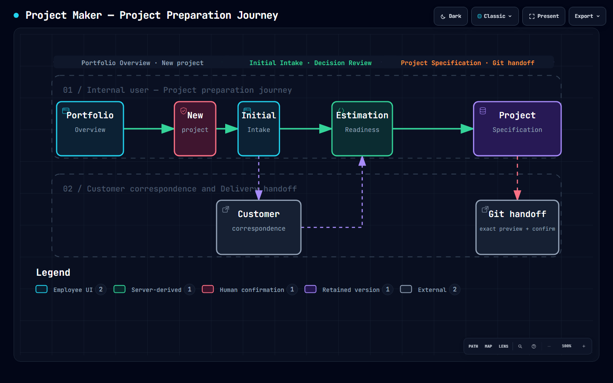
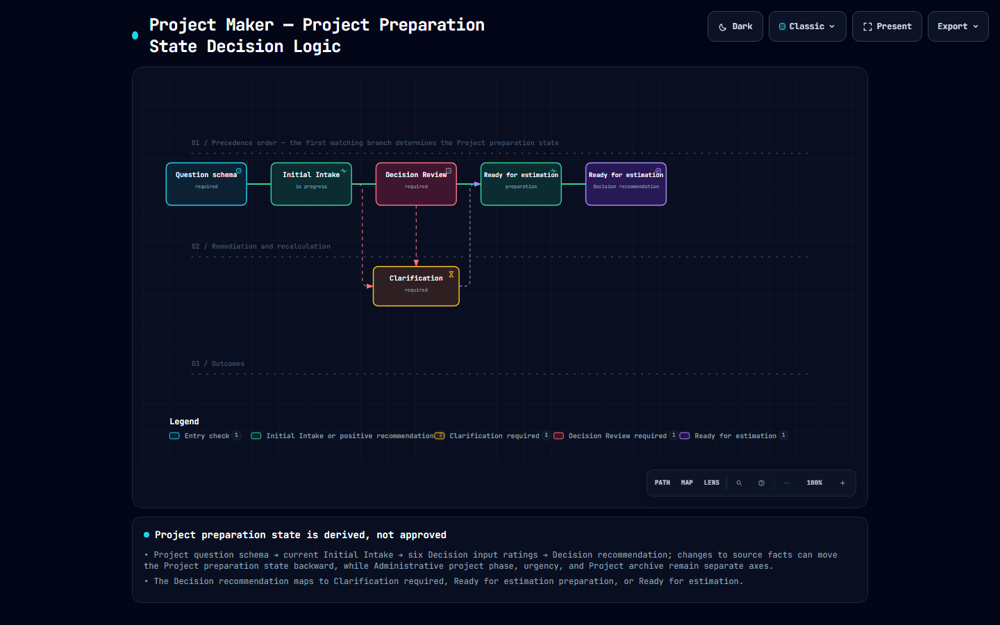
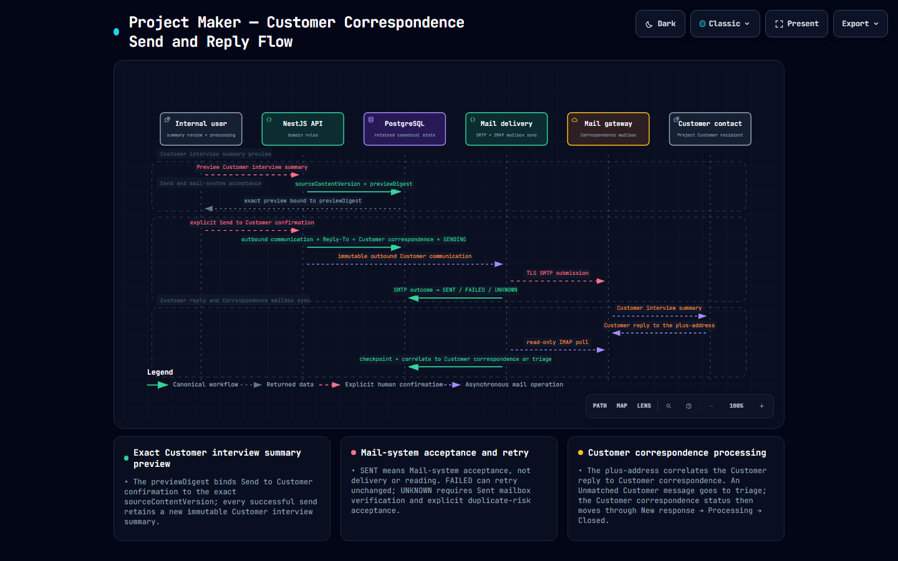
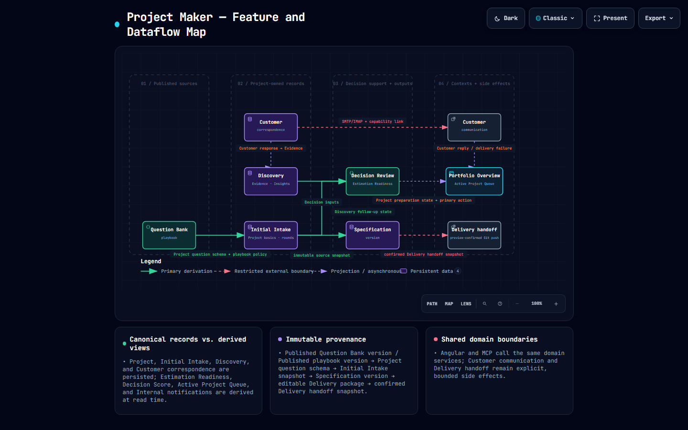
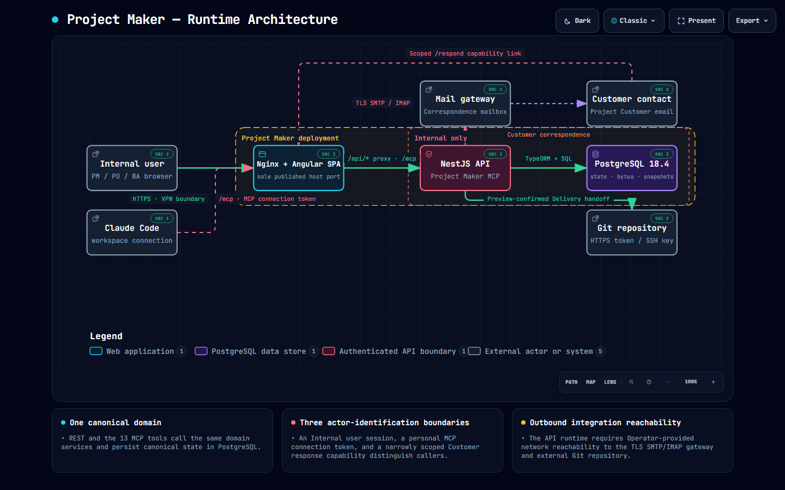

# Project Maker visual maps

These five maps describe the current Project Maker product from complementary perspectives. They use the application's canonical English terminology and are intended for onboarding, day-to-day orientation, engineering review, and operational handoff.

| Perspective | Best used for | Application view |
| --- | --- | --- |
| [User workflow](#user-workflow) | Onboarding and end-to-end Project preparation orientation | `user-workflow` |
| [Preparation lifecycle](#preparation-lifecycle) | Understanding server-derived preparation state and its independent dimensions | `preparation-lifecycle` |
| [Customer communication](#customer-communication) | Reviewing the send, delivery, reply, and processing sequence | `customer-communication` |
| [Feature and data flow](#feature-and-data-flow) | Connecting product features, retained records, and controlled outputs | `feature-dataflow` |
| [Runtime architecture](#runtime-architecture) | Understanding deployment, system, security, and integration boundaries | `architecture` |

## Application access

After signing in, open **Workspace Map** from the global navigation panel. The protected `/workspace-map` route loads only the selected interactive map; direct links may select a view with `?view=<application-view>`.

The Portfolio Overview and sign-in journey use the workflow preview as contextual onboarding. Selected Project pages link to the preparation lifecycle, and Customer correspondence links to the communication sequence. The technical maps remain in the central Workspace Map so they do not compete with operational work.

## User workflow

Follow an Internal user from **Portfolio Overview** and **New project** through **Initial Intake**, **Estimation Readiness**, **Project Specification**, Customer correspondence, and the exact-preview Git handoff.

- [Interactive HTML asset](../apps/web/public/diagrams/project-maker-user-workflow.html)
- [Archify source specification](diagrams/project-maker-user-workflow.json)

## Preparation lifecycle

Explain how the Project question schema, current Initial Intake, Estimation Readiness, and Decision Review produce the server-derived preparation state. Administrative project phase, urgency, archive, and the Project lifecycle remain separate dimensions.

- [Interactive HTML asset](../apps/web/public/diagrams/project-maker-preparation-lifecycle.html)
- [Archify source specification](diagrams/project-maker-preparation-lifecycle.json)

## Customer communication

Trace preview creation, explicit **Send to Customer** confirmation, retained immutable summaries, Operator mail-gateway delivery, reply correlation, and Internal user processing.

- [Interactive HTML asset](../apps/web/public/diagrams/project-maker-customer-communication.html)
- [Archify source specification](diagrams/project-maker-customer-communication.json)

## Feature and data flow

Connect versioned Question Bank and template sources, Project intake, discovery evidence, derived decision support, immutable Specification versions, editable Delivery Packages, and controlled external handoffs.

- [Interactive HTML asset](../apps/web/public/diagrams/project-maker-feature-dataflow.html)
- [Archify source specification](diagrams/project-maker-feature-dataflow.json)

## Runtime architecture

Inspect the VPN-bounded Angular/Nginx web edge, NestJS API, PostgreSQL persistence, Operator mail gateway, public Customer response boundary, Git destination, and Claude Code MCP connection.

- [Interactive HTML asset](../apps/web/public/diagrams/project-maker-architecture.html)
- [Archify source specification](diagrams/project-maker-architecture.json)

The architecture map's verified source links are intentionally pinned to repository revision `cc0db808ffa2c7f47068a36c6f7e2ac7a80b15b3`, the source snapshot used during validation. Regenerate and revalidate the map before moving those references to another revision.

## Maintenance

- Treat the JSON files under `docs/diagrams/` as the editable Archify inputs.
- Treat the standalone HTML files under `apps/web/public/diagrams/` as generated runtime artifacts; do not hand-edit them.
- Keep the dark preview for every map and both workflow-theme previews synchronized with regenerated output.
- Re-run Archify validation and visual checks after any map-content change.
- Review map wording whenever canonical vocabulary, routes, workflow policy, or system boundaries change.
